## Monitoring stack components 

* Prometheus Operator - simplifies and automates the process of Prometheus configuration in terms of the resources, persistent volumes, target configurations and etc 

* Prometheus serves as the metrics scraper. It regularly collects the metrics of the observed applications, accumulates them and provides a query interface to fetch them 

* Alertmanager manages the alerts: it monitors the status of the alert rules from prometheus and notifies the developers if they are triggered. It also provides functionality to silence the alerts. 

* Prometheus node exporter collects the OS metrics, converts them to open metrics format and exposes an API endpoint for prometheus to collect them

* Prometheus Adapter for Kubernetes Metrics APIs converts the k8s system metrics to the open metrics format and lets the prometheus to collect them 

* kube-state-metrics is a service that collects the metrics from the Kubernetes API  and exports metrics about the state of the k8s objects

* Grafana is a visualization tool that collects metrics from prometheus and builds graphs based on them


## After apply 

Result of `kubectl get po,sts,svc,pvc,cm`

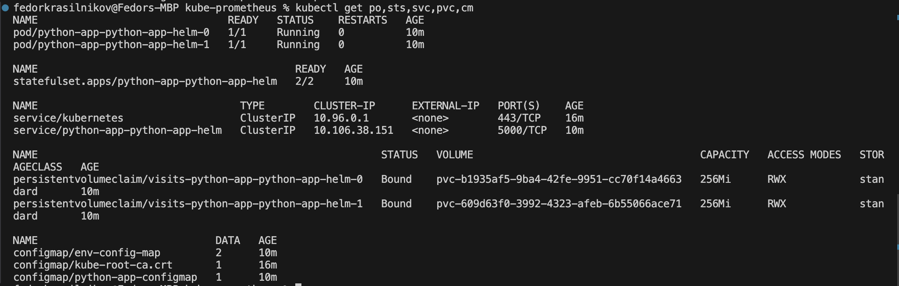

In case if it was required to execute `kubectl get po,sts,svc,pvc,cm --all-namespaces`

```
fedorkrasilnikov@Fedors-MBP kube-prometheus % kubectl get po,sts,svc,pvc,cm --all-namespaces                   
NAMESPACE     NAME                                       READY   STATUS            RESTARTS      AGE
default       pod/python-app-python-app-helm-0           1/1     Running           0             12m
default       pod/python-app-python-app-helm-1           1/1     Running           0             12m
kube-system   pod/coredns-64897985d-9s4jl                1/1     Running           0             18m
kube-system   pod/etcd-minikube                          1/1     Running           0             18m
kube-system   pod/kube-apiserver-minikube                1/1     Running           0             18m
kube-system   pod/kube-controller-manager-minikube       1/1     Running           0             18m
kube-system   pod/kube-proxy-ls8jv                       1/1     Running           0             18m
kube-system   pod/kube-scheduler-minikube                1/1     Running           0             18m
kube-system   pod/storage-provisioner                    1/1     Running           1 (18m ago)   18m
monitoring    pod/alertmanager-main-0                    2/2     Running           0             53s
monitoring    pod/alertmanager-main-1                    1/2     Running           0             53s
monitoring    pod/alertmanager-main-2                    2/2     Running           0             53s
monitoring    pod/blackbox-exporter-74c5c5695c-5l8rz     3/3     Running           0             2m21s
monitoring    pod/grafana-d855d95f5-8p7m7                1/1     Running           0             2m20s
monitoring    pod/kube-state-metrics-59bf5db747-zbd85    3/3     Running           0             2m20s
monitoring    pod/node-exporter-98gjl                    2/2     Running           0             2m20s
monitoring    pod/prometheus-adapter-757bcf9594-26mww    1/1     Running           0             2m19s
monitoring    pod/prometheus-adapter-757bcf9594-chgwf    1/1     Running           0             2m19s
monitoring    pod/prometheus-k8s-0                       0/2     PodInitializing   0             52s
monitoring    pod/prometheus-k8s-1                       0/2     PodInitializing   0             52s
monitoring    pod/prometheus-operator-5b58c4bc89-wb296   2/2     Running           0             2m19s

NAMESPACE    NAME                                          READY   AGE
default      statefulset.apps/python-app-python-app-helm   2/2     12m
monitoring   statefulset.apps/alertmanager-main            2/3     53s
monitoring   statefulset.apps/prometheus-k8s               0/2     52s

NAMESPACE     NAME                                 TYPE        CLUSTER-IP       EXTERNAL-IP   PORT(S)                        AGE
default       service/kubernetes                   ClusterIP   10.96.0.1        <none>        443/TCP                        18m
default       service/python-app-python-app-helm   ClusterIP   10.106.38.151    <none>        5000/TCP                       12m
kube-system   service/kube-dns                     ClusterIP   10.96.0.10       <none>        53/UDP,53/TCP,9153/TCP         18m
kube-system   service/kubelet                      ClusterIP   None             <none>        10250/TCP,10255/TCP,4194/TCP   54s
monitoring    service/alertmanager-main            ClusterIP   10.105.150.37    <none>        9093/TCP,8080/TCP              2m21s
monitoring    service/alertmanager-operated        ClusterIP   None             <none>        9093/TCP,9094/TCP,9094/UDP     53s
monitoring    service/blackbox-exporter            ClusterIP   10.101.178.71    <none>        9115/TCP,19115/TCP             2m21s
monitoring    service/grafana                      ClusterIP   10.102.208.177   <none>        3000/TCP                       2m20s
monitoring    service/kube-state-metrics           ClusterIP   None             <none>        8443/TCP,9443/TCP              2m20s
monitoring    service/node-exporter                ClusterIP   None             <none>        9100/TCP                       2m20s
monitoring    service/prometheus-adapter           ClusterIP   10.110.143.83    <none>        443/TCP                        2m19s
monitoring    service/prometheus-k8s               ClusterIP   10.102.25.45     <none>        9090/TCP,8080/TCP              2m19s
monitoring    service/prometheus-operated          ClusterIP   None             <none>        9090/TCP                       52s
monitoring    service/prometheus-operator          ClusterIP   None             <none>        8443/TCP                       2m19s

NAMESPACE   NAME                                                        STATUS   VOLUME                                     CAPACITY   ACCESS MODES   STORAGECLASS   AGE
default     persistentvolumeclaim/visits-python-app-python-app-helm-0   Bound    pvc-b1935af5-9ba4-42fe-9951-cc70f14a4663   256Mi      RWX            standard       12m
default     persistentvolumeclaim/visits-python-app-python-app-helm-1   Bound    pvc-609d63f0-3992-4323-afeb-6b55066ace71   256Mi      RWX            standard       12m

NAMESPACE         NAME                                                            DATA   AGE
default           configmap/env-config-map                                        2      12m
default           configmap/kube-root-ca.crt                                      1      18m
default           configmap/python-app-configmap                                  1      12m
kube-node-lease   configmap/kube-root-ca.crt                                      1      18m
kube-public       configmap/cluster-info                                          2      18m
kube-public       configmap/kube-root-ca.crt                                      1      18m
kube-system       configmap/coredns                                               1      18m
kube-system       configmap/extension-apiserver-authentication                    6      18m
kube-system       configmap/kube-proxy                                            2      18m
kube-system       configmap/kube-root-ca.crt                                      1      18m
kube-system       configmap/kubeadm-config                                        1      18m
kube-system       configmap/kubelet-config-1.23                                   1      18m
monitoring        configmap/adapter-config                                        1      2m19s
monitoring        configmap/blackbox-exporter-configuration                       1      2m21s
monitoring        configmap/grafana-dashboard-alertmanager-overview               1      2m21s
monitoring        configmap/grafana-dashboard-apiserver                           1      2m21s
monitoring        configmap/grafana-dashboard-cluster-total                       1      2m21s
monitoring        configmap/grafana-dashboard-controller-manager                  1      2m21s
monitoring        configmap/grafana-dashboard-grafana-overview                    1      2m21s
monitoring        configmap/grafana-dashboard-k8s-resources-cluster               1      2m21s
monitoring        configmap/grafana-dashboard-k8s-resources-multicluster          1      2m21s
monitoring        configmap/grafana-dashboard-k8s-resources-namespace             1      2m21s
monitoring        configmap/grafana-dashboard-k8s-resources-node                  1      2m21s
monitoring        configmap/grafana-dashboard-k8s-resources-pod                   1      2m21s
monitoring        configmap/grafana-dashboard-k8s-resources-workload              1      2m21s
monitoring        configmap/grafana-dashboard-k8s-resources-workloads-namespace   1      2m21s
monitoring        configmap/grafana-dashboard-kubelet                             1      2m21s
monitoring        configmap/grafana-dashboard-namespace-by-pod                    1      2m21s
monitoring        configmap/grafana-dashboard-namespace-by-workload               1      2m21s
monitoring        configmap/grafana-dashboard-node-cluster-rsrc-use               1      2m20s
monitoring        configmap/grafana-dashboard-node-rsrc-use                       1      2m20s
monitoring        configmap/grafana-dashboard-nodes                               1      2m20s
monitoring        configmap/grafana-dashboard-nodes-darwin                        1      2m20s
monitoring        configmap/grafana-dashboard-persistentvolumesusage              1      2m20s
monitoring        configmap/grafana-dashboard-pod-total                           1      2m20s
monitoring        configmap/grafana-dashboard-prometheus                          1      2m20s
monitoring        configmap/grafana-dashboard-prometheus-remote-write             1      2m20s
monitoring        configmap/grafana-dashboard-proxy                               1      2m20s
monitoring        configmap/grafana-dashboard-scheduler                           1      2m20s
monitoring        configmap/grafana-dashboard-workload-total                      1      2m20s
monitoring        configmap/grafana-dashboards                                    1      2m20s
monitoring        configmap/kube-root-ca.crt                                      1      2m43s
monitoring        configmap/prometheus-k8s-rulefiles-0                            8      52s
```

### Pods 

alertmanager, grafana, kube-state-metrics, node-exporter, prometheus-adapter, and prometheus-operator are the components responsible for performing the tasks explained in the first section: executing all those services 

### Stateful sets 

Prometheus and alert manager require persistent storage, so they are deployed as stateful sets to store metrics and alert meta information 

### Services 
Such services as alertmanager, blackbox-exporter, grafana, kube-state-metrics, node-exporter, prometheus-adapter, and prometheus-k8s provide novigation for the monitoring stack components described above 

### Config maps 

Such config maps as env-config-map, python-app-configmap, adapter-config, and prometheus-k8s-rulefiles-0 store configurations for the prometheus, grafana, alert manager and other services of the monitoring stack 

## Exploring dashboards 

I loaded the system with thousands of requests with my bash script to make the gpaphs more representative, so here are the results 

1. Memory and cpu usage: 
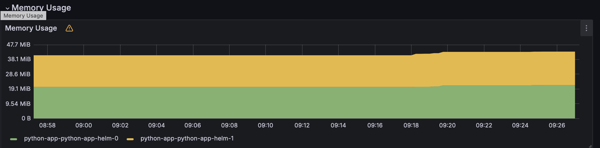


2. Pod python-app-python-app-helm-1 has more cpu usage 
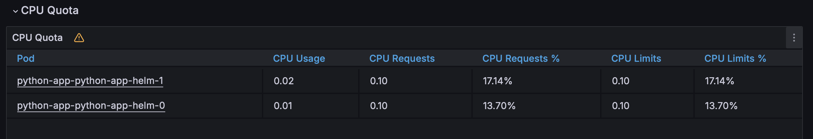

3. Node memory usage in GB is 1.54 GiB
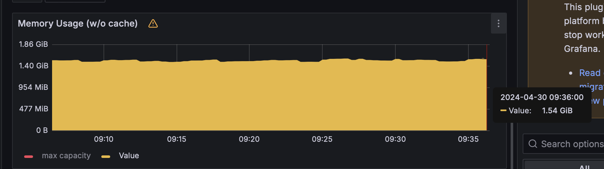
In percentages it's 9.53% 
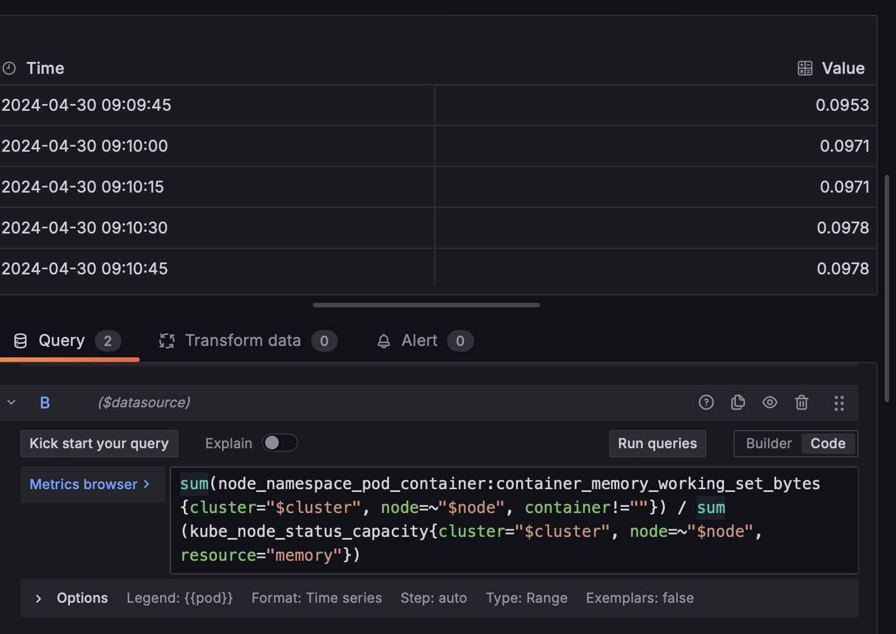

4. Number of pods ran by kubelet is 21, number of containers is 39
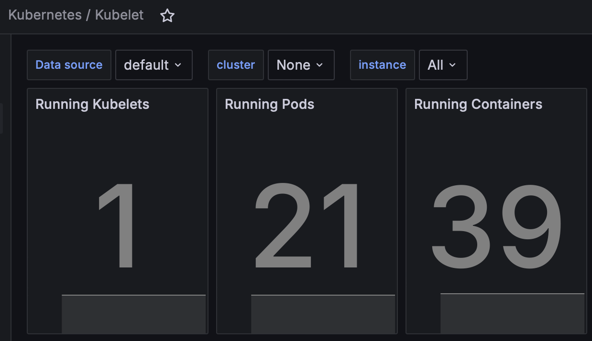

5. Network usage by pods in the default namespace: 
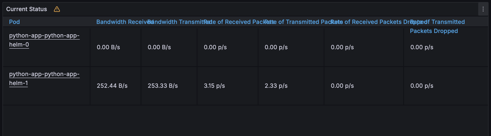

6. The number of active alerts is 10 
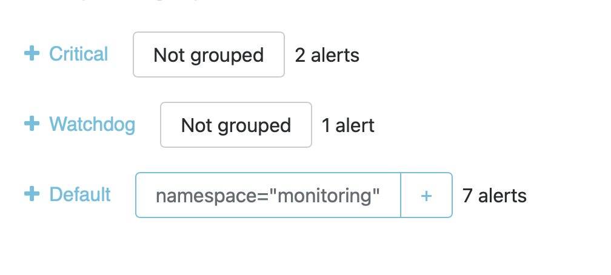

## Init containers 

I used the same volume and file as in the tutorial and here is the output of `k exec -it python-app-python-app-helm-0 -- cat /share/index.html`

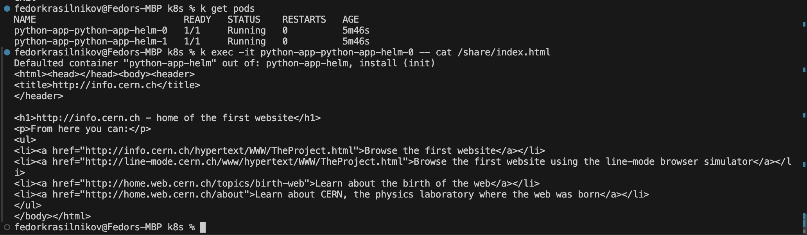

## Bonus task 

### Custom target 

I included a service account and enabled metrics export. After that I upgraded the helm repository and was able to see the targets in the targets panel 
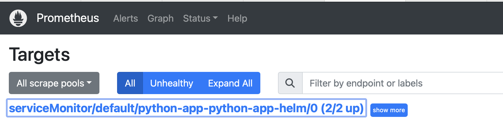

I also could fetch the relevant metrics via the query engine 
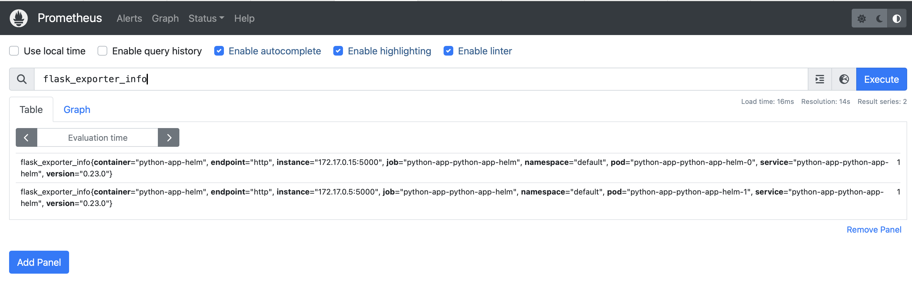

### Init containers 

As for the init containers, I added the following ones to the init containers section: 
```
- name: init-container-1
  image: busybox:1.28
  command:
  - /bin/sh
  - -c
  - |
    echo '1' > /work-dir/bonus
  volumeMounts:
  - name: workdir
    mountPath: "/work-dir"
- name: init-container-2
  image: busybox:1.28
  command:
  - /bin/sh
  - -c
  - |
    echo '2' >> /work-dir/bonus
  volumeMounts:
  - name: workdir
    mountPath: "/work-dir"
- name: init-container-3
  image: busybox:1.28
  command:
  - /bin/sh
  - -c
  - |
    echo '3' >> /work-dir/bonus
  volumeMounts:
  - name: workdir
    mountPath: "/work-dir"
```

And here is the result of `k exec -it python-app-python-app-helm-0 -- cat /share/bonus` after the pod initialization 

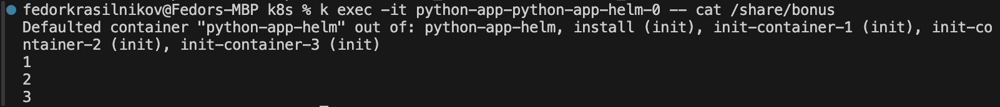