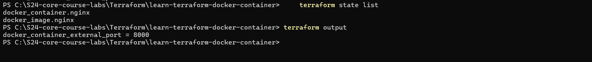
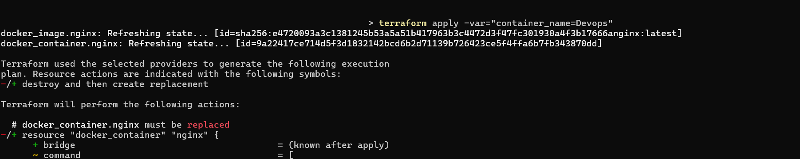
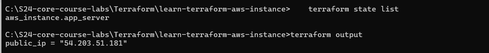
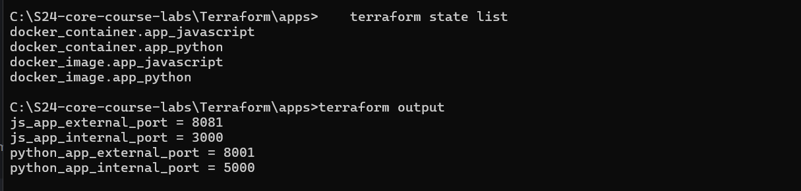
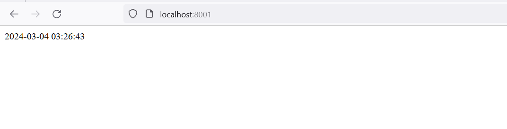
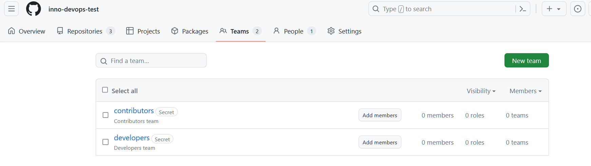

# Terraform

## Docker Terraform Tutorial

- After following the tutorial from [Docker](https://developer.hashicorp.com/terraform/tutorials/docker-get-started/), I have created a Terraform configuration to deploy a simple Docker container.

```bash
    terraform show
```

- The output of the above command:

```bash
# docker_container.nginx:
resource "docker_container" "nginx" {
    attach                                      = false
    command                                     = [
        "nginx",
        "-g",
        "daemon off;",
    ]
    container_read_refresh_timeout_milliseconds = 15000
    cpu_shares                                  = 0
    entrypoint                                  = [
        "/docker-entrypoint.sh",
    ]
    env                                         = []
    hostname                                    = "9a22417ce714"
    id                                          = "9a22417ce714d5f3d1832142bcd6b2d71139b726423ce5f4ffa6b7fb343870dd"
    image                                       = "sha256:e4720093a3c1381245b53a5a51b417963b3c4472d3f47fc301930a4f3b17666a"
    init                                        = false
    ipc_mode                                    = "private"
    log_driver                                  = "json-file"
    logs                                        = false
    max_retry_count                             = 0
    memory                                      = 0
    memory_swap                                 = 0
    must_run                                    = true
    name                                        = "tutorial"
    network_data                                = [
        {
            gateway                   = "172.17.0.1"
            global_ipv6_address       = ""
            global_ipv6_prefix_length = 0
            ip_address                = "172.17.0.2"
            ip_prefix_length          = 16
            ipv6_gateway              = ""
            mac_address               = "02:42:ac:11:00:02"
            network_name              = "bridge"
        },
    ]
    network_mode                                = "default"
    privileged                                  = false
    publish_all_ports                           = false
    read_only                                   = false
    remove_volumes                              = true
    restart                                     = "no"
    rm                                          = false
    runtime                                     = "runc"
    security_opts                               = []
    shm_size                                    = 64
    start                                       = true
    stdin_open                                  = false
    stop_signal                                 = "SIGQUIT"
    stop_timeout                                = 0
    tty                                         = false
    wait                                        = false
    wait_timeout                                = 60

    ports {
        external = 8000
        internal = 80
        ip       = "0.0.0.0"
        protocol = "tcp"
    }
}

# docker_image.nginx:
resource "docker_image" "nginx" {
    id           = "sha256:e4720093a3c1381245b53a5a51b417963b3c4472d3f47fc301930a4f3b17666anginx:latest"
    image_id     = "sha256:e4720093a3c1381245b53a5a51b417963b3c4472d3f47fc301930a4f3b17666a"
    keep_locally = false
    name         = "nginx:latest"
    repo_digest  = "nginx@sha256:c26ae7472d624ba1fafd296e73cecc4f93f853088e6a9c13c0d52f6ca5865107"
}


Outputs:

docker_container_external_port = 8000
```

- About the state list

```bash
    terraform state list
```

- The output of the above command:

```bash
    docker_container.nginx
    docker_image.nginx
```

## Verify the Deployed Docker Container



## Use `-var` to Rename the Docker Container



## AWS Terraform Tutorial

- After following the tutorial from [AWS](https://developer.hashicorp.com/terraform/tutorials/aws-get-started/aws-build?in=terraform%2Faws-get-started), I have created a Terraform configuration to deploy a simple AWS EC2 instance.

```bash
    terraform show
```

- The output of the above command:

```bash
# aws_instance.app_server:
resource "aws_instance" "app_server" {
    ami                                  = "ami-830c94e3"
    arn                                  = "arn:aws:ec2:us-west-2:058264266933:instance/i-0048eb7045b2e82ad"
    associate_public_ip_address          = true
    availability_zone                    = "us-west-2b"
    cpu_core_count                       = 1
    cpu_threads_per_core                 = 1
    disable_api_termination              = false
    ebs_optimized                        = false
    get_password_data                    = false
    hibernation                          = false
    id                                   = "i-0048eb7045b2e82ad"
    instance_initiated_shutdown_behavior = "stop"
    instance_state                       = "running"
    instance_type                        = "t2.micro"
    ipv6_address_count                   = 0
    ipv6_addresses                       = []
    monitoring                           = false
    primary_network_interface_id         = "eni-0c868b627997f4819"
    private_dns                          = "ip-172-31-27-103.us-west-2.compute.internal"
    private_ip                           = "172.31.27.103"
    public_dns                           = "ec2-54-203-51-181.us-west-2.compute.amazonaws.com"
    public_ip                            = "54.203.51.181"
    secondary_private_ips                = []
    security_groups                      = [
        "default",
    ]
    source_dest_check                    = true
    subnet_id                            = "subnet-0926272d181f1589a"
    tags                                 = {
        "Name" = "example-instance"
    }
    tags_all                             = {
        "Name" = "example-instance"
    }
    tenancy                              = "default"
    vpc_security_group_ids               = [
        "sg-02ef03b380832a5bc",
    ]

    capacity_reservation_specification {
        capacity_reservation_preference = "open"
    }

    credit_specification {
        cpu_credits = "standard"
    }

    enclave_options {
        enabled = false
    }

    metadata_options {
        http_endpoint               = "enabled"
        http_put_response_hop_limit = 1
        http_tokens                 = "optional"
        instance_metadata_tags      = "disabled"
    }

    root_block_device {
        delete_on_termination = true
        device_name           = "/dev/sda1"
        encrypted             = false
        iops                  = 0
        tags                  = {}
        throughput            = 0
        volume_id             = "vol-076be94ff5fa7fc0f"
        volume_size           = 8
        volume_type           = "standard"
    }
}


Outputs:

public_ip = "54.203.51.181"

```

- About the state list

```bash
    terraform state list
```

- The output of the above command:

```bash
    aws_instance.app_server
```



## Create Terraform for the Python and Python Apps

- Based on the created apps in the previous labs, I have created a Terraform configuration to deploy a simple Python app.

- Inside the `apps` directory, I have created the terraform configuration files.

```bash
    terraform show
```

```bash
# docker_container.app_javascript:
resource "docker_container" "app_javascript" {
    attach                                      = false
    command                                     = [
        "node",
        "app.js",
    ]
    container_read_refresh_timeout_milliseconds = 15000
    cpu_shares                                  = 0
    entrypoint                                  = [
        "docker-entrypoint.sh",
    ]
    env                                         = []
    hostname                                    = "f0ad1e1e1e2a"
    id                                          = "f0ad1e1e1e2ab4b826ca0d4f362f279afd5189ab098ec21794019f0df2db301a"
    image                                       = "sha256:edd816dd43f846b1e9022049fdb30a027e8070e9afaa83c307887dd2397facfc"
    init                                        = false
    ipc_mode                                    = "private"
    log_driver                                  = "json-file"
    logs                                        = false
    max_retry_count                             = 0
    memory                                      = 0
    memory_swap                                 = 0
    must_run                                    = true
    name                                        = "moscow_tz_js"
    network_data                                = [
        {
            gateway                   = "172.17.0.1"
            global_ipv6_address       = ""
            global_ipv6_prefix_length = 0
            ip_address                = "172.17.0.2"
            ip_prefix_length          = 16
            ipv6_gateway              = ""
            mac_address               = "02:42:ac:11:00:02"
            network_name              = "bridge"
        },
    ]
    network_mode                                = "default"
    privileged                                  = false
    publish_all_ports                           = false
    read_only                                   = false
    remove_volumes                              = true
    restart                                     = "no"
    rm                                          = false
    runtime                                     = "runc"
    security_opts                               = []
    shm_size                                    = 64
    start                                       = true
    stdin_open                                  = false
    stop_timeout                                = 0
    tty                                         = false
    user                                        = "appuser"
    wait                                        = false
    wait_timeout                                = 60
    working_dir                                 = "/app"

    ports {
        external = 8081
        internal = 3000
        ip       = "0.0.0.0"
        protocol = "tcp"
    }
}

# docker_container.app_python:
resource "docker_container" "app_python" {
    attach                                      = false
    command                                     = [
        "python",
        "app.py",
    ]
    container_read_refresh_timeout_milliseconds = 15000
    cpu_shares                                  = 0
    entrypoint                                  = []
    env                                         = []
    hostname                                    = "d47911c7d0af"
    id                                          = "d47911c7d0af7bc8395fb76778f956cefacb5a92edb8eeba29ff286103240d17"
    image                                       = "sha256:b4a2fbbba8bfa63e718f5b1c0df4e9297244d9b81f1a935b6a890357d7cbeefb"
    init                                        = false
    ipc_mode                                    = "private"
    log_driver                                  = "json-file"
    logs                                        = false
    max_retry_count                             = 0
    memory                                      = 0
    memory_swap                                 = 0
    must_run                                    = true
    name                                        = "moscow_tz"
    network_data                                = [
        {
            gateway                   = "172.17.0.1"
            global_ipv6_address       = ""
            global_ipv6_prefix_length = 0
            ip_address                = "172.17.0.3"
            ip_prefix_length          = 16
            ipv6_gateway              = ""
            mac_address               = "02:42:ac:11:00:03"
            network_name              = "bridge"
        },
    ]
    network_mode                                = "default"
    privileged                                  = false
    publish_all_ports                           = false
    read_only                                   = false
    remove_volumes                              = true
    restart                                     = "no"
    rm                                          = false
    runtime                                     = "runc"
    security_opts                               = []
    shm_size                                    = 64
    start                                       = true
    stdin_open                                  = false
    stop_timeout                                = 0
    tty                                         = false
    user                                        = "appuser"
    wait                                        = false
    wait_timeout                                = 60
    working_dir                                 = "/app"

    ports {
        external = 8001
        internal = 5000
        ip       = "0.0.0.0"
        protocol = "tcp"
    }
}

# docker_image.app_javascript:
resource "docker_image" "app_javascript" {
    id           = "sha256:edd816dd43f846b1e9022049fdb30a027e8070e9afaa83c307887dd2397facfcwesamnaseer/mtz_js:latest"
    image_id     = "sha256:edd816dd43f846b1e9022049fdb30a027e8070e9afaa83c307887dd2397facfc"
    keep_locally = true
    name         = "wesamnaseer/mtz_js:latest"
    repo_digest  = "wesamnaseer/mtz_js@sha256:6ef71019982e792b0bf7bfb3d794cbbb2f95ae7e809615ebeeae9755f769ad8c"
}

# docker_image.app_python:
resource "docker_image" "app_python" {
    id           = "sha256:b4a2fbbba8bfa63e718f5b1c0df4e9297244d9b81f1a935b6a890357d7cbeefbwesamnaseer/mtz:v1.0"
    image_id     = "sha256:b4a2fbbba8bfa63e718f5b1c0df4e9297244d9b81f1a935b6a890357d7cbeefb"
    keep_locally = true
    name         = "wesamnaseer/mtz:v1.0"
    repo_digest  = "wesamnaseer/mtz@sha256:7ce56927e24c75d258709f0dedb68436f94f497b00d725d914d77e90a3be655d"
}


Outputs:

js_app_external_port = 8081
js_app_internal_port = 3000
python_app_external_port = 8001
python_app_internal_port = 5000
```

- About the state list

```bash
    terraform state list
```

- The output of the above command:

```bash
    docker_container.app_javascript
    docker_container.app_python
    docker_image.app_javascript
    docker_image.app_python
```



### Verify the Deployed Apps




## GitHub Terraform + `Bonus`

- I have an existing Github Organization called `AyotoAI` and I have created a Terraform configuration to deploy a simple GitHub repository.

- I have created two empty teams called `developers` and `contributors`.

```bash
    terraform show
```

```bash
# github_branch_default.main:
resource "github_branch_default" "main" {
    branch     = "main"
    etag       = "W/\"09e1922be509670cd4c5d7e66b495203a2d28bfc4a84d6d61ee83bd966cddef7\""
    id         = "devops-terraform-example"
    rename     = false
    repository = "devops-terraform-example"
}

# github_branch_protection.default:
resource "github_branch_protection" "default" {
    allows_deletions                = false
    allows_force_pushes             = false
    blocks_creations                = false
    enforce_admins                  = false
    force_push_bypassers            = []
    id                              = "BPR_kwDOLbNYTM4C1czT"
    lock_branch                     = false
    pattern                         = "main"
    push_restrictions               = []
    repository_id                   = "devops-terraform-example"
    require_conversation_resolution = true
    require_signed_commits          = false
    required_linear_history         = false

    required_pull_request_reviews {
        dismiss_stale_reviews           = false
        dismissal_restrictions          = []
        pull_request_bypassers          = []
        require_code_owner_reviews      = false
        require_last_push_approval      = false
        required_approving_review_count = 1
        restrict_dismissals             = false
    }
}

# github_repository.repo:
resource "github_repository" "repo" {
    allow_auto_merge            = false
    allow_merge_commit          = true
    allow_rebase_merge          = true
    allow_squash_merge          = true
    allow_update_branch         = false
    archived                    = false
    auto_init                   = false
    default_branch              = "main"
    delete_branch_on_merge      = false
    description                 = "Terraform example to create a GitHub repository"
    etag                        = "W/\"09e1922be509670cd4c5d7e66b495203a2d28bfc4a84d6d61ee83bd966cddef7\""
    full_name                   = "inno-devops-test/devops-terraform-example"
    git_clone_url               = "git://github.com/inno-devops-test/devops-terraform-example.git"
    gitignore_template          = "VisualStudio"
    has_discussions             = false
    has_downloads               = false
    has_issues                  = true
    has_projects                = false
    has_wiki                    = true
    html_url                    = "https://github.com/inno-devops-test/devops-terraform-example"
    http_clone_url              = "https://github.com/inno-devops-test/devops-terraform-example.git"
    id                          = "devops-terraform-example"
    is_template                 = false
    license_template            = "mit"
    merge_commit_message        = "PR_TITLE"
    merge_commit_title          = "MERGE_MESSAGE"
    name                        = "devops-terraform-example"
    node_id                     = "R_kgDOLbNYTA"
    private                     = false
    repo_id                     = 766728268
    squash_merge_commit_message = "COMMIT_MESSAGES"
    squash_merge_commit_title   = "COMMIT_OR_PR_TITLE"
    ssh_clone_url               = "git@github.com:inno-devops-test/devops-terraform-example.git"
    svn_url                     = "https://github.com/inno-devops-test/devops-terraform-example"
    topics                      = []
    visibility                  = "public"
    vulnerability_alerts        = false
    web_commit_signoff_required = false

    security_and_analysis {
        secret_scanning {
            status = "disabled"
        }
        secret_scanning_push_protection {
            status = "disabled"
        }
    }
}

# github_team.contributors:
resource "github_team" "contributors" {
    create_default_maintainer = false
    description               = "Contributors team"
    etag                      = "W/\"05cf297a215a6f33dfcde34b04ee15e4a3f738217b0035698bc9f195e9a77959\""
    id                        = "9608248"
    members_count             = 0
    name                      = "contributors"
    node_id                   = "T_kwDOCaj6kM4Akpw4"
    privacy                   = "secret"
    slug                      = "contributors"
}

# github_team.developers:
resource "github_team" "developers" {
    create_default_maintainer = false
    description               = "Developers team"
    etag                      = "W/\"15f1d15ed4948560a817411200c60cec1512739a778d7d31dc720175d5ab0c72\""
    id                        = "9608250"
    members_count             = 0
    name                      = "developers"
    node_id                   = "T_kwDOCaj6kM4Akpw6"
    privacy                   = "secret"
    slug                      = "developers"
}

# github_team_repository.contributors_access:
resource "github_team_repository" "contributors_access" {
    etag       = "W/\"b60afd3b97f0a05ef64c41c3fc37eeb375566c6c9c1cd367c48ccb48cfbc44eb\""
    id         = "9608248:devops-terraform-example"
    permission = "pull"
    repository = "devops-terraform-example"
    team_id    = "9608248"
}

# github_team_repository.developers_access:
resource "github_team_repository" "developers_access" {
    etag       = "W/\"80b03c204d90246f2815fb3f396f8d227bed13d00507d568d9c18d78a38c6aaf\""
    id         = "9608250:devops-terraform-example"
    permission = "push"
    repository = "devops-terraform-example"
    team_id    = "9608250"
}
```

- About the state list

```bash
    terraform state list
```

- The output of the above command:

```bash
    github_branch_default.main
    github_branch_protection.default
    github_repository.repo
    github_team.contributors
    github_team.developers
    github_team_repository.contributors_access
    github_team_repository.developers_access
```


### Verify the Deployed GitHub Repository



- Also Import the existing GitHub repository

```bash
    terraform import github_repository.repo devops-terraform-example
```


## Best Practices Followed

1. **Modular Structure**: Configuration files are organized within separate directories for Docker and AWS, improving maintainability and clarity.

2. **Provider Declaration**: Providers are declared explicitly within each main.tf file, ensuring clear dependency management.

3. **Resource Declarations**: Resources are defined appropriately inside the corresponding resources.tf file, enhancing readability and maintainability. Moreover, resources are named meaningfully, ensuring clarity and consistency.

4. **Variable Usage**: Variables are utilized to parameterize configuration, enhancing flexibility and reusability.

5. **Output Usage**: Outputs are defined to expose the results of the infrastructure deployment, ensuring clarity and consistency.

6. **Secrets Management**: Sensitive information is managed securely using environment variables.
