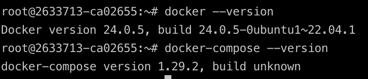

# Ansible lab results

<br> <br/>

# Best practicies

- Document playbooks and roles effectively to provide clear understanding and usage instructions
- Use Fully Qualified Class Names (FQCN) for builtin module actions to provide clear and unambiguous references to the modules being used in Ansible playbooks
- Use `ansible-lint` to check Ansible playbooks and roles for style violations
- Secrets in Ansible can be stored and managed using Ansible Vault, which provides encryption for sensitive data such as passwords, API keys, and other credentials
- Organize the directory layout in Ansible effectively to improve readability, maintainability, and reusability of playbooks, roles, and associated resources

<br> <br/>
<br> <br/>
<br> <br/>

# Main task

## `ansible-playbook playbooks/dev/main.yml --diff` output:

```text

PLAY [Install Docker on cloud] **************************************************************************************************************************************************

TASK [Gathering Facts] **********************************************************************************************************************************************************
ok: [host1]

TASK [docker : Install pip] *****************************************************************************************************************************************************
included: /Users/timur/develop/labs/devops/S24-core-course-labs/ansible/roles/docker/tasks/install_pip.yml for host1

TASK [docker : Update apt] ******************************************************************************************************************************************************
changed: [host1]

TASK [docker : Upgrade apt] *****************************************************************************************************************************************************
ok: [host1]

TASK [docker : Install python] **************************************************************************************************************************************************
ok: [host1]

TASK [docker : Install pip] *****************************************************************************************************************************************************
ok: [host1]

TASK [docker : Install docker] **************************************************************************************************************************************************
included: /Users/timur/develop/labs/devops/S24-core-course-labs/ansible/roles/docker/tasks/install_docker.yml for host1

TASK [docker : Install docker] **************************************************************************************************************************************************
ok: [host1]

TASK [docker : Install docker-compose] ******************************************************************************************************************************************
included: /Users/timur/develop/labs/devops/S24-core-course-labs/ansible/roles/docker/tasks/install_compose.yml for host1

TASK [docker : Install docker compose] ******************************************************************************************************************************************
ok: [host1]

PLAY RECAP **********************************************************************************************************************************************************************
host1                      : ok=10   changed=1    unreachable=0    failed=0    skipped=0    rescued=0    ignored=0 

```

<br> <br/>

## `ansible-inventory -i inventory/default_cloud.yml --list` output:

```json

{
    "_meta": {
        "hostvars": {
            "host1": {
                "ansible_host": "188.225.76.110",
                "ansible_user": "root"
            }
        }
    },
    "all": {
        "children": [
            "ungrouped"
        ]
    },
    "ungrouped": {
        "hosts": [
            "host1"
        ]
    }
}

```
<br> <br/>

Proof of installed using ssh:



<br> <br/>
<br> <br/>
<br> <br/>

# Dynamic Inventory

I studies all CLI commands, but TimeWeb.cloud doesn't have dynamic inventory
https://timeweb.cloud/docs/twc-cli

BUT, lector said that if you cloud service doesn't have it, we will give you bonus points if you tried

It is because they are selling their own mechanism to increase raising the load level
https://timeweb.com/ru/docs/virtualnyj-hosting/voprosy-po-nagruzke/uvelichenie-limita-nagruzki/

## `ansible-inventory -e timeweb_token=$SECRET --list` output:

```json

    empty :(

```