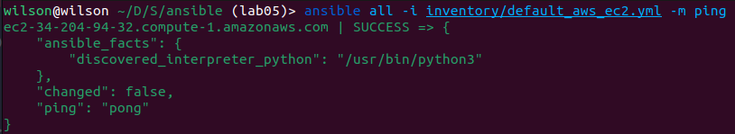

# Ansible logs

## Best practices
- The proper folder structure was used for the files.
- Named tasks.
- `ansible.cfg` for settings.
- `--syntax-check` was used before running the playbook.

### 1. Installing the docker role and aws collection 
```shell
ansible-galaxy role install geerlingguy.docker
ansible-galaxy collection install amazon.aws
```

### 2. Installing dependencies 
```shell
pip install boto3 botocore
```

### 3. Checking if inventory is reachable `ansible all -i inventory/default_aws_ec2.yml -m ping`


### 4. Running `ansible-playbook playbooks/dev/main.yaml --diff`
```shell
PLAY [Install Docker and Docker Compose] ***************************************************

TASK [Gathering Facts] *********************************************************************
ok: [ec2-34-204-94-32.compute-1.amazonaws.com]

TASK [../../roles/docker : Install `pip`] **************************************************
ok: [ec2-34-204-94-32.compute-1.amazonaws.com]

TASK [../../roles/docker : Refresh apt packages] *******************************************
changed: [ec2-34-204-94-32.compute-1.amazonaws.com]

TASK [../../roles/docker : Install/Update docker.io] ***************************************
ok: [ec2-34-204-94-32.compute-1.amazonaws.com]

TASK [../../roles/docker : Install docker] *************************************************
ok: [ec2-34-204-94-32.compute-1.amazonaws.com]

TASK [../../roles/docker : Install docker-compose] *****************************************
ok: [ec2-34-204-94-32.compute-1.amazonaws.com]

PLAY RECAP *********************************************************************************
ec2-34-204-94-32.compute-1.amazonaws.com : ok=6    changed=1    unreachable=0    failed=0    skipped=0    rescued=0    ignored=0   
```

### 5. Running `ansible-inventory -i inventory/default_aws_ec2.yml --list`
```shell
{
    "_meta": {
        "hostvars": {
            "ec2-34-204-94-32.compute-1.amazonaws.com": {
                "ansible_connection": "ssh",
                "ansible_ssh_private_key_file": "~/pair.pem",
                "ansible_user": "ubuntu"
            }
        }
    },
    "all": {
        "children": [
            "ungrouped"
        ]
    },
    "ungrouped": {
        "hosts": [
            "ec2-34-204-94-32.compute-1.amazonaws.com"
        ]
    }
}
```