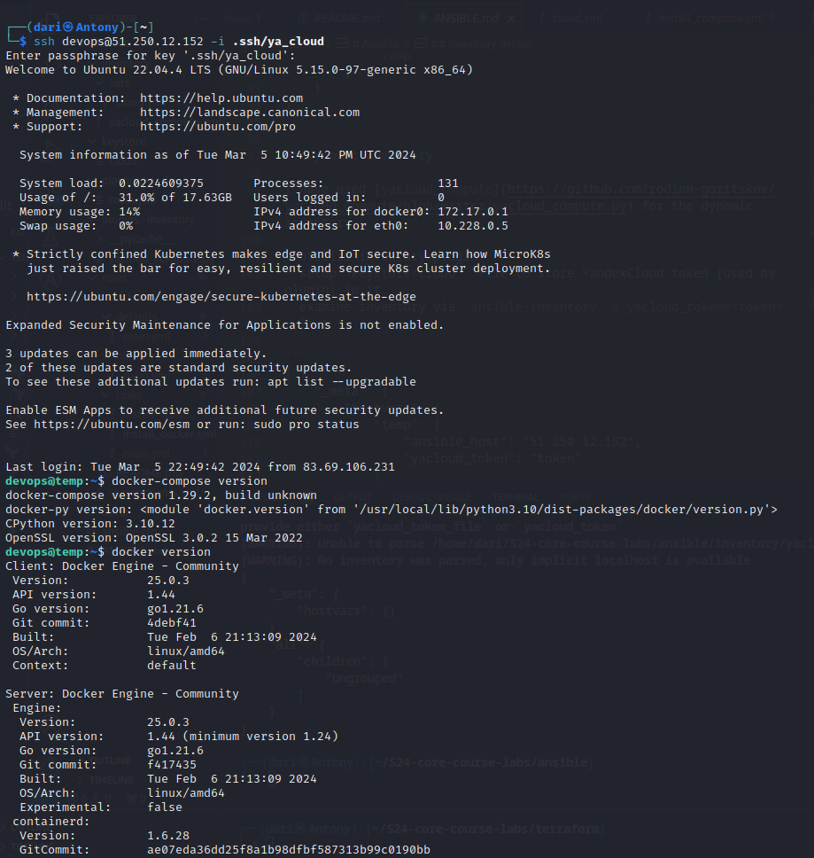

# Ansible

## Best practices

1. Utilize cache to speedup tasks
2. Name the tasks and roles properly
3. Utilize well-known plugins
4. Use `ansible-lint` to check files (playbooks and roles) lint for best practices
5. `requirements.yml` for managingroles and collections.
6. Better to store secrets in the environment variables, not dirrectly in files
7. Have default behaviour in case some crucial options aren't filled in playbook
8. Use `ansible-playbook --check --diff` to run the playbooks in check mode to see the changes that will be made
9. Use dynamic inventory to automatically update your inventory


## [Existing Ansible Role for Docker](https://github.com/geerlingguy/ansible-role-docker)
The role `geerlingguy.docker` should be installed via `ansible-galaxy install -r roles/requirements.yml` from the `ansible` directory

## Custom Docker role output

```
(dari㉿Antony)-[~/S24-core-course-labs/ansible]
└─$ ansible-playbook playbooks/dev/main.yml --diff

PLAY [AnsibleLab-05] ********************************************************************************************************************************

TASK [Gathering Facts] *******************************************************************************************************************************
Enter passphrase for key '/home/dari/.ssh/ya_cloud': 
ok: [temp]

TASK [docker : Install Docker] ***********************************************************************************************************************
included: /home/dari/S24-core-course-labs/ansible/roles/docker/tasks/install_docker.yml for temp

TASK [docker : Install aptitude] *********************************************************************************************************************
ok: [temp]

TASK [docker : Install required system packages] *****************************************************************************************************
ok: [temp]

TASK [docker : Add Docker Repository] ****************************************************************************************************************
ok: [temp]

TASK [docker : Update apt and install docker-ce] *****************************************************************************************************
The following additional packages will be installed:
  docker-buildx-plugin docker-ce-cli docker-compose-plugin libltdl7 pigz
Suggested packages:
  aufs-tools cgroupfs-mount | cgroup-lite
The following NEW packages will be installed:
  docker-buildx-plugin docker-ce docker-ce-cli docker-compose-plugin libltdl7
  pigz
0 upgraded, 6 newly installed, 0 to remove and 3 not upgraded.
changed: [temp]

TASK [docker : Install docker-compose] ***************************************************************************************************************
included: /home/dari/S24-core-course-labs/ansible/roles/docker/tasks/install_compose.yml for temp

TASK [docker : Install docker-compose plugin] ********************************************************************************************************
ok: [temp]

TASK [docker : Add user to docker group] *************************************************************************************************************
changed: [temp]

PLAY RECAP *******************************************************************************************************************************************
temp                       : ok=9    changed=2    unreachable=0    failed=0    skipped=0    rescued=0    ignored=0   
                                                   
```

Screenshot to proove:


## Inventory details

- `ansible-inventory -i inventory/yacloud_compute.yml --list`

```
{
    "_meta": {
        "hostvars": {
            "temp": {
                "ansible_host": "84.201.157.229"
                "ansible_user": "devops"
            }
        }
    },
    "all": {
        "children": [
            "ungrouped"
        ]
    },
    "ungrouped": {
        "hosts": [
            "temp"
        ]
    }
}
```

## Dynamic Inventory

I have used [yacloud_compute](https://github.com/rodion-goritskov/yacloud_compute/blob/master/yacloud_compute.py) for the dynamic inventory

- utilize inventory plugin
- setup `keystore/cloud` file to store YandexCloud token (used by plugin) in it
- examine inventory via `ansible-inventory -e yacloud_token=<token> --list`:

```
{
    "_meta": {
        "hostvars": {
            "temp": {
                "ansible_host": "51.250.12.152",
                "yacloud_token": "token"
            }
        }
    },
    "all": {
        "children": [
            "ungrouped",
            "yacloud"
        ]
    },
    "yacloud": {
        "hosts": [
            "temp"
        ]
    }
}
```
