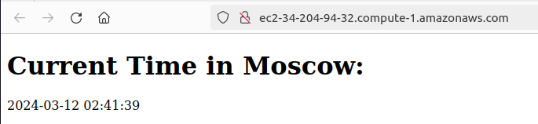
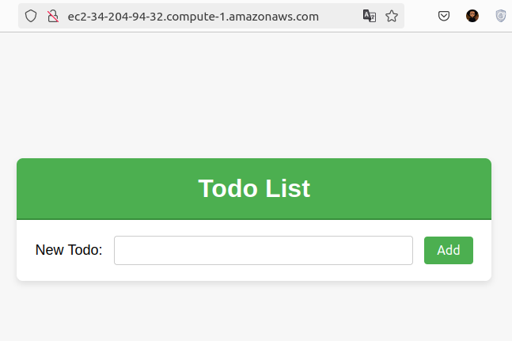

# Ansible logs

## Best practices
- The proper folder structure was used for the files.
- Named tasks.
- `ansible.cfg` for settings.
- `--syntax-check` was used before running the playbook.
- Tasks were grouped with blocks.
- Ansible tags were used to group tasks.
- Wipe logic implemented with `web_app_full_wipe` variable.

### Installing the docker role and aws collection 
```shell
ansible-galaxy role install geerlingguy.docker
ansible-galaxy collection install amazon.aws
```

### Installing dependencies 
```shell
pip install boto3 botocore
```

### Checking if inventory is reachable `ansible all -i inventory/default_aws_ec2.yml -m ping`


### Running `ansible-playbook playbooks/dev/main.yaml --diff`
```shell
PLAY [Install Docker and Docker Compose] ***************************************************

TASK [Gathering Facts] *********************************************************************
ok: [ec2-34-204-94-32.compute-1.amazonaws.com]

TASK [../../roles/docker : Install `pip`] **************************************************
ok: [ec2-34-204-94-32.compute-1.amazonaws.com]

TASK [../../roles/docker : Refresh apt packages] *******************************************
changed: [ec2-34-204-94-32.compute-1.amazonaws.com]

TASK [../../roles/docker : Install/Update docker.io] ***************************************
ok: [ec2-34-204-94-32.compute-1.amazonaws.com]

TASK [../../roles/docker : Install docker] *************************************************
ok: [ec2-34-204-94-32.compute-1.amazonaws.com]

TASK [../../roles/docker : Install docker-compose] *****************************************
ok: [ec2-34-204-94-32.compute-1.amazonaws.com]

PLAY RECAP *********************************************************************************
ec2-34-204-94-32.compute-1.amazonaws.com : ok=6    changed=1    unreachable=0    failed=0    skipped=0    rescued=0    ignored=0   
```

### Running `ansible-inventory -i inventory/default_aws_ec2.yml --list`
```shell
{
    "_meta": {
        "hostvars": {
            "ec2-34-204-94-32.compute-1.amazonaws.com": {
                "ansible_connection": "ssh",
                "ansible_ssh_private_key_file": "~/pair.pem",
                "ansible_user": "ubuntu"
            }
        }
    },
    "all": {
        "children": [
            "ungrouped"
        ]
    },
    "ungrouped": {
        "hosts": [
            "ec2-34-204-94-32.compute-1.amazonaws.com"
        ]
    }
}
```

### Deploying Python application `ansible-playbook playbooks/dev/app_python/main.yml --diff` (last 50 lines)
```shell
changed: [ec2-34-204-94-32.compute-1.amazonaws.com]

TASK [web_app : Ensure Nginx is installed and current] *****************************************************************************************************************************************************
ok: [ec2-34-204-94-32.compute-1.amazonaws.com]

TASK [web_app : Update Nginx config from template] *********************************************************************************************************************************************************
--- before
+++ after: /home/wilson/.ansible/tmp/ansible-local-60503ekiqx37m/tmp7mtuggsq/nginx.conf.j2
@@ -0,0 +1,8 @@
+server {
+    listen 80;
+    listen [::]:80;
+    server_name ec2-34-204-94-32.compute-1.amazonaws.com;
+    location / {
+        proxy_pass http://localhost:5000/;
+    }
+}
\ No newline at end of file

changed: [ec2-34-204-94-32.compute-1.amazonaws.com]

TASK [web_app : Ensure web app directory exists] ***********************************************************************************************************************************************************
ok: [ec2-34-204-94-32.compute-1.amazonaws.com]

TASK [web_app : Deploy docker-compose from template] *******************************************************************************************************************************************************
--- before
+++ after: /home/wilson/.ansible/tmp/ansible-local-60503ekiqx37m/tmpzp3nvs5m/docker-compose.yml.j2
@@ -0,0 +1,7 @@
+version: "3"
+
+services:
+  web:
+    image: cogbonna/app_python_image:latest
+    ports:
+      - "5000:5000"
\ No newline at end of file

changed: [ec2-34-204-94-32.compute-1.amazonaws.com]

TASK [web_app : Clean Docker environment] ******************************************************************************************************************************************************************
changed: [ec2-34-204-94-32.compute-1.amazonaws.com]

TASK [web_app : Run docker-compose] ************************************************************************************************************************************************************************
changed: [ec2-34-204-94-32.compute-1.amazonaws.com]

RUNNING HANDLER [web_app : Re-start Nginx] *****************************************************************************************************************************************************************
changed: [ec2-34-204-94-32.compute-1.amazonaws.com]

PLAY RECAP *************************************************************************************************************************************************************************************************
ec2-34-204-94-32.compute-1.amazonaws.com : ok=25   changed=10   unreachable=0    failed=0    skipped=0    rescued=0    ignored=0   
```

### Deployed Python App (Screenshot)


### Deploying Bonus Application `ansible-playbook playbooks/dev/app_javascript/main.yml --diff` (last 50 lines)
```shell
TASK [docker : Install/Update docker.io] *******************************************************************************************************************************************************************
ok: [ec2-34-204-94-32.compute-1.amazonaws.com]

TASK [docker : Install docker] *****************************************************************************************************************************************************************************
ok: [ec2-34-204-94-32.compute-1.amazonaws.com]

TASK [docker : Install docker-compose] *********************************************************************************************************************************************************************
ok: [ec2-34-204-94-32.compute-1.amazonaws.com]

TASK [web_app : Check if docker-compose file exists] *******************************************************************************************************************************************************
skipping: [ec2-34-204-94-32.compute-1.amazonaws.com]

TASK [web_app : Delete Docker environment] *****************************************************************************************************************************************************************
skipping: [ec2-34-204-94-32.compute-1.amazonaws.com]

TASK [web_app : command] ***********************************************************************************************************************************************************************************
skipping: [ec2-34-204-94-32.compute-1.amazonaws.com]

TASK [web_app : command] ***********************************************************************************************************************************************************************************
skipping: [ec2-34-204-94-32.compute-1.amazonaws.com]

TASK [web_app : file] **************************************************************************************************************************************************************************************
skipping: [ec2-34-204-94-32.compute-1.amazonaws.com]

TASK [web_app : file] **************************************************************************************************************************************************************************************
skipping: [ec2-34-204-94-32.compute-1.amazonaws.com]

TASK [web_app : Ensure Nginx is installed and current] *****************************************************************************************************************************************************
ok: [ec2-34-204-94-32.compute-1.amazonaws.com]

TASK [web_app : Update Nginx config from template] *********************************************************************************************************************************************************
ok: [ec2-34-204-94-32.compute-1.amazonaws.com]

TASK [web_app : Ensure web app directory exists] ***********************************************************************************************************************************************************
ok: [ec2-34-204-94-32.compute-1.amazonaws.com]

TASK [web_app : Deploy docker-compose from template] *******************************************************************************************************************************************************
ok: [ec2-34-204-94-32.compute-1.amazonaws.com]

TASK [web_app : Clean Docker environment] ******************************************************************************************************************************************************************
changed: [ec2-34-204-94-32.compute-1.amazonaws.com]

TASK [web_app : Run docker-compose] ************************************************************************************************************************************************************************
changed: [ec2-34-204-94-32.compute-1.amazonaws.com]

RUNNING HANDLER [web_app : Re-start Nginx] *****************************************************************************************************************************************************************
changed: [ec2-34-204-94-32.compute-1.amazonaws.com]

PLAY RECAP *************************************************************************************************************************************************************************************************
ec2-34-204-94-32.compute-1.amazonaws.com : ok=19   changed=3    unreachable=0    failed=0    skipped=6    rescued=0    ignored=0    
```

### Deployed Bonus App (Screenshot)
