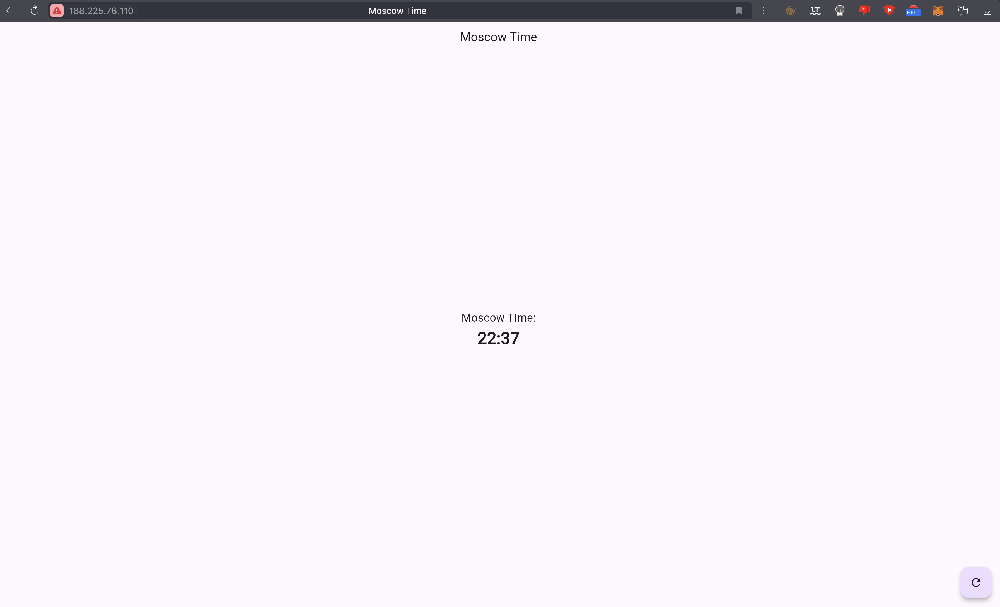

# Flutter Web App Role

## Description
This is ansible role that deploys a web app using pip, Docker, Docker-Compose. 
Supports `wipe` - clearing all previous containers.
Dependencies: 'meta/main.yaml' file.

## Requirements
- Ansible >= 2.10
- Target hosts are running Ubuntu 22.04
- Python 3.11+ on host
- A VM with a public IP address
- Docker image from DockerHub

## Dependencies

- `apt`
- `python3`

## How to Use

Example of playbook:

```yaml
- name: Install Docker on cloud
  hosts: all
  become: true
  roles:
    - ../../roles/web_app
```

## How to run inside ansible folder

```bash
ansible-playbook playbooks/dev/app_flutter/main.yaml -i inventory/default_cloud.yaml    
```

### YML Files in WebApp Folder

- defaults/main.yml
- handlers/main.yml
- meta/main.yml
- tasks/0-wipe.yml
- tasks/main.yml

## Image of running app 

 
