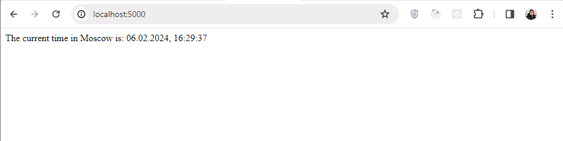
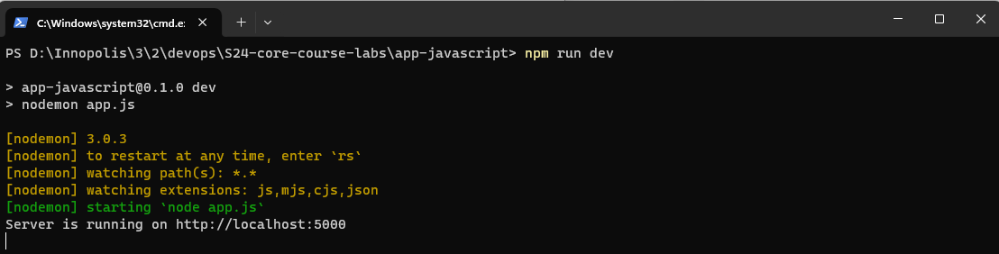

# Node.js Express Web Application

## Framework Choice: Express

For this Node.js web application, I chose Express as the web framework. Express is a fast, unopinionated, and minimalist web framework for Node.js, making it ideal for building lightweight and efficient web applications.

## Implementation Details: Check the README.md file

## Best Practices

1. **Code Comments:** The code includes comments to explain key functionalities, such as retrieving the current date and time in the specified timezone.

2. **Code Quality:** The code is concise and straightforward, focusing on the core functionality of displaying the current time in Moscow. However, additional comments and documentation could enhance readability and maintainability.

## How To Install and Test

To run the Node.js Express web application, follow these steps:

2. **Install Dependencies:**

   - Make sure you have Node.js installed on your system.
   - Install the required dependencies by running:
     ```
     npm install
     ```

3. **Run the Application:**

   - After installing dependencies, navigate to the directory containing the `app.js` file.
   - Run the following command to start the Express server:
     ```
     node app.js
     ```

4. **Test:**

   - Open a web browser and visit `http://localhost:5000/` to access the application.
   - You should see the current time in Moscow displayed on the webpage.
   - Refresh the browser tab to ensure the application continues to work as expected.

   
   

This report provides an overview of the Node.js Express web application, its framework choice, implementation details, best practices, and instructions for installation and testing. Adjustments can be made based on specific project requirements.
