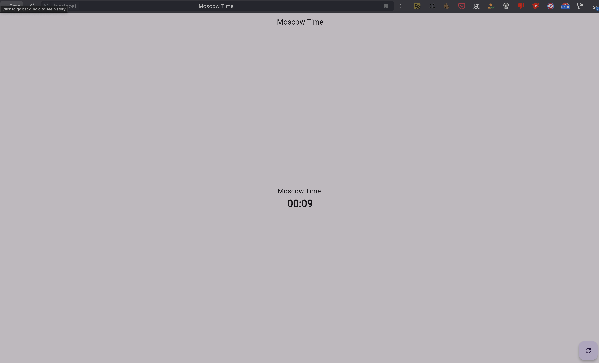

# Lab1 Flutter mobile app

Application to display current time in Moscow

## Prerequisites

Ensure you have Flutter SDK installed on your system. You can follow the [official Flutter installation guide](https://flutter.dev/docs/get-started/install) for detailed instructions.

## Installation

### How to build

```bash
docker build -t flutter_web .
```

## How to pull

```bash
docker pull flutter_web:latest 
```

## How to run

```bash
docker run -d -p 80:80 timurharin/flutter_web:latest
```

## Use

Service is here `http://127.0.0.1`




## Installation (legacy)

Clone the repository and navigate to the project directory. Install the
dependencies using Flutter:

```bash
flutter pub get
```

## Running the Application
Start the application using the following command:

```bash
flutter run
```

Upon successful startup, you should see the app running on your device or simulator with the current time in Moscow displayed.

