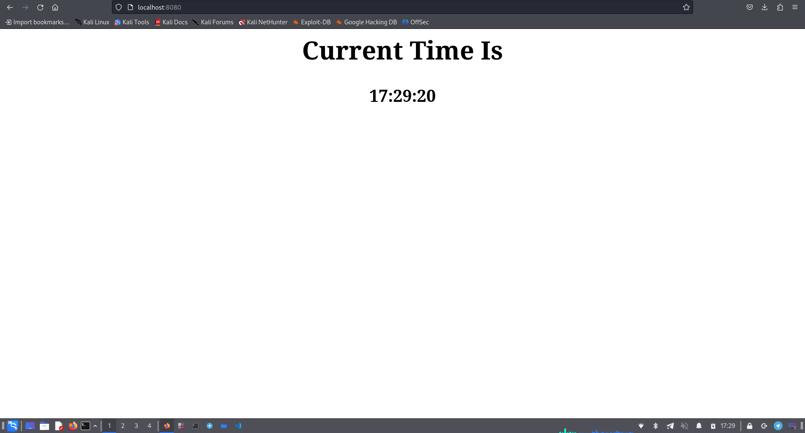

# Time Table app development

## Development

I've decided to run simple web server using [Gin](https://gin-gonic.com/) framework.
It's pretty easy and fast framework for simple web applications.

## Quality

In order to ensure code quality I've integrated `Golang-Lint Github Action` into github repository.

## Readability

- The code were written in the most consise way with proper naming conventions.
- It was properly commented.

## Testing

As a result, application shows time on every page refresh:

