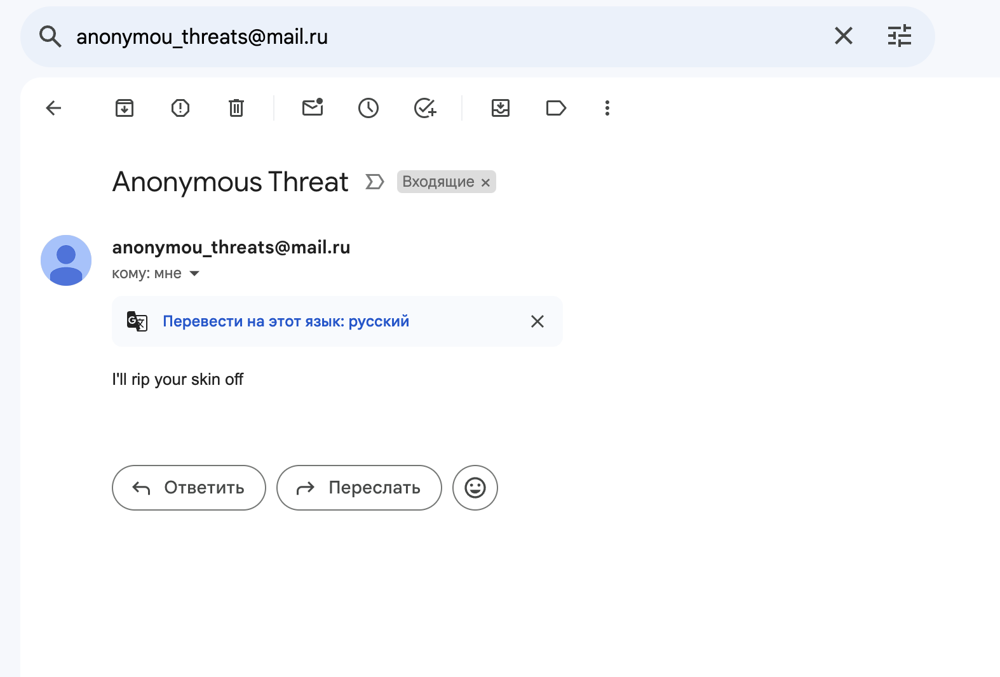

# Anonymous threats sender
The app is created to send threats via an anonymized email. The interaction with the app works via api:
* POST /api/receivers 
  **body:** {"alias": "threat-receiver-alias", "email": "threat-receiver-email"} 
  **description:** creates a receiver 
* POST /api/messages 
  **body:** {"alias": "threat-receiver-alias", "content": "your content"} 
  **description:** sends an anonimized threat to an existing receiver 

## Technologies
* Spring Boot

## Best pratices
* Configurations: the app can be configured with an application.properties file
* RESTful api: the api operates resources like message and receiver
* Containerisation: the app is run in a docker container that makes it portable 
* Dependencies: I used the most relevant versions of the dependencies to avoid possible security vulnerabilities 

## Testing 
I sent a sample email from an anonymous threat sender to my other email, and it worked as you can see below. The sender is very simple, so it was enough to test 100% of the functionality
