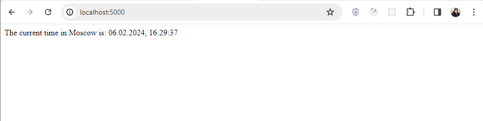
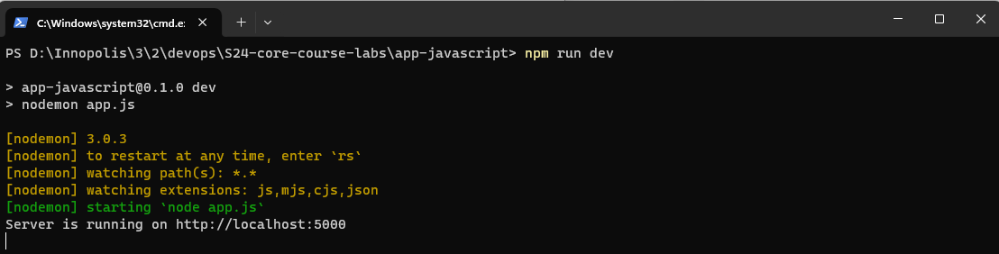

# Node.js Express Web Application

[](https://github.com/zeyadAjamy/S24-core-course-labs/actions/workflows/javascript-ci.yaml)

## Framework Choice: Express

For this Node.js web application, I chose Express as the web framework. Express is a fast, unopinionated, and minimalist web framework for Node.js, making it ideal for building lightweight and efficient web applications.

## Implementation Details: Check the README.md file

## Best Practices

1. **Code Comments:** The code includes comments to explain key functionalities, such as retrieving the current date and time in the specified timezone.

2. **Code Quality:** The code is concise and straightforward, focusing on the core functionality of displaying the current time in Moscow. However, additional comments and documentation could enhance readability and maintainability.

## How To Install and Test

To run the Node.js Express web application, follow these steps:

2. **Install Dependencies:**

   - Make sure you have Node.js installed on your system.
   - Install the required dependencies by running:
     ```
     npm install
     ```

3. **Run the Application:**

   - After installing dependencies, navigate to the directory containing the `app.js` file.
   - Run the following command to start the Express server:
     ```
     node app.js
     ```

4. **Test:**

   - Open a web browser and visit `http://localhost:5000/` to access the application.
   - You should see the current time in Moscow displayed on the webpage.
   - Refresh the browser tab to ensure the application continues to work as expected.

   
   

### Unit Test: Testing Current Time Format

#### Purpose:

- The `test_current_time_format` unit test ensures that the Express application endpoint `/` returns the current time in Moscow with the expected format `DD.MM.YYYY, HH:MM.SS`.

#### Test Setup:

- The test suite utilizes the `supertest` library to perform HTTP requests to the Express application.
- The Express application instance is imported from the `app.js` file to enable testing.

```javascript
const request = require("supertest");
const app = require("../app");
```

#### Test Function:

- The `GET /` test case sends a GET request to the `/` endpoint and verifies that the response contains the current time in the specified format.

```javascript
describe("GET /", () => {
  it("should return the current time in Moscow", async () => {
    const response = await request(app).get("/");
    expect(response.status).toBe(200);
    expect(response.text).toMatch(
      /The current time in Moscow is: \d{2}.\d{2}.\d{4}, \d{2}:\d{2}.\d{2}/gm
    );
  });
});
```

#### Best Practices Applied:

- **Asynchronous Testing**: Uses `async` and `await` to handle asynchronous operations, ensuring proper sequencing and error handling in test execution.
- **Assertion**: Asserts the expected behavior of the Express application, validating both the HTTP status code and the format of the response text.
- **Regular Expressions**: Employs a regular expression to verify that the response contains the current time in the expected format, enabling precise validation.
- **Separation of Concerns**: Defines the test case within a separate `describe` block, enhancing readability and organization of test suites.
