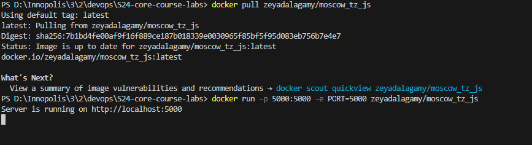
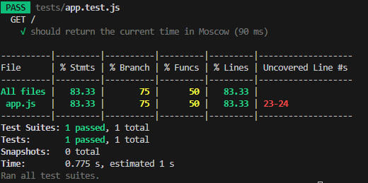

# Node.js Express Web Application Documentation

This documentation provides an overview of the Node.js web application built using Express.

[](https://github.com/zeyadAjamy/S24-core-course-labs/actions/workflows/javascript-ci.yaml)

## Overview

The web application displays the current time in Moscow. It utilizes the Express framework to create a simple web server in Node.js and the `toLocaleString` method to retrieve and format the current time.

## Code Structure

The application consists of a single JavaScript file:

- `app.js`: This file contains the main code for the Express web application. It imports the necessary modules, creates an Express application instance, and sets up a route to handle requests to the root URL (`/`). When a request is received at this route, the callback function is called to retrieve the current time in Moscow and return it as a response.

## Implementation Details

### Express Application Initialization

- The Express web application is initialized by importing the `express` module and creating an Express application instance using `express()`.

```javascript
const express = require("express");
const env = require("dotenv");

env.config();
const app = express();
```

### Define Route for Homepage

- The route `/` is defined using `app.get('/')`. This method specifies a callback function to be executed when a GET request is made to the root URL.

```javascript
app.get("/", (_, res) => {
  // Function implementation goes here
});
```

### Current Time Retrieval

- Inside the route handler function, the current time in Moscow is retrieved using the `toLocaleString` method with the Russian locale and the Europe/Moscow timezone.

```javascript
const now = new Date().toLocaleString("ru-RU", { timeZone: "Europe/Moscow" });
```

### Sending Response

- The retrieved current time in Moscow is sent as a response to the client using `res.send()`.

```javascript
res.send(`The current time in Moscow is: ${now}`);
```

### Running the Express Application

- The Express application is started and listens on the port specified in the environment variable `PORT`, or defaults to port 5000 if the environment variable is not set.

```javascript
const port = process.env.PORT ?? 5000;
app.listen(port, () => {
  console.log(`Server is running on http://localhost:${port}`);
});
```

## How To Install and Run

To run the Node.js Express web application, follow these steps:

1. **Install Node.js:**

   - Make sure you have Node.js installed on your system.

2. **Install Dependencies:**

   - Navigate to the directory containing the `app.js` file.
   - Install the required dependencies by running:
     ```
     npm install
     ```

3. **Run the Application:**

   - After installing dependencies, run the following command to start the Express server:
     ```
     node app.js
     ```

4. **Run:**

   - Open a web browser and visit `http://localhost:5000/` to access the application.
   - You should see the current time in Moscow displayed on the webpage.
   - Refresh the browser tab to ensure the application continues to work as expected.

   
   

## Docker

### Containerized Application

The application is containerized using Docker, ensuring portability and ease of deployment across different environments. Below are instructions for building, pulling, and running the Docker container.

### How to Build

To build the Docker image locally, follow these steps:

```bash
docker build -t zeyadalagamy/moscow_tz_js .
```

This command builds the Docker image based on the provided Dockerfile (`Dockerfile`) in the `app_javascript` directory and tags it with the name `moscow_tz_js`.

### How to Pull

If you prefer to pull the pre-built Docker image from a container registry instead of building it locally, you can use the following command:

```bash
docker pull zeyadalagamy/moscow_tz_js
```

### How to Run

Once you have either built the Docker image locally or pulled it from a registry, you can run the container using the following command:

```bash
docker run -p 5000:5000 -e PORT=5000 zeyadalagamy/moscow_tz_js
```



### Unit Tests

#### Testing Current Time Formatting

- We have a unit test named `app.test.js` which verifies that the current time retrieved by our application is correctly formatted in the expected format.

#### Running the Unit Tests

To run the unit tests for the JavaScript application, follow these steps:

1. **Navigate to the Application Directory:**

   - Open a terminal or command prompt.
   - Navigate to the directory where your JavaScript application (`app_javascript`) is located.

2. **Install Testing Dependencies (if not already installed):**

   - Ensure that the required testing dependencies are installed. You can install them using npm:

     ```
     npm install
     ```

3. **Run the Unit Tests:**

   - Run the following command to execute the unit tests:

     ```
     npm run test
     ```

   - This command will execute the tests defined in the `app.test.js` file within the `tests` directory.

4. **View Test Results:**

   - After running the tests, the test runner (such as Jest) will display the test results in the terminal. You should see information about the test cases executed and whether they passed or failed.


