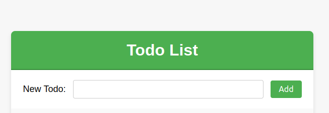

# ToDo List App

A simple ToDo List web application built with Node.js and Express.

## Setup

### Prerequisites

- Node.js installed on your machine
- npm (Node Package Manager)

### Installation

1. Clone the repository:

   ```bash
   git clone -b lab01 https://github.com/bruteforceboy/S24-core-course-labs/
2. Navigate to the project directory:
   ```bash 
   cd S24-core-course-labs/app_javascript/
3. Install dependencies:
   ```bash 
   npm install 
4. Run the application: 
   ```bash 
   node app.js
   ```
   
5. Running tests: 
   ```bash
   npm test 