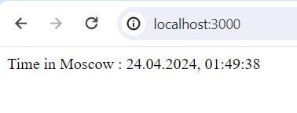
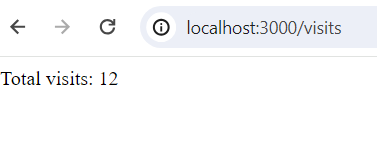

# Moscow Time Web Application

## Overview

The Moscow Time Web Application is a simple JavaScript-based web application that displays the current time in Moscow. It provides users with an easy and quick way to check the current time in the Moscow timezone. The app also shows the total number of times the page has been visited.

## Features

- Lightweight and minimalistic design for a seamless user experience.
- Responsive layout for compatibility across various devices and screen sizes.

## Framework and Technologies

The application is built using Javascript programming language and using express framework.

The decision to avoid additional frameworks was made to keep the application lightweight and easily understandable for developers of all experience levels.

## Installation and Usage

1. Clone or download the repository to your local machine.
2. Install Node.js on your system
3. Run the server using the command ```node app.js```
4. Open a web browser and visit `http://localhost:3000/` to access the application.
5. The web page will display the current time in Moscow.


## Docker Containerization

### Building the Docker Image

To build the Docker image locally, execute the following command in the root directory of the project:

```bash
docker build -t your_username/app_js .
```

Replace `your_username` with your Docker Hub username. This command will create a Docker image with the tag latest.

### Pulling the Docker Image

To pull the image from docker hub, you can use the following command:

```bash
docker pull your_username/app_js:latest
```

### Running the Docker Image
To run the Docker container and start the application, use the following command:

```bash
docker run -p 3000:3000 your_username/app_js:latest
```
<n><n>
Please note that you must have docker installed on your device to be able to run the previous commands.

## Continuous Integration (CI)

This project is configured with Continuous Integration (CI) using GitHub Actions. CI is a development practice that allows automatic testing and building of your codebase whenever changes are pushed to the repository. The CI workflow ensures that code changes are validated and can be easily integrated into the project without introducing issues.

The JavaScript CI workflow is triggered on each push to the repository. It performs the following steps:

1. **Build**: Sets up Node.js, installs dependencies, and runs tests to ensure the integrity of the JavaScript code.

2. **Docker Build and Push**: Builds a Docker image for the JavaScript app and pushes it to Docker Hub. This step ensures that the latest version of the app is available in a Docker container for deployment.

## Screenshots

