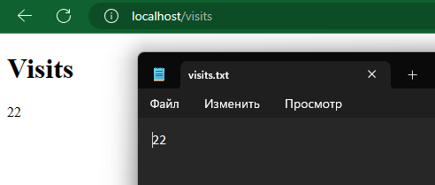

# Kotlin Web Application

A Web Application that displays current time in Moscow based on NTP Pool service (since the system may have incorrect time set)

## Installation and Running

```bash
./gradlew build # build
./gradlew run # run
./gradlew test # test
```

If everything goes well, you will see startup logs with message`Application - Responding at http://127.0.0.1:8000`. You can now see html page with moscow time at `localhost:8000`

## Docker

### How to build

```bash
cd app_kotlin
docker build -t tufra/moscow-time-app-kotlin .
```

### How to pull

```bash
docker image pull tufra/moscow-time-app-kotlin:0.0.1
```

### How to run

```bash
docker run -p 80:8080 -t tufra/moscow-time-app-kotlin:0.0.1
```

Now you can see moscow time at `localhost`

## Unit tests

### Test cases

- `get("/")` returns `200` code
- `get("/")` and `get("/")` after 2 seconds return different bodies

### How to run

```bash
cd app_kotlin
./gradlew test
```

## CI

Repository has a workflow `build_kotlin` with 2 jobs:

- `build`
    - `Setup Gradle`
    - `Make gradlew executable`
    - `Run build with Gradle Wrapper`
    - `Lint with Spotless`
    - `Test with kotlin.test`
    - `Snyk test`
- `docker`
    - `Login to Docker Hub` (using `docker/login-action@v3` and repository secrets)
    - `Set up Docker Buildx` (using `docker/setup-buildx-action@v3`)
    - `Build and push` (using `docker/build-push-action@v5` and repository secrets)

## Persistent data

The application stores number of requests in `/app/visits.txt`. In compose file `visits.txt` is mounted to `/app/visits.txt`.


