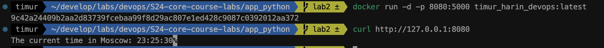
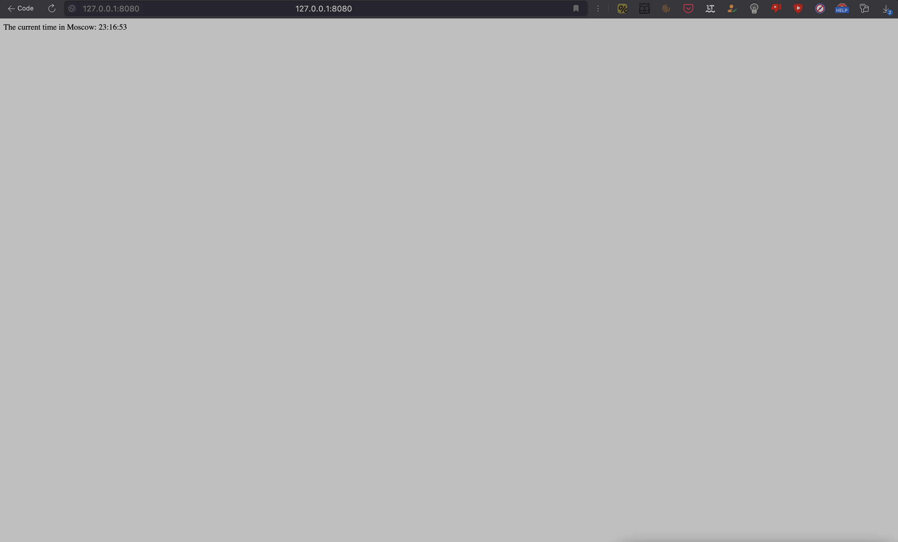
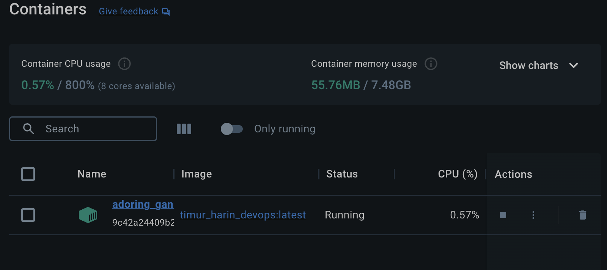

# Docker Best Practices

1. **Use a Base Image Wisely**: Starting from a Python base image (`FROM python:3.11-slim-buster`) is a common practice, providing a clean environment for Python applications. The slim variant ensures a smaller image size, contributing to a lightweight final image.

2. **Copying Source Code**: Using `COPY . /app_python` ensures that all necessary application files are copied into the container. This approach allows Docker to cache dependencies separately, improving build performance.

3. **Setting Working Directory**: `WORKDIR /app_python` sets the working directory for subsequent commands, simplifying commands that operate on the application files.

4. **User Management**: Creating a non-root user (`nonroot`) and setting ownership of the application directory to this user (`chown -R nonroot /app_python`) enhances security by minimizing the impact of potential security vulnerabilities.

5. **Health Checks**: While health checks are essential, they are not implemented directly in the provided Dockerfile. Consider adding a health check (`HEALTHCHECK`) command to monitor the health of the application, ensuring Docker can verify its responsiveness.

6. **Dependency Installation**: Installing dependencies (`poetry install --no-cache`) separately from the application code helps leverage Docker's layer caching mechanism, improving build efficiency. Poetry is used here as the package manager.

7. **Entry Point Definition**: Specifying an entry point (`CMD ["poetry", "run", "python", "app.py"]`) provides a default command to execute when the container starts. This allows for easy configuration and overrides when running the container.

8. **Ignore Unnecessary Files**: While not explicitly mentioned in the Dockerfile, it's essential to have a `.dockerignore` file to specify files and directories that should not be copied into the Docker image. This helps reduce the size of the final image and avoids including unnecessary files like development artifacts, temporary files, or sensitive data.

## Images

DockerHub link https://hub.docker.com/repository/docker/timurharin/devops/general

