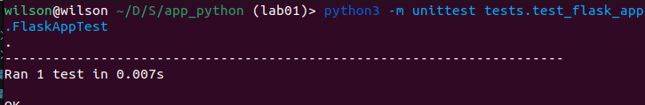

# Framework Justification:
The project was developed using Python's Flask framework because it is lightweight and easy to work with.

# Best Practices and Coding Standards:

## Modular Structure:

- The application is organized with a modular structure, promoting clarity and ease of maintenance.
- Key components are separated into distinct folders: `app` for main logic, `static` for static files, and `tests` for testing purposes.

## Separation of Concerns:

- The Flask framework is used to maintain a clear separation of concerns within the application.
- Route definitions are in `routes.py` within the `app` folder, contributing to code readability and maintainability.

## Version Control:

- A well-crafted `.gitignore` file demonstrates adherence to version control best practices.
- Helps manage versioned files and directories efficiently.

## Requirements file:

- The `requirements.txt` file specifies the essential packages required for the app, streamlining the installation process.

## Documentation:

- A comprehensive `README.md` that contains instructions on running the project.
- The `README.md` also contains images. 

# Testing and Code Quality:

## Unit Testing:

- Unit tests, in the `tests` folder and specifically in `test_flask_app.py`.
- Ensures proper functionality.
\

## Testing Structure:

- The testing folder maintains consistency with an `__init__.py`, signaling a Python package, and a dedicated test file.
- This organized structure enhances the maintainability and scalability of the testing suite.

## DocStrings: 
- Code is complemented by descriptive docstrings, enhancing readability and providing clear documentation for each component.

## Code Quality:

- Code quality is upheld through the use of a linter and strict adherence to PEP 8 style guidelines.
- The absence of linting errors and warnings in the provided structure attests to a commitment to maintaining high code quality standards.