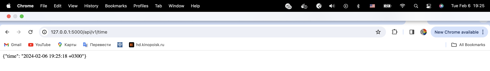
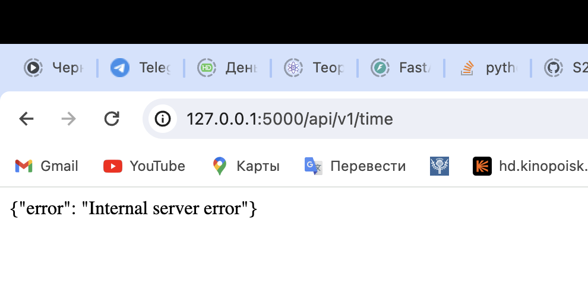

# Datetime app 

## Technologies 
* Flask (was used because it is very simple and lightweight python framework that nicely incapsulates HTTP web server logic and quite easy to set up)

## Best pratices
* Configurations: the app is highly configurable. Via `.env` file you can set timezone, datatime format, and app port number
* Documentation: the app contains comments documenting the code
* RESTful api: the app has a restful api in which we have a resource called time 
* Versions: the api path contains a version number, so it will be easy to develop a new one keeping the original for the backward compatibility 
* Dependencies: I used the most relevant versions of the dependencies to avoid possible security vulnerabilities 

## Testing and code quality 
* to maintain the code quality I used linters embedded in the code editor fixing all its remarks 
* I tested the application manually refreshing the page and getting correct time values

* I also tested its stability against misconfiguration. In particular I set timezone to an invalid value and the app returned me an expected error message
