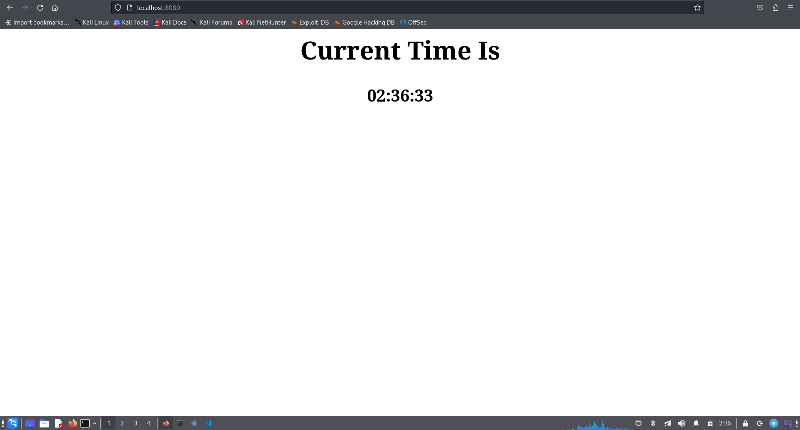
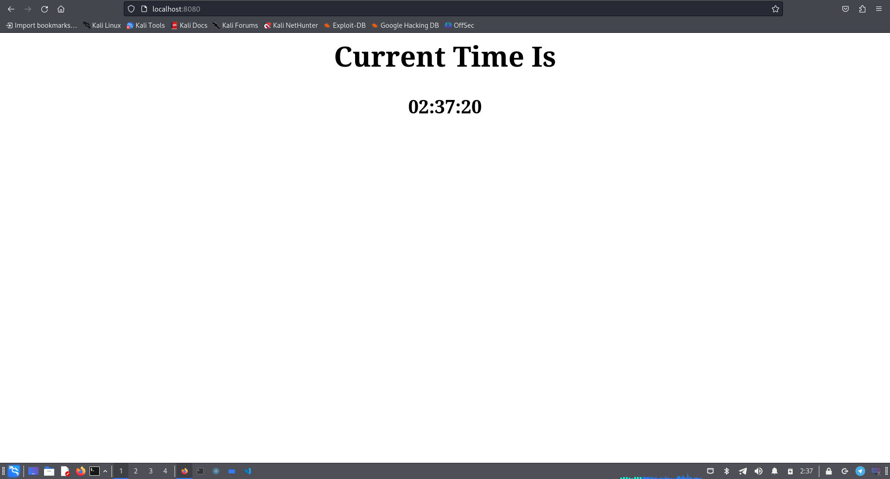

# Time Table app development

## Development

I've decided to run simple web server using [FastAPI](https://fastapi.tiangolo.com/) framework.
It's pretty easy and fast framework for simple web applications.

## Quality

In order to ensure code quality:

- I used [RuFF](https://docs.astral.sh/ruff/) exstension and integrated `RuFF Github Action` into github repository. RuFF will ensure, that code is written according to [PEP8](https://peps.python.org/pep-0008/) standart.

For readability:

- The code were written in the most consise way with proper naming conventions.
- It was properly commented according to [PEP257](https://peps.python.org/pep-0257/) standart.

## Testing

As a result, application shows time on every page refresh:





## Unit Tests

I've integrated two unit tests:

`test_root()` checks, whether root path returns a result:
```python
def test_root():
    response: HTMLResponse = client.get("/")
    assert response.status_code == 200
```

`test_time()` check if the time path retruns a valid time:
```python
def test_time():
    response = client.get("/time")
    assert response.status_code == 200
    data = response.json()
    assert 'time' in data.keys(), "No time field"
    assert re.match(r'[0-2][0-9]:[0-5][0-9]:[0-5][0-9]', data['time']), "Invalid time format"
```
## CI

