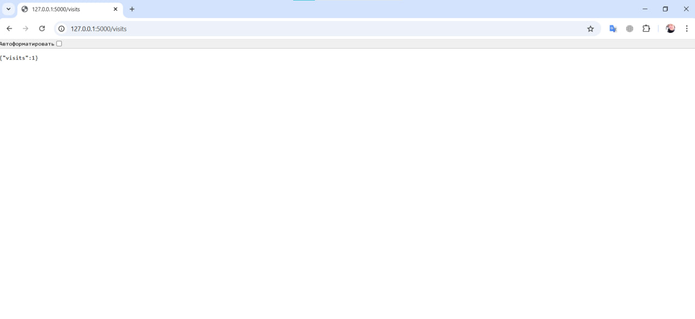

# Moscow Time Web Application
[](https://github.com/ErnestMatskevich/Matskevich/actions/workflows/ci.yml)
## Overview

This web application, built using Flask, displays the current Moscow time on a webpage. It utilizes HTML templates for rendering and dynamically updates the time using JavaScript.

## Table of Contents

- [Getting Started](#getting-started)
- [Installation](#installation)
- [Project Structure](#project-structure)
- [Usage](#usage)
- [Running Tests](#running-tests)
- [Technologies Used](#technologies-used)

## Getting Started

### Prerequisites

- Python 3.x
- Pip (Python package installer)
- Docker

### Installation


1. Install dependencies:

    ```bash
    pip install -r requirements.txt
    ```
   
## Docker Container

### How to Build the Docker Image

1. Navigate to the `app_python` folder:

    ```bash
    cd moscow-time-web-app/app_python
    ```

2. Build the Docker image:

    ```bash
    docker build -t moscow-time:latest .
    ```
### How to Run the Docker Container

1.  Run the Docker container:
    
    ```bash 
    `docker run -p 5000:5000 moscow-time:latest`
    
2.  Open your web browser and navigate to [http://localhost:5000/](http://localhost:5000/) to view the current Moscow time.
   
3.  Open [http://localhost:5000/visits](http://localhost:5000/visits) to view how many times web application was visited.

Example of visits page:

## Project Structure

```plaintext
app_python/
|-- application.py
|-- Docker.md
|-- Dockerfile
|-- test_app.py
|-- static/
|   `-- moscow.jpg
`-- templates/
    `-- current_time.html
```
*   **application.py:** Main application file containing Flask code.
*   **test\_application.py:** Test file ensuring the correctness of the application's functionality.
*   **static/:** Directory for static files, such as images.
*   **templates/:** Directory for storing HTML templates.

Usage
-----

To run the web application, execute the following command:


`python application.py`

Visit `http://127.0.0.1:5000/` in your web browser.

Running Tests
-------------

To run tests, execute the following command:

The following tests were implemented in `test_app.py` to check the correct operation of the application:

- **`test_current_time_displayed`**: Checks that the main route (`'/'`) returns a `200` response code, uses the correct `current_time.html` template, and displays the current Moscow time in the template context.

- **`test_main_page_status_code`**: Verifies that the request to the main page returns a `200 OK` status code, ensuring that the route is available and responding correctly.

- **`test_content_contains_current_time_text`**: Verifies that the content of the main page displays the text "Current Moscow Time" (or other specified text), confirming that the page has the expected content.

`python test_application.py`

Technologies Used
-----------------

*   Flask
*   Jinja2
*   HTML

## Continuous Integration

This project includes a CI pipeline set up using GitHub Actions. The workflow, defined in `.github/workflows/ci.yml`, performs the following steps:

- **Install dependencies**: Installs required packages.
- **Linting**: Checks code style and formatting using `flake8`.
- **Testing**: Runs unit tests using `unittest`.
- **Docker Build**: Builds a Docker image locally to validate the Dockerfile.

The workflow runs on each push or pull request to the `main` branch.


