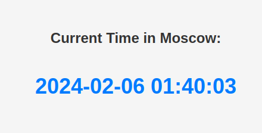

# Python Web Application - Moscow Time

## Overview

This Python web application displays the current time in Moscow. 

- `app`: Contains the Flask application and routes.
- `static`: Holds static files such as CSS.
- `tests`: Includes unit tests for the Flask application.
- `templates`: Contains HTML templates for rendering.

## How to Run the Program

1. **Install Dependencies:**

   Ensure you have Python installed on your machine. You can install project dependencies using the following command:
   ```bash
   pip install -r requirements.txt
2. **Running the Flask Application:** 

	Navigate to `/app_python` and execute the following commands:
   ```bash
   export FLASK_APP=app.routes	
   export FLASK_ENV=development
   flask run
   ```
   Can be displayed by visiting [localhost:5000](127.0.0.1/5000)
   \
   

3. **Running Unit Tests:**

	Navigate to `/app_python` and execute the following command:
   ```bash
	python3 -m unittest tests.test_flask_app.FlaskAppTest