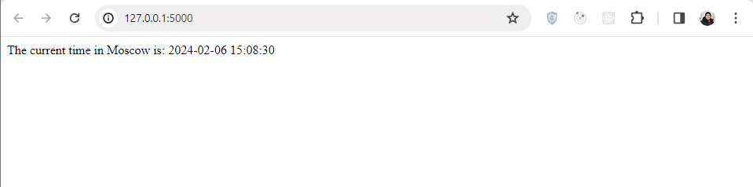

# Python Web Application Documentation

This documentation provides an overview of the Python web application built using Flask.

[](https://github.com/zeyadAjamy/S24-core-course-labs/actions/workflows/python-ci.yaml)

## Overview

The web application displays the current time in Moscow. It utilizes the Flask web framework to create a simple web server and the `datetime` and `pytz` modules to retrieve and format the current time.

## Code Structure

The application consists of a single Python script:

- `app.py`: This script contains the main code for the Flask web application. It imports the necessary modules, defines the Flask application instance, and sets up a route to handle requests to the root URL (`/`). When a request is received at this route, the `current_time` function is called to retrieve the current time in Moscow and return it as a response.

## Implementation Details

### Flask Application Creation

- The Flask web application is created by instantiating the `Flask` class from the `flask` module. This class represents the Flask application and provides methods for handling routes, requests, and responses.

```python
from flask import Flask

app = Flask(__name__)
```

### Define Route for Homepage

- The route `/` is defined using the `@app.route('/')` decorator. This decorator binds the URL `/` to the current_time function, specifying that the function should be called when a request is made to the root URL.

```python
@app.route('/')
def current_time():
    # Function implementation goes here
    pass
```

### Current Time Retrieval Function

- The `current_time` function is responsible for retrieving the current time in Moscow and formatting it as a string with the format `YYYY-MM-DD HH:MM:SS`. This function combines the usage of `datetime.now()` to get the current time and `pytz.timezone('Europe/Moscow')` to convert it to the Moscow timezone.

```python
from datetime import datetime
import pytz

def current_time():
    moscow_time = datetime.now(pytz.timezone('Europe/Moscow')).strftime('%Y-%m-%d %H:%M:%S')
    return moscow_time
```

### Running the Flask Application

- When the script is executed directly (`__name__ == '__main__'`), the Flask application is run using the `app.run()` method, which starts the development server.

```python
if __name__ == '__main__':
    app.run()
```

## How To Install and Run

To run the Flask web application, follow these steps:

1. **Create a Virtual Environment:**

   - It's recommended to use a virtual environment to isolate project dependencies. Create a new virtual environment by running:

     ```
     python -m venv venv
     ```

   - Activate the virtual environment:

     - On Windows:

       ```
       venv\Scripts\activate
       ```

     - On macOS/Linux:

       ```
       source venv/bin/activate
       ```

2. **Install Dependencies:**

   - Once the virtual environment is activated, install the required dependencies by running:
     ```
     pip install -r requirements.txt
     ```

3. **Run the Application:**

   - After installing dependencies, navigate to the directory containing the `app.py` file.
   - Run the following command to start the Flask development server:

     ```
     python app.py
     ```

   - Open a web browser and visit `http://127.0.0.1:5000/` to access the application.
   - You should see the current time in Moscow displayed on the webpage.
   - Refresh the browser tab and still works :)

   
   

### Unit Tests

#### Testing Current Time Formatting

- We have a unit test named `test_current_time_format` which verifies that the current time retrieved by our application is correctly formatted in the expected format (`YYYY-MM-DD HH:MM:SS`).

#### Running the Unit Tests

To run the unit tests for the Python web application, follow these steps:

1. **Navigate to the Application Directory:**

   - Open a terminal or command prompt.
   - Navigate to the directory where your Python web application (`app_python`) is located.

2. **Activate Virtual Environment (if applicable):**

   - If you are using a virtual environment, activate it using the appropriate command for your operating system.

3. **Install Testing Dependencies (if not already installed):**

   - Ensure that the required testing dependencies are installed. You can install them using pip:

     ```
     pip install pytest
     ```

4. **Run the Unit Tests:**

   - Run the following command to execute the unit tests:

     ```
     pytest
     ```

   - This command will discover and run all test cases within the `tests` directory.

5. **View Test Results:**

   - After running the tests, pytest will display the test results in the terminal. You should see information about the test cases executed and whether they passed or failed.


