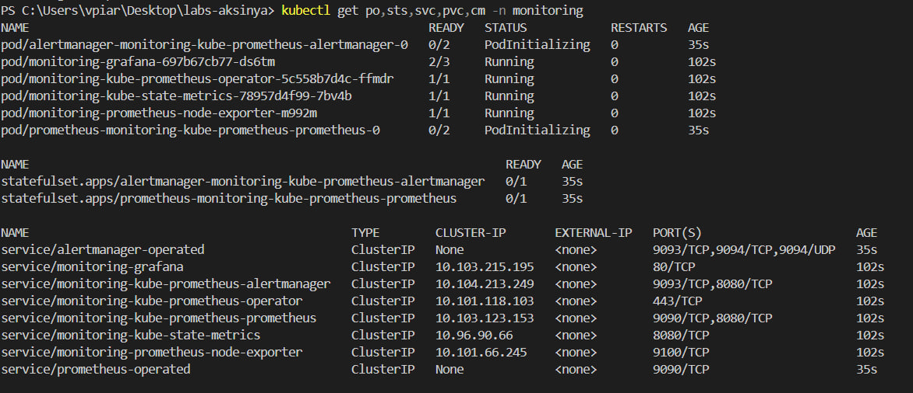
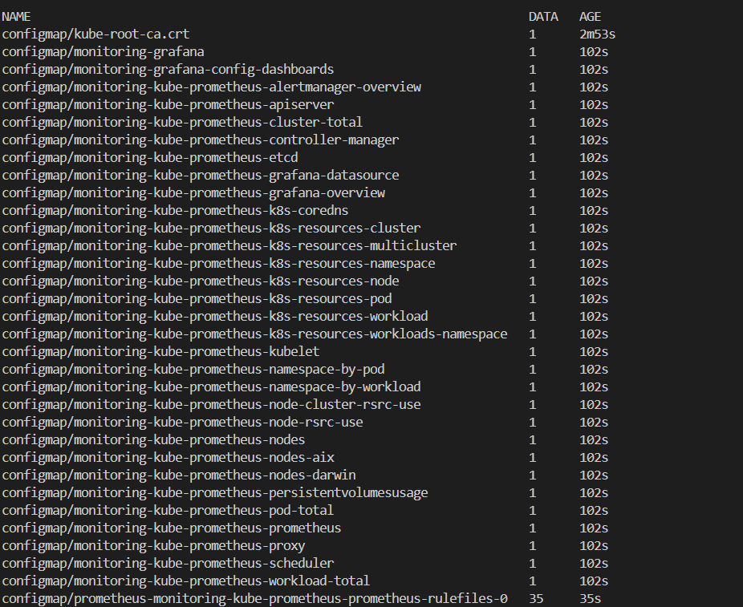
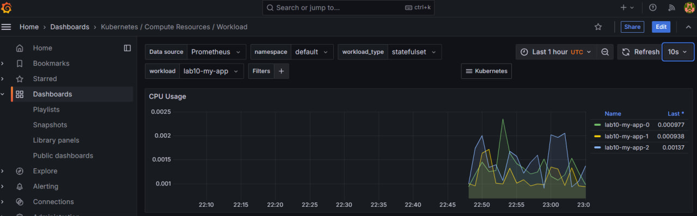
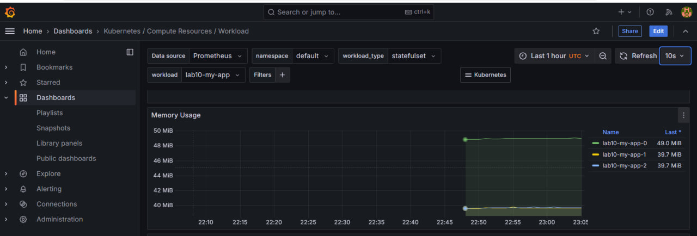
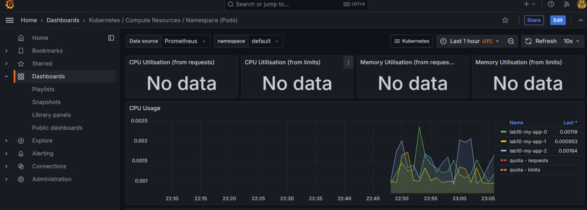
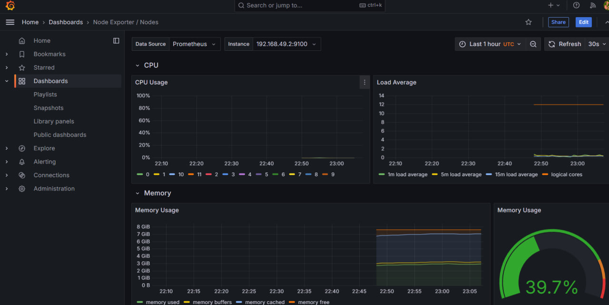
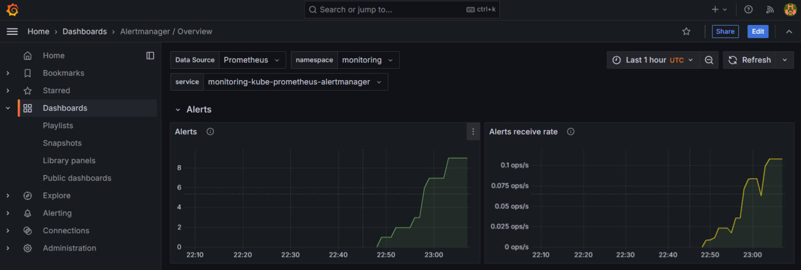
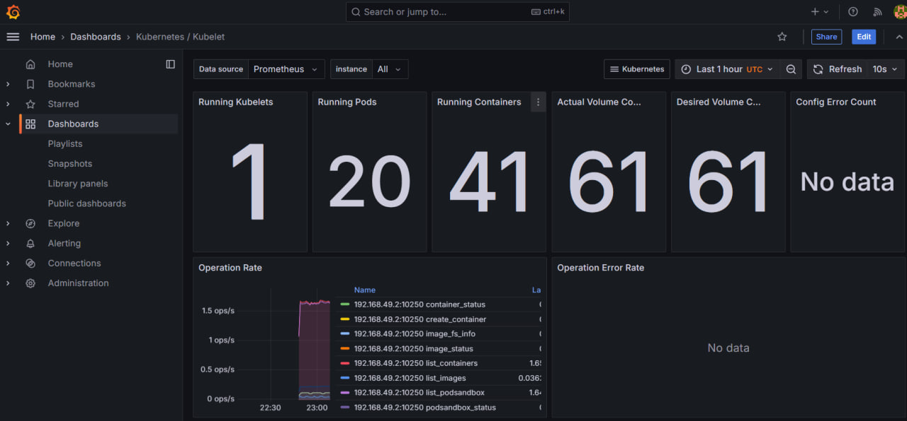
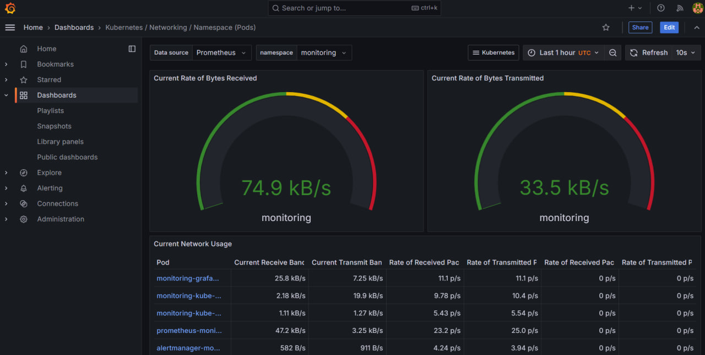

## Components of Kube Prometheus Stack

### 1. Prometheus
Prometheus is a powerful monitoring and alerting toolkit specifically designed for containerized environments like Kubernetes.
### 2. Alertmanager
Alertmanager is responsible for handling alerts generated by Prometheus.
### 3. Grafana
Grafana is a visualization tool that provides rich, customizable dashboards for data collected by Prometheus.
### 4. Node Exporter
Node Exporter is a lightweight exporter for exposing hardware and OS-level metrics from nodes.
### 5. Kube State Metrics
Kube State Metrics is a metrics exporter that focuses on the state of Kubernetes resources.
### 6. Prometheus Operator
The Prometheus Operator simplifies the management of Prometheus instances within Kubernetes.
### 7. Default Dashboards
The Kube Prometheus Stack includes pre-configured Grafana dashboards for monitoring Kubernetes clusters.
## Output of `kubectl get po,sts,svc,pvc,cm`

## Grafana

