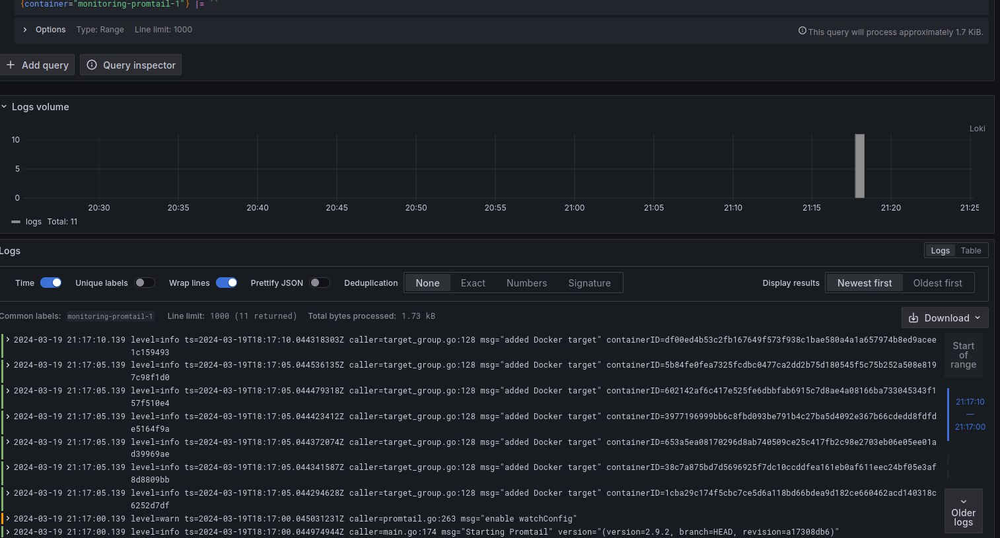
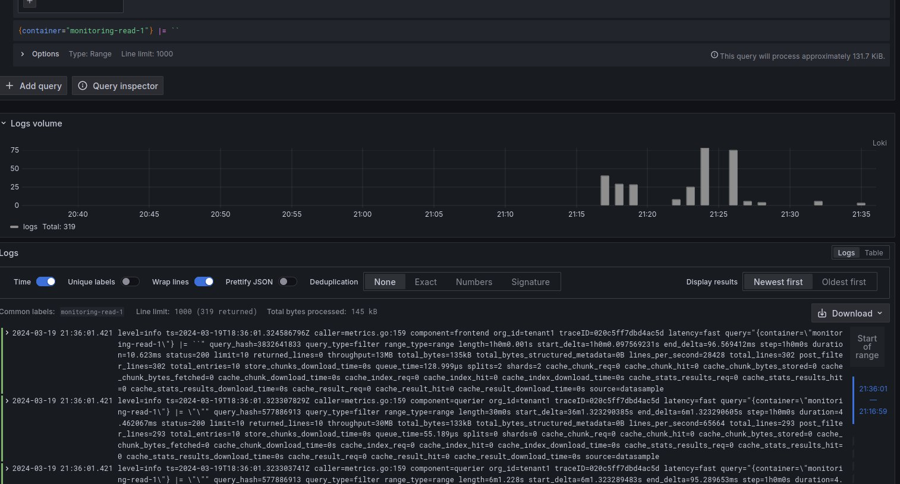
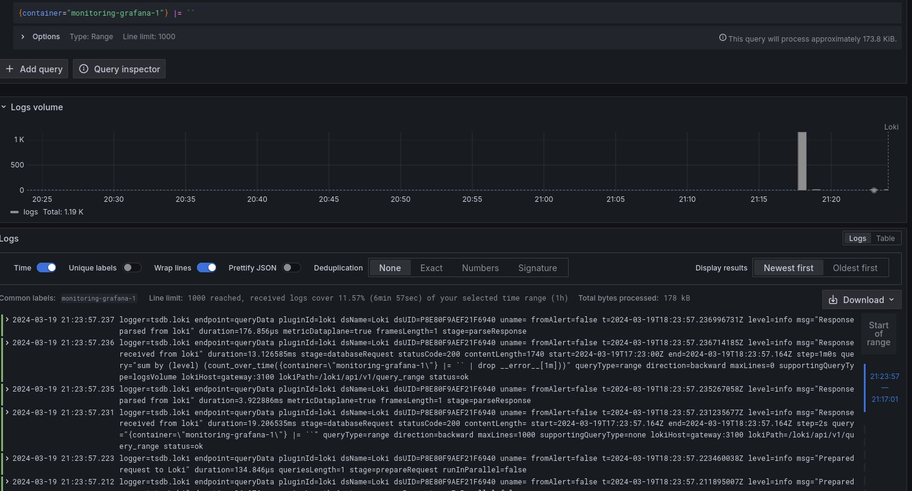

## Logging and monitoring

The logging stack consists of tools that used to capture, aggregate and visualize logs.

### Promtail 
Scrapping logs from docker containers and forwarding them to Loki. The configuration is in `promtail-local-config.yaml`.

**Logs**

### Loki
Aggregate the logs.

### Grafana
Visualize the logs.
