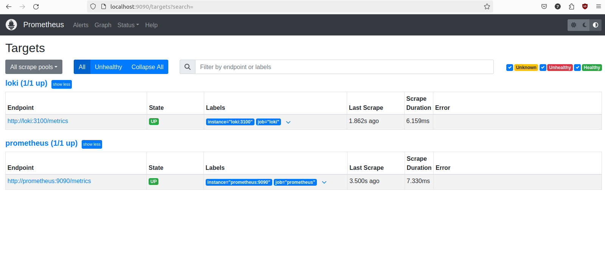

## Metrics

`docker-compose.yaml` is updated to include prometheus, `prometheus.yml` is added to allow track metrics from targets: loki and prometheus itself.

I updated `app_python/app.py` with new entry point to be able to obtain metrics. I is accesseble via `/metrics` and allow to track number of requests and up time.
The prometheus config is updated accordingly to track also graphana, promtail and app_python blocks.  
