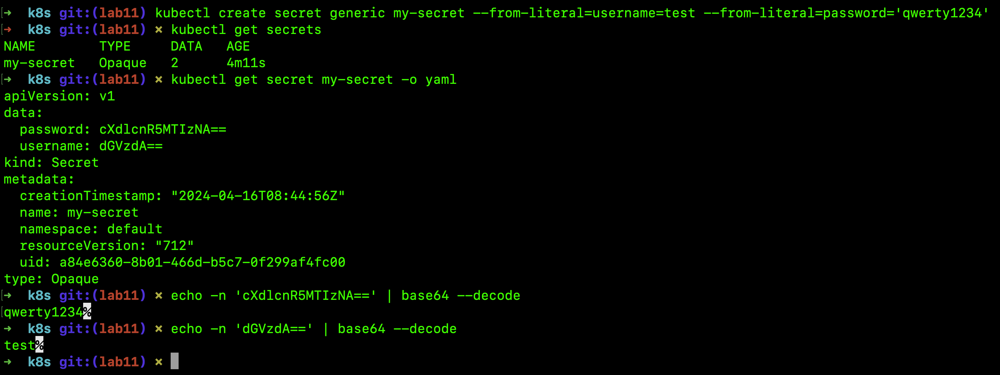
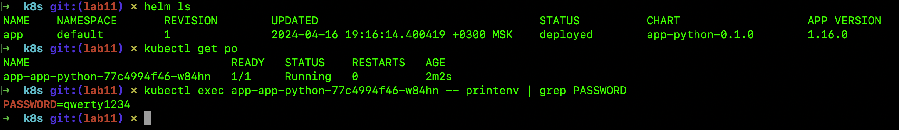
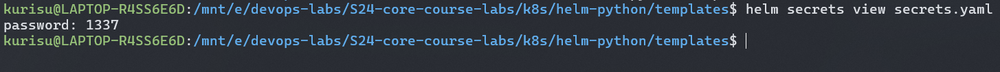
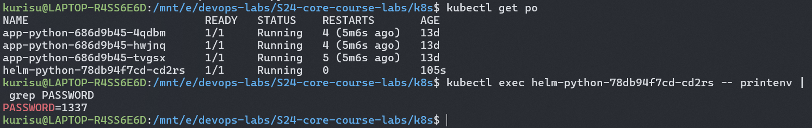
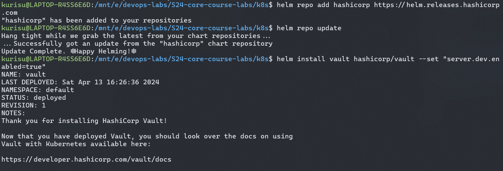
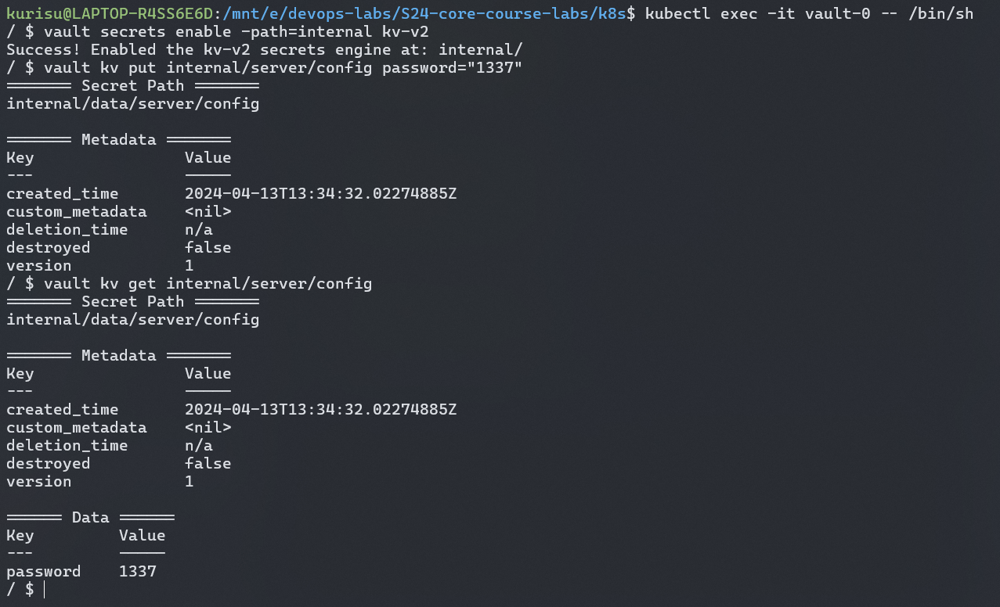
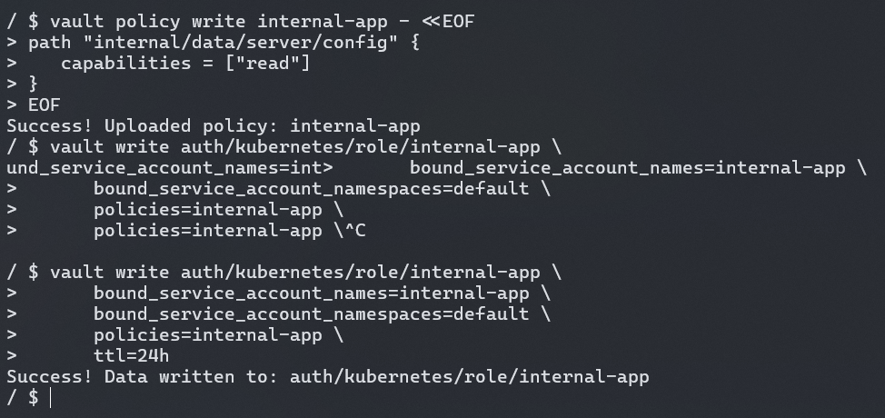
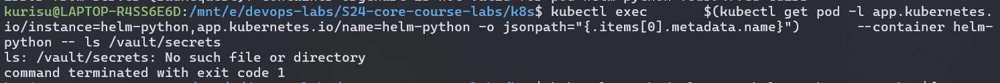
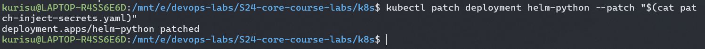
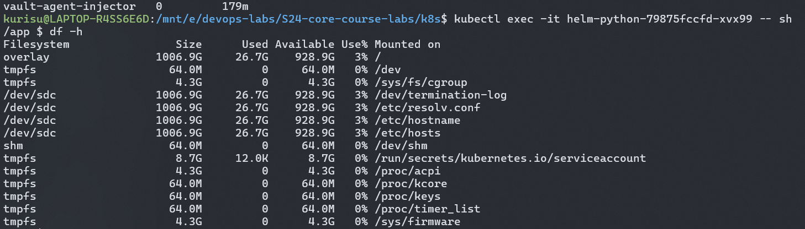

## Task 1

### Kubernetes Secrets
1. Created secret

2. View and decode secret

### Helm Secrets
1. View secrets added with helm-secrets plugin

2. Retrieve secret after adding it to container env

## Task 2
1. Add and install Hashicorp Vault

2. Set a Secret in Vault

3. Configure Kubernetes Authentication

4. Inject secrets and patch deployment

