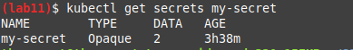

# Secrets

## First task

- Creating the secret:

    To create username and password secrets I used:

    ```properties
    kubectl create secret generic my-secret --from-literal=username=ahmad --from-literal=password='abc123'
    ```

- Verify the secret:

    I used the commands: `kubectl get secrets` and `kubectl get secret my-secret -o yaml`


    
    

- Helm:

    Running `kubectl get po`, and `kubectl exec helm-hooks-web-app-5d9df7f698-r8tdf -- printenv | grep  PASSWORD`

    
    

## Second task

Needed a vpn :(