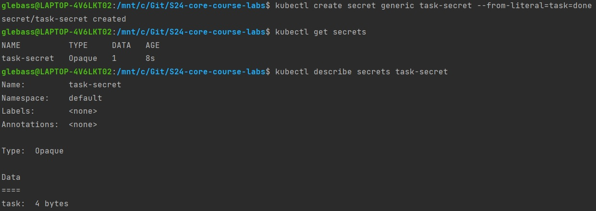
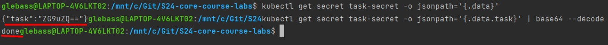
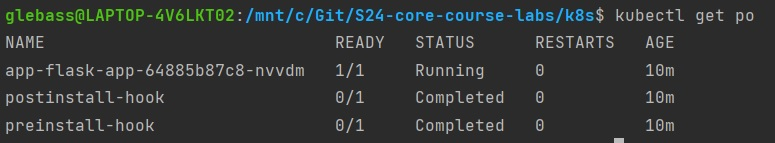
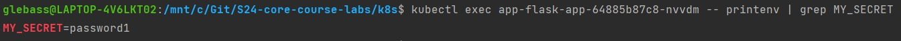
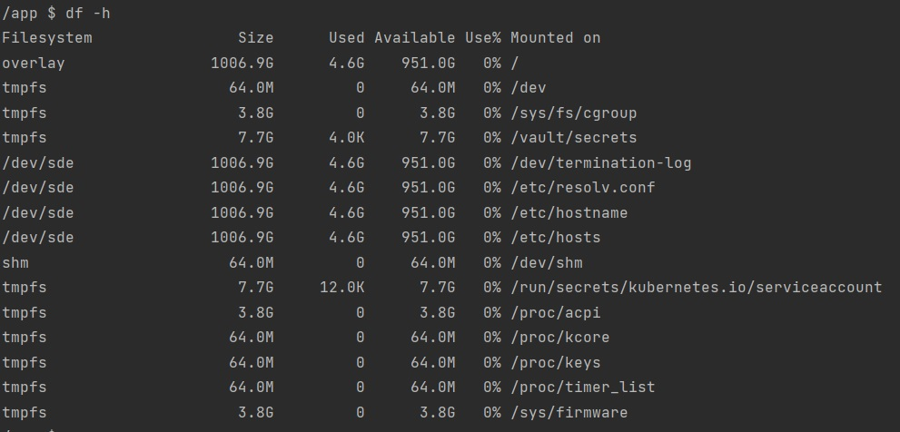
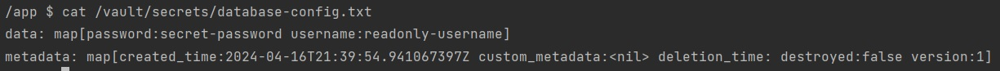

# Task 1.2
## Secret Creation

## Secret Decoding

# Task 1.3
## `kubectl get po`

## `kubectl exec my_pod -- printenv | grep MY_SECRET` 

# Task 2.3
## `df -h`

## `cat /vault/secrets/database-config.txt`

