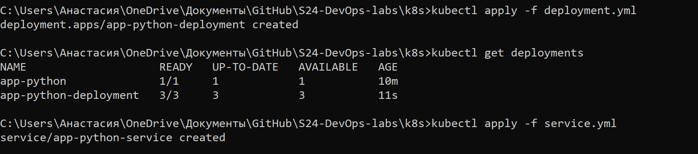
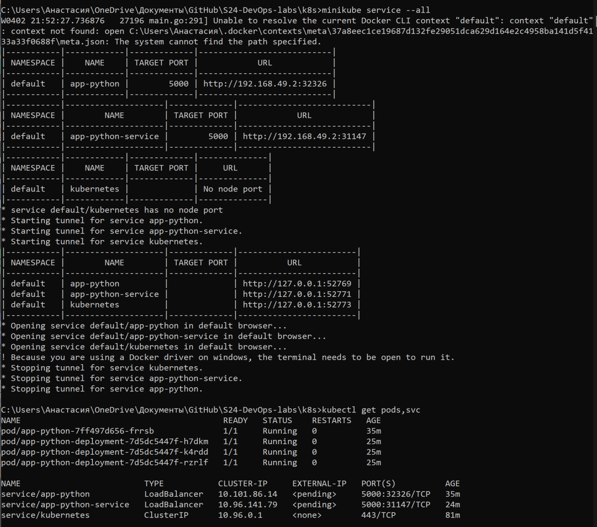

# Secrets

## First task

- Creating the secret:

    To create username and password secrets I used:
    
    ```properties
    kubectl create secret generic my-secret --from-literal=username=ahmad --from-literal=password='abc123'
    ```

- Verify the secret:

    I used the commands: `kubectl get secrets` and `kubectl get secret my-secret -o yaml`


    

- Helm:

    Running `kubectl get po`, and `kubectl exec app-web-app-575b5b9879-tztsc    -- printenv | grep  PASSWORD`

    