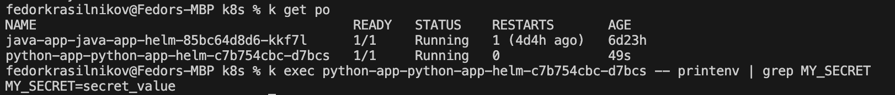
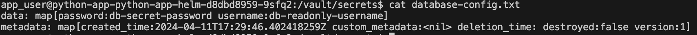
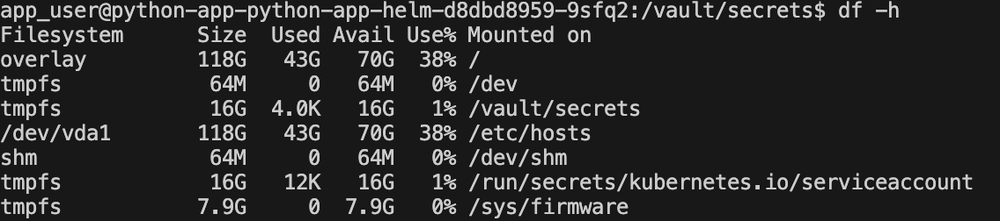
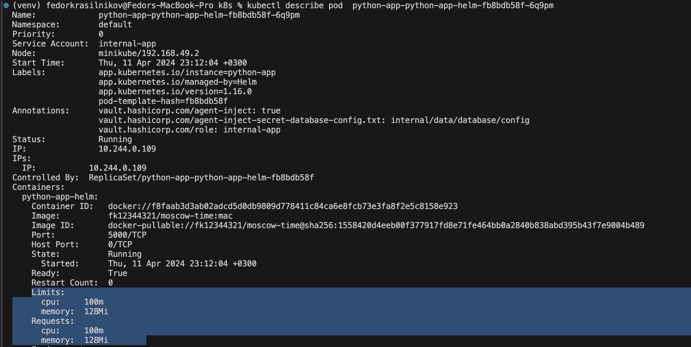
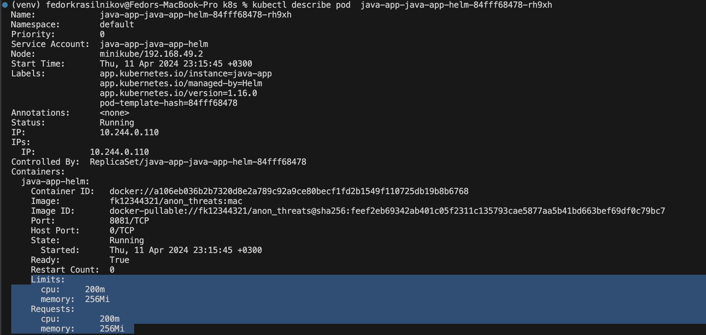
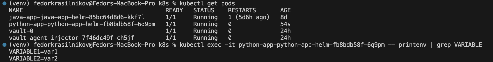

## Secrets 

I creted the secret with `kubectl create secret generic my-secret --from-literal=secret_key=secret_value` 

And then I decoded it and here is the output: 
```
(venv) fedorkrasilnikov@Fedors-MBP S24-core-course-labs % kubectl get secret  my-secret -o json | jq -r '.data | map_values(@base64d)' 
{
  "secret_key": "secret_value"
}
```

Here is the screenshot that proves that the secret penetrated into the environment variables of the container


## Vault

Results of `cat /path/to/your/secret`


Results of `df -h`


## Bonus 

Here are the limits of the python app 


Here are the limits of the java app 


And here are the variables of the python container defined via the named templates 
