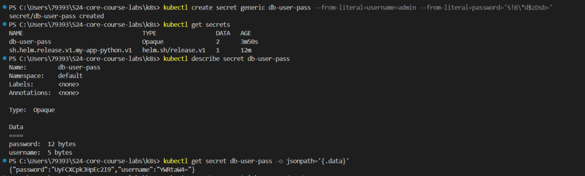
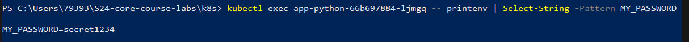
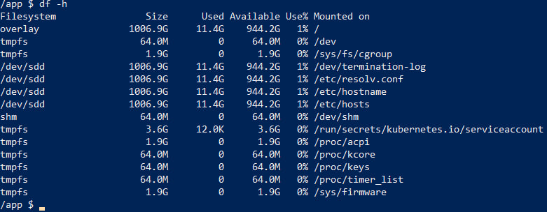

# 11 md

## Outputs for commands while creating the secret using kubectl (task 1, point 2)

`[System.Text.Encoding]::UTF8.GetString([System.Convert]::FromBase64String('UyFCXCpkJHpEc2I9'))`

Output: `S!B\*d$zDsb=`

## Outputs while creating the secret using helm  

`kubectl get po`

`kubectl exec app-python-66b697884-ljmgq -- printenv | Select-String -Pattern MY_PASSWORD`

## Vault

`kubectl exec -it app-python-f89754554-lf8px -- /bin/sh`

`/app $ cat /vault/secrets/app-python-secret.txt`

Output: `data: map[data:secret]`
`metadata: map[created_time:2024-04-16T21:32:27.378729844Z custom_metadata:<nil> deletion_time: destroyed:false version:1]`

Output of `df -h`:

