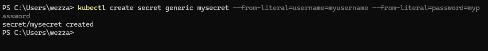
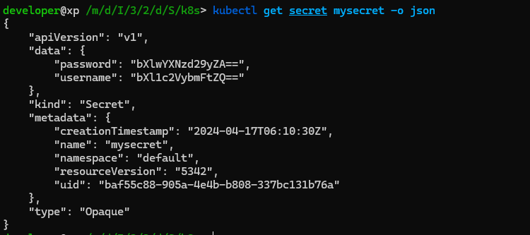
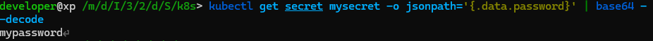
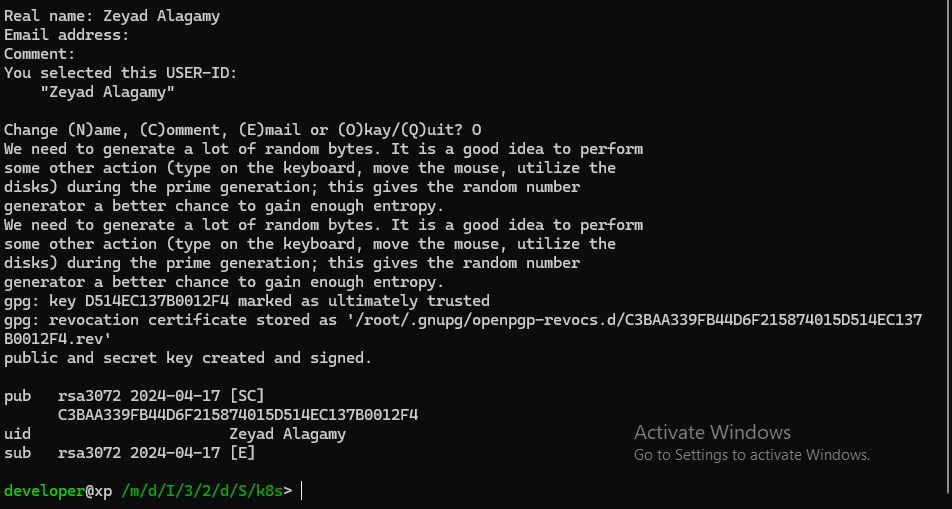
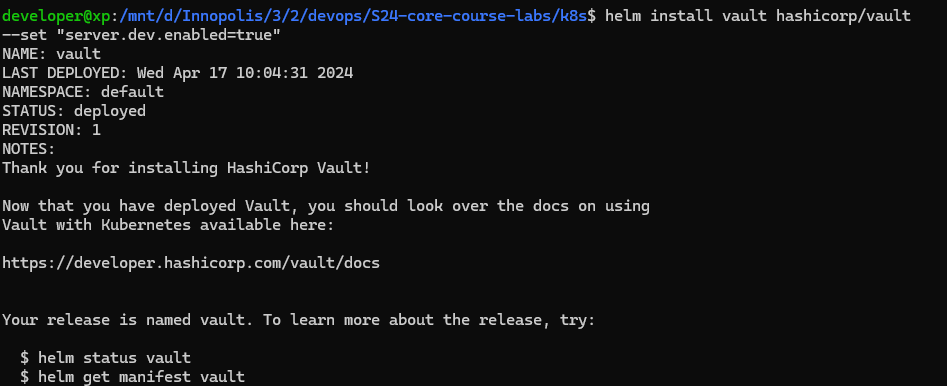
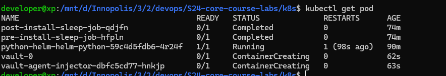

# Secrets and K8s

## Task 1

1. Create and verify a secret.

1.1 Create a secret with the name `mysecret` with the key `password` and value `mypassword`.

```bash
kubectl create secret generic mysecret --from-literal=username=myusername --from-literal=password=mypassword
```



1.2 Get the secret and decode the password.

```bash
kubectl get secret mysecret -o json
```



1.3 Describe the secret.

```bash
kubectl describe secret mysecret
```


1.4 Decode the secret.

- The secret is encoded in base64, so we need to decode it.

For Linux:

```bash
kubectl get secret mysecret -o jsonpath='{.data.password}' | base64 --decode
```



2. Manage secrets with Helm.

2.1 Install Helm secrets plugin.

```bash
helm plugin install https://github.com/jkroepke/helm-secrets
helm secrets patch windows
helm secrets upgrade name . -f secrets.yaml
```

2.2 Create a `secrets.yaml` file in the `templates` folder.

```yaml
apiVersion: v1
kind: Secret
metadata:
  name: credentials
  labels:
    app: python-app-helm
    chart: "{{ .Chart.Name }}-{{ .Chart.Version }}"
    release: "{{ .Release.Name }}"
    heritage: "{{ .Release.Service }}"
type: Opaque
data:
  password: { { .Values.password | quote } }
```

2.3 Create a main `secrets.yaml`

```yaml
apiVersion: v1
kind: Secret
metadata:
  name: mysecret
type: Opaque
data:
  password: bXlwYXNzd29yZA==
```

2.4 Encrypt the secret.

2.4.1 Create a key pair.

```bash
gpg --full-generate-key
```



2.4.2 Encrypt the secret using the public key.

```bash
sudo sops -p "C3BAA339FB44D6F215874015D514EC137B0012F4" -e secrets-raw.yaml > secrets.yaml

rm secrets-raw.yaml
```


2.5 Deploy the Helm chart with the encrypted secret

```bash
helm secrets install app-python-helm ./app-python-helm/ -n default -f ./secrets.yaml
```

2.6 Verify the secret inside the pod.

```bash
kubectl exec app-python-helm-0 -- printenv | grep MY_PASSWORD
```

```bash
MY_PASSWORD=mypassword
```

## Task 2

1. Install Vault Using Helm Chart:

```bash
helm repo add hashicorp https://helm.releases.hashicorp.com
helm repo update
helm install vault hashicorp/vault --set "server.dev.enabled=true"
```



2. Follow the Tutorial with Your Helm Chart:

2.1 Access the Vault pod.

```bash
kubectl exec -it vault-0 -- /bin/sh
```

2.2 Get the pods

```bash
kubectl get pod
```


2.3 Set Secret in Vault.

```bash
>$ kubectl exec -it vault-0 -- /bin/sh
/ $ vault secrets enable -path=internal kv-v2
Success! Enabled the kv-v2 secrets engine at: internal/
/ $ vault kv put internal/server/config password="mypassword"
======= Secret Path =======
internal/data/server/config

======= Metadata =======
Key                Value
---                -----
created_time       2024-04-17T09:55:05.726565855Z
custom_metadata    <nil>
deletion_time      n/a
destroyed          false
version            1
/ $ vault kv get internal/server/config
======= Secret Path =======
internal/data/server/config

======= Metadata =======
Key                Value
---                -----
created_time       2024-04-17T09:55:05.726565855Z
custom_metadata    <nil>
deletion_time      n/a
destroyed          false
version            1

====== Data ======
Key         Value
---         -----
password    mypassword
/ $ vault auth enable kubernetes
Success! Enabled kubernetes auth method at: kubernetes/
/ $ vault write auth/kubernetes/config \
>       kubernetes_host="https://$KUBERNETES_PORT_443_TCP_ADDR:443"
Success! Data written to: auth/kubernetes/config
/ $ vault policy write internal-app - <<EOF
> path "internal/data/database/config" {
>    capabilities = ["read"]
> }
> EOF
Success! Uploaded policy: internal-app
/ $ vault write auth/kubernetes/role/internal-app \
>       bound_service_account_names=internal-app \
>       bound_service_account_namespaces=default \
>       policies=internal-app \
>       ttl=24h
Success! Data written to: auth/kubernetes/role/internal-app
/ $ exit
```

2.4 Check the secret in the pod.

```bash
>$ kubectl exec -it python-helm-helm-python-59c4d5fdb6-4r24f -- /bin/sh
/app cat /vault/secrets/config.txt
data: map[password:mypassword]
metadata: map[created_time:2024-04-17T09:55:05.726565855Z custom_metadata:<nil> deletion_time: destroyed:false version:1]

/app df -h
Filesystem      Size  Used Avail Use% Mounted on
overlay          55G   50G  2.0G  97% /
tmpfs            64M     0   64M   0% /dev
tmpfs           3.8G     0  3.8G   0% /sys/fs/cgroup
tmpfs           7.5G  4.0K  7.5G   1% /vault/secrets
/dev/nvme0n1p5   55G   50G  2.0G  97% /etc/hosts
shm              64M     0   64M   0% /dev/shm
tmpfs           7.5G   12K  7.5G   1% /run/secrets/kubernetes.io/serviceaccount
tmpfs           3.8G     0  3.8G   0% /proc/asound
tmpfs           3.8G     0  3.8G   0% /proc/acpi
tmpfs           3.8G     0  3.8G   0% /proc/scsi
tmpfs           3.8G     0  3.8G   0% /sys/firmware
```

## Bouns Task

```bash
>$ kubectl exec python-helm-helm-python-59c4d5fdb6-4r24f -- printenv | grep -e 'RELEASE_NAME' -e 'MY_PASS' -e 'SLEEP_TIME'

RELEASE_NAME=app-python-helm
SLEEP_TIME=3
MY_PASSWORD=mypassword
```

```bash
>$ kubectl exec javascript-helm-helm-javascript-cr8bdc844-s62p5 -- printenv | grep -e 'RELEASE_NAME' -e 'IMAGE_TAG'

RELEASE_NAME=app-javascript-helm
IMAGE_TAG=latest
```