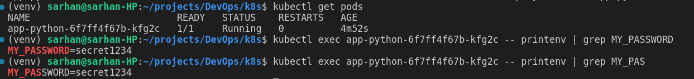

# lab 11
## Task 1
1. **Create the secret**
    ```terminal 
    $ echo -n 'admin' > ./username.txt
    $ echo -n 'S!B\*d$zDsb=' > ./password.txt
    $ kubectl create secret generic db-user-pass --from-file=./username.txt --from-file=./password.txt
    secret/db-user-pass created
    ```

2. **Verfify**
    ```terminal
    $ kubectl get secrets
    NAME           TYPE     DATA   AGE
    db-user-pass   Opaque   2      8m27s

    $ kubectl describe secret db-user-pass
    Name:         db-user-pass
    Namespace:    default
    Labels:       <none>
    Annotations:  <none>

    Type:  Opaque

    Data
    ====
    password.txt:  12 bytes
    username.txt:  5 bytes
    ```

3. **Decode**
    ```terminal
    $ kubectl get secret db-user-pass -o jsonpath='{.data}'
    {"password.txt":"UyFCXCpkJHpEc2I9","username.txt":"YWRtaW4="}

    $ echo 'UyFCXCpkJHpEc2I9' | base64 --decode
    S!B\*d$zDsb=

    ```

4. **Manage secrets with helm**
    ```terminal
    $ gpg --list-keys
    /home/sarhan/.gnupg/pubring.kbx
    -------------------------------
    pub   rsa3072 2024-04-23 [SC] [expires: 2026-04-23]
        12767A9AC61D56B8A6AE2680F968B06BE51CF6A8
    uid           [ultimate] Ahmad <ahmadhasansarhana@gmail.com>
    sub   rsa3072 2024-04-23 [E] [expires: 2026-04-23]

    $ sops -p 12767A9AC61D56B8A6AE2680F968B06BE51CF6A8 secrets.yaml
    password: secret1234

    $ helm secrets view secrets.yaml
    password: secret1234

    $ helm secrets install app-python ./app-python -n default -f ./secrets.yaml
    NAME: app-python
    LAST DEPLOYED: Tue Apr 23 23:29:00 2024
    NAMESPACE: default
    STATUS: deployed
    REVISION: 1
    NOTES:
    1. Get the application URL by running these commands:
        NOTE: It may take a few minutes for the LoadBalancer IP to be available.
            You can watch the status of by running 'kubectl get --namespace default svc -w app-python'
    export SERVICE_IP=$(kubectl get svc --namespace default app-python --template "{{ range (index .status.loadBalancer.ingress 0) }}{{.}}{{ end }}")
    echo http://$SERVICE_IP:5000
    removed './secrets.yaml.dec'

    $ helm ls
    NAME            NAMESPACE       REVISION        UPDATED                                 STATUS          CHART                   APP VERSION
    app-python      default         1               2024-04-23 23:29:00.300040908 +0300 MSK deployed        app-python-0.1.0        1.16.0

    $ kubectl get pods
    NAME                          READY   STATUS    RESTARTS   AGE
    app-python-6f7ff4f67b-kfg2c   1/1     Running   0          4m52s

    $ kubectl exec app-python-6f7ff4f67b-kfg2c -- printenv | grep MY_PASSWORD
    MY_PASSWORD=secret1234
    ```

    

## Task 2

1. **create secret**
    ```terminal
    $ kubectl exec -it vault-0 -- /bin/sh

    / $ vault secrets enable -path=internal kv-v2
    Success! Enabled the kv-v2 secrets engine at: internal/

    / $ vault kv put internal/database/config username="db-readonly-username" password="db-secret-password"
    ======== Secret Path ========
    internal/data/database/config

    ======= Metadata =======
    Key                Value
    ---                -----
    created_time       2024-04-24T18:29:43.426198259Z
    custom_metadata    <nil>
    deletion_time      n/a
    destroyed          false
    version            1

    / $ exit
    ```

2. **Configure authentication**
    ```terminal
    $ kubectl exec -it vault-0 -- /bin/sh
    / $ vault auth enable kubernetes
    Success! Enabled kubernetes auth method at: kubernetes/
    / $ vault write auth/kubernetes/config \
    >       kubernetes_host="https://$KUBERNETES_PORT_443_TCP_ADDR:443"
    Success! Data written to: auth/kubernetes/config

    / $ vault policy write internal-app - <<EOF
    > path "internal/data/database/config" {
    >    capabilities = ["read"]
    > }
    > EOF
    Success! Uploaded policy: internal-app

    / $ vault write auth/kubernetes/role/internal-app \
    >       bound_service_account_names=internal-app \
    >       bound_service_account_namespaces=default \
    >       policies=internal-app \
    >       ttl=24h
    Success! Data written to: auth/kubernetes/role/internal-app
    
    / $ exit
    ```