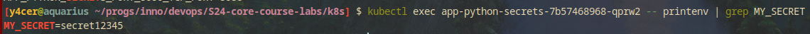
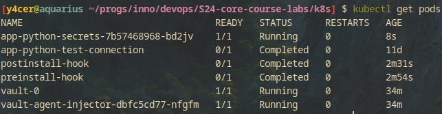

# Kubernetes secrets

## Output of `kubectl describe secrets my-secret`

```
Name:         my-secret
Namespace:    default
Labels:       <none>
Annotations:  <none>

Type:  Opaque

Data
====
SECRET:  13 bytes
```

## Output of `helm secrets install app-python-with-secrets app-python -f secrets.yaml`

```
NAME: app-python-with-secrets
LAST DEPLOYED: Wed Apr 17 09:33:01 2024
NAMESPACE: default
STATUS: deployed
REVISION: 1
NOTES:
1. Get the application URL by running these commands:
     NOTE: It may take a few minutes for the LoadBalancer IP to be available.
           You can watch the status of by running 'kubectl get --namespace default svc -w app-python-with-secrets'
  export SERVICE_IP=$(kubectl get svc --namespace default app-python-with-secrets --template "{{ range (index .status.loadBalancer.ingress 0) }}{{.}}{{ end }}")
  echo http://$SERVICE_IP:8080
removed 'secrets.yaml.dec'
```

## Output of `kubectl get secrets credentials -o yaml`

```
apiVersion: v1
data:
  password: c2VjcmV0MTIzNDU=
kind: Secret
metadata:
  annotations:
    meta.helm.sh/release-name: app-python-with-secrets
    meta.helm.sh/release-namespace: default
  creationTimestamp: "2024-04-17T09:33:24Z"
  labels:
    app.kubernetes.io/managed-by: Helm
  name: credentials
  namespace: default
  resourceVersion: "40302"
  uid: b3b9f0a9-f5fb-4f58-99ff-30cdc2b6bcba
type: Opaque
```

## Output of env values in the pod



## Output of successfully running hashicorp vault


