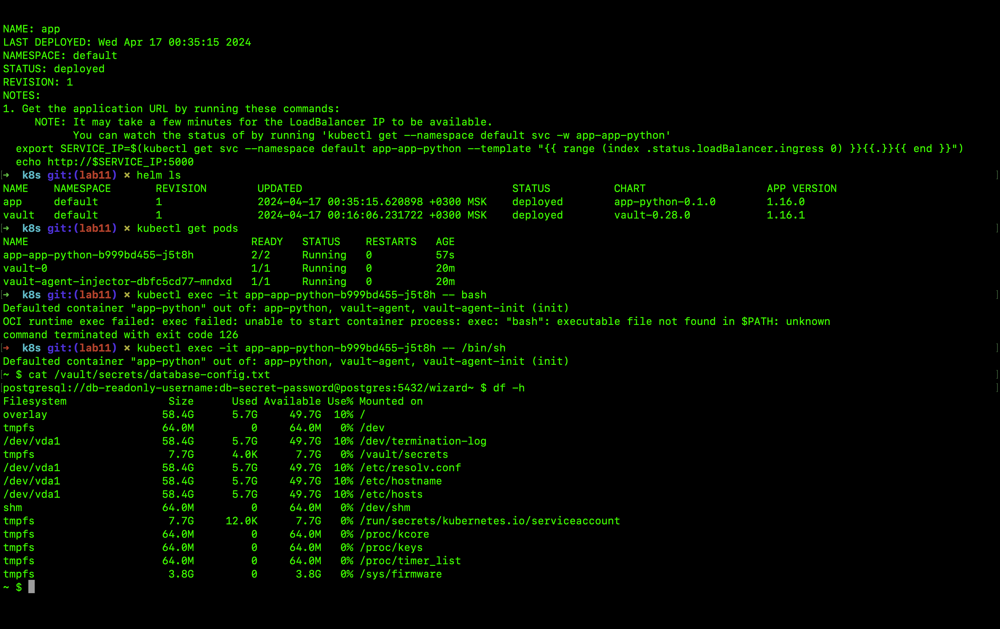

# Secrets

## Task 1

### Initially, I create a secret by using:
`kubectl create secret generic my-secret --from-literal=username=test --from-literal=password='qwerty1234'`
 
### Verify the Secret:
`kubectl get secrets`

`kubectl get secret my-secret -o yaml`

### Manage Secrets with `helm`

## Task 2

The output of the Vault configuration:

