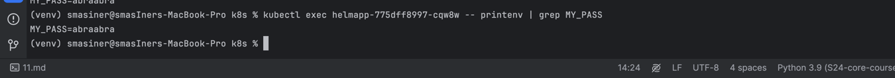

```bash
(venv) smasiner@smasIners-MacBook-Pro k8s % kubectl create secret generic db-user-pass \
    --from-literal=username=admin \
    --from-literal=password='S!B*d$zDsb='
secret/db-user-pass created
(venv) smasiner@smasIners-MacBook-Pro k8s % kubectl get secret db-user-pass -o yaml

apiVersion: v1
data:
  password: UyFCXCpkJHpEc2I9
  username: YWRtaW4=
kind: Secret
metadata:
  creationTimestamp: "2024-11-13T02:42:22Z"
  name: db-user-pass
  namespace: default
  resourceVersion: "5821"
  uid: a568406b-25a5-4b88-a843-a3fb7a7104bd
type: Opaque
(venv) smasiner@smasIners-MacBook-Pro k8s % echo -n "UyFCXCpkJHpEc2I9" | base64 --decode
S!B\*d$zDsb=%                                                                                                                                                          (venv) smasiner@smasIners-MacBook-Pro k8s % echo -n "YWRtaW4=" | base64 --decode
(venv) smasiner@smasIners-MacBook-Pro k8s % echo -n "YWRtaW4=" | base64 --decode
admin%
```
# 1.3



# Part 2
```bash
(venv) smasiner@smasIners-MacBook-Pro templates % kubectl exec -it vault-0 -- /bin/sh
/ $ vault kv get internal/database/config
======== Secret Path ========
internal/data/database/config

======= Metadata =======
Key                Value
---                -----
created_time       2024-11-16T19:20:00.301597588Z
custom_metadata    <nil>
deletion_time      n/a
destroyed          false
version            2

==== Data ====
Key      Value
---      -----
token    tokentoken
/ $ exit
(venv) smasiner@smasIners-MacBook-Pro templates % kubectl get serviceaccounts
NAME                   SECRETS   AGE
default                0         3d18h
helmapp                0         124m
internal-app           0         3d15h
vault                  0         42m
vault-agent-injector   0         42m
(venv) smasiner@smasIners-MacBook-Pro templates % kubectlget pods
zsh: command not found: kubectlget
(venv) smasiner@smasIners-MacBook-Pro templates % kubectl get pods
NAME                                    READY   STATUS    RESTARTS   AGE
helmapp-6854689bd4-hcp9s                1/1     Running   0          21m
vault-0                                 1/1     Running   0          43m
vault-agent-injector-84b987db6f-gkrxp   1/1     Running   0          43m
(venv) smasiner@smasIners-MacBook-Pro templates % kubectl exec -it helmapp-6854689bd4-hcp9s -- sh
/app_python $ cat /vault/secrets/database-config.txt 
Bearer token: tokentoken

```

