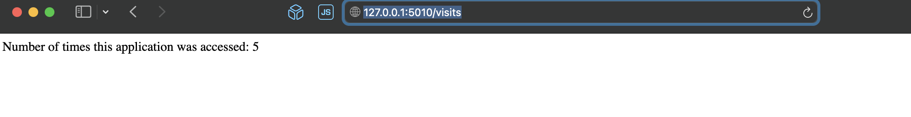

## Task 1


## Task 2
`helm install app ./app-python`
```sh
NAME: app
LAST DEPLOYED: Tue Apr 23 00:03:02 2024
NAMESPACE: default
STATUS: deployed
REVISION: 1
NOTES:
1. Get the application URL by running these commands:
     NOTE: It may take a few minutes for the LoadBalancer IP to be available.
           You can watch the status of by running 'kubectl get --namespace default svc -w app-app-python'
  export SERVICE_IP=$(kubectl get svc --namespace default app-app-python --template "{{ range (index .status.loadBalancer.ingress 0) }}{{.}}{{ end }}")
  echo http://$SERVICE_IP:5000
```
`kubectl get po`
```sh
NAME                              READY   STATUS    RESTARTS   AGE
app-app-python-6964bbd9b8-swz77   1/1     Running   0          49s
```
`kubectl exec app-app-python-6964bbd9b8-swz77 - cat /app/config.json`
```sh
{
    "password": "1234"
}
```