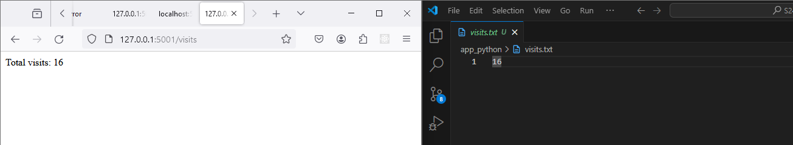
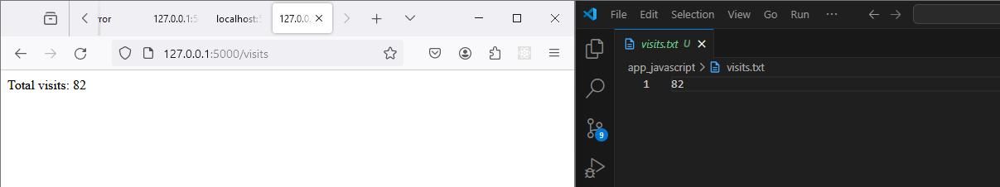

# Taks One `/visits` endpoint

- Create a new route `/visits` that returns the number of visits to the website.
- The number of visits should be stored in a file called `visits.txt`.
- Increment the number of visits every time the `/visits` endpoint is accessed.
- The response should include the number of visits.
- The file `visits.txt` should be mounted to the container so that the number of visits is saved even if the container is deleted.

