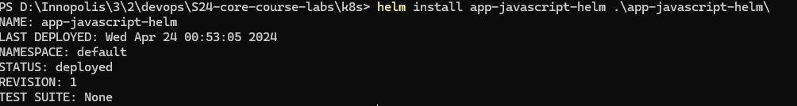
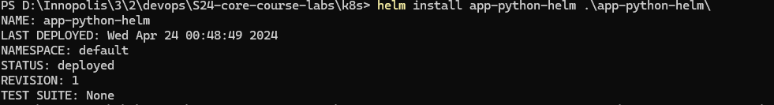
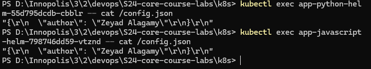

# Taks One `/visits` endpoint

- Create a new route `/visits` that returns the number of visits to the website.
- The number of visits should be stored in a file called `visits.txt`.
- Increment the number of visits every time the `/visits` endpoint is accessed.
- The response should include the number of visits.
- The file `visits.txt` should be mounted to the container so that the number of visits is saved even if the container is deleted.


# Task Two

- Create a dir called files in <app-name>/files
- Create a file called `config.json` in the files dir
- Add the following content to the file:

```json
{
  "author": "Zeyad Alagamy"
}
```

- created a `configmap.yaml` file in the templates dir

````yaml
apiVersion: v1
kind: ConfigMap
metadata:
  name: {{ .Release.Name }}-configmap
data:
  config.json: |
    {{ .Files.Get "files/config.json" | indent 4 }}
    ```
````

- Edit the deployment.yaml file to mount the configmap as a volume to the container in the path `/app/files`

```yaml
apiVersion: apps/v1
kind: Deployment
# ... (rest of the file)
    spec:
      # ... (rest of the spec)
      containers:
        - name: {{ .Chart.Name }}
          # ... (rest of the container spec)
          volumeMounts:
            - name: config-volume
              mountPath: /config.json
              subPath: config.json
            {{- with .Values.volumeMounts }}
            {{- toYaml . | nindent 12 }}
            {{- end }}
      volumes:
        - name: config-volume
          configMap:
            name: {{ include "app-<lang>-helm.fullname" . }}-configmap
        {{- with .Values.volumes }}
        {{- toYaml . | nindent 8 }}
        {{- end }}
      # ... (rest of the spec)
```

- Install the chart.

```bash
helm install app-python-helm ./app-python-helm
helm install app-javascript-helm ./app-javascript-helm
kubectl get pod
```




- Check that the file is mounted correctly.

```bash
kubectl exec app-python-helm-55d795dcdb-cbblr -- cat /config.json
kubectl exec app-javascript-helm-798746dd59-vtznd -- cat /config.json
```


