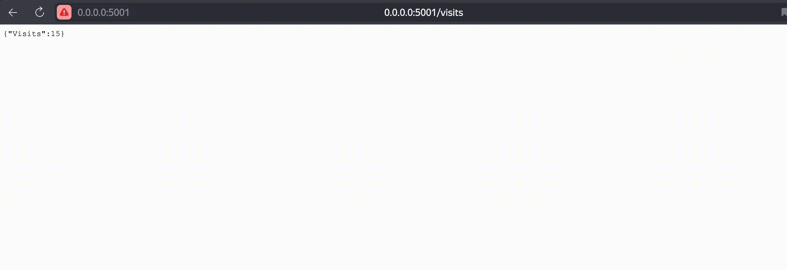
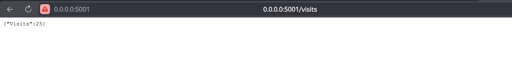
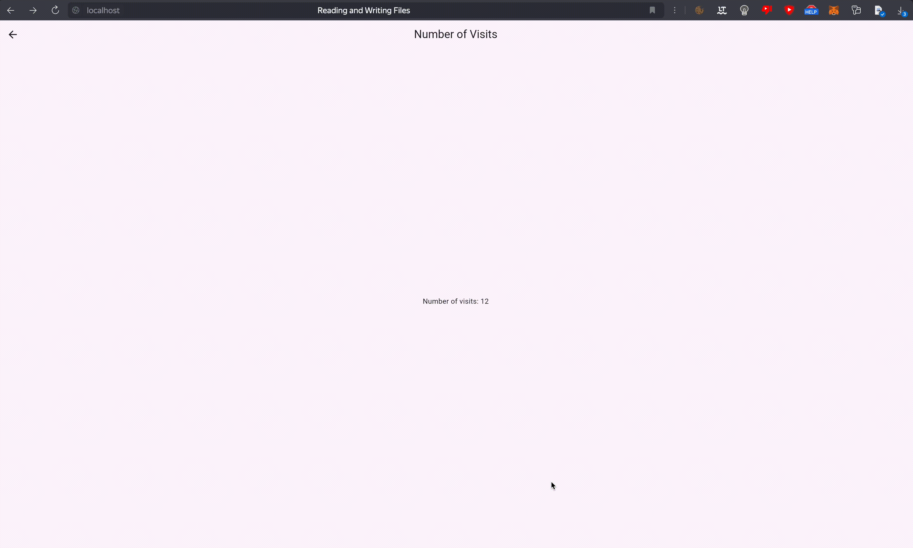
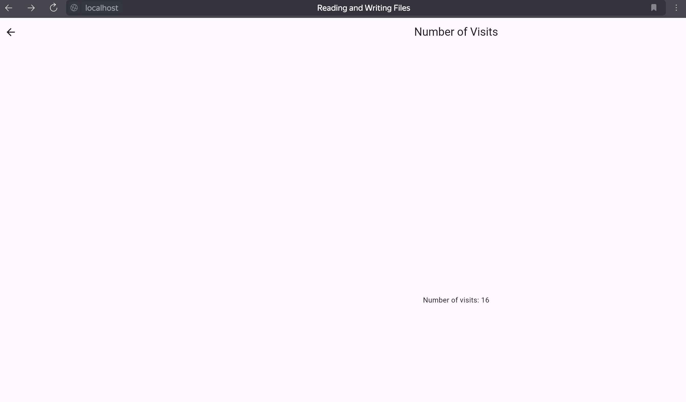

# Lab 12

## Task 1





## Task 2


### Get po


```bash
kubectl get po
```

```bash
NAME                                         READY   STATUS      RESTARTS        AGE
flutter-app-flutter-chart-6885df768c-clrgh   1/1     Running     1 (6h41m ago)   8h
flutter-chart-54549cc578-rbr5z               1/1     Running     0               101m
post-install-hook                            0/1     Completed   0               117m
pre-install-hook                             0/1     Completed   0               117m
python-app-python-chart-686bbccf5b-bpcxg     2/2     Running     0               12s
vault-0                                      1/1     Running     0               119m
vault-agent-injector-6d57d65964-dm28q        1/1     Running     0               119m
```

### Get configmaps

```bash
kubectl get configmaps
```

```bash
NAME               DATA   AGE
config             1      19s
kube-root-ca.crt   1      10h
```

### Descirbe

```bash
kubectl describe configmaps config
```

```bash
Name:         config
Namespace:    default
Labels:       app.kubernetes.io/instance=python-app
              app.kubernetes.io/managed-by=Helm
              app.kubernetes.io/name=python-chart
              app.kubernetes.io/version=1.16.0
              helm.sh/chart=python-chart-0.1.0
Annotations:  meta.helm.sh/release-name: python-app
              meta.helm.sh/release-namespace: default

Data
====
config.json:
----
{
    "app_name": "My Web App",
    "environment": "production",
    "database": {
        "host": "localhost",
        "port": 5432,
        "username": "admin",
        "password": "password123",
        "database_name": "my_app_db"
    },
    "logging": {
        "level": "info",
        "file_path": "/var/log/my_app.log"
    },
    "api_keys": {
        "google_maps": "YOUR_GOOGLE_MAPS_API_KEY",
        "stripe": "YOUR_STRIPE_API_KEY"
    }
}

BinaryData
====

Events:  <none>
```

### Exec

```bash
kubectl exec python-app-python-chart-686bbccf5b-bpcxg -- cat /app/config.json
```

```bash
Defaulted container "python-chart" out of: python-chart, vault-agent, vault-agent-init (init)
{
    "app_name": "My Web App",
    "environment": "production",
    "database": {
        "host": "localhost",
        "port": 5432,
        "username": "admin",
        "password": "password123",
        "database_name": "my_app_db"
    },
    "logging": {
        "level": "info",
        "file_path": "/var/log/my_app.log"
    },
    "api_keys": {
        "google_maps": "YOUR_GOOGLE_MAPS_API_KEY",
        "stripe": "YOUR_STRIPE_API_KEY"
    }
}
```


### Bonus

Same visits for flutter 






Environment variables

```bash
kubectl get po
```

```bash 
NAME                                         READY   STATUS      RESTARTS        AGE
flutter-app-flutter-chart-6885df768c-clrgh   1/1     Running     1 (6h51m ago)   8h
flutter-chart-54549cc578-rbr5z               1/1     Running     0               111m
post-install-hook                            0/1     Completed   0               127m
pre-install-hook                             0/1     Completed   0               128m
python-app-python-chart-698fc58649-5rk48     2/2     Running     0               28s
vault-0                                      1/1     Running     0               130m
vault-agent-injector-6d57d65964-dm28q        1/1     Running     0               130m
```

```bash
kubectl exec python-app-python-chart-698fc58649-5rk48 -- env | grep config.json
```

```bash
Defaulted container "python-chart" out of: python-chart, vault-agent, vault-agent-init (init)
config.json={
```

```bash 
kubectl exec python-app-python-chart-698fc58649-5rk48 -- printenv config.json    
```

```bash
Defaulted container "python-chart" out of: python-chart, vault-agent, vault-agent-init (init)
{
    "app_name": "My Web App",
    "environment": "production",
    "database": {
        "host": "localhost",
        "port": 5432,
        "username": "admin",
        "password": "password123",
        "database_name": "my_app_db"
    },
    "logging": {
        "level": "info",
        "file_path": "/var/log/my_app.log"
    },
    "api_keys": {
        "google_maps": "YOUR_GOOGLE_MAPS_API_KEY",
        "stripe": "YOUR_STRIPE_API_KEY"
    }
}
```

