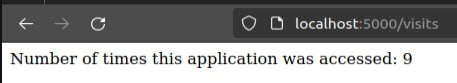

# Kubernetes ConfigMaps

## Task 1



## Task 2

```commandLine
yuszx@yuszx-VirtualBox:~/devops/k8s$ helm install app-python-configmap ./app-python
NAME: app-python-configmap
LAST DEPLOYED: Fri Apr 19 14:36:09 2024
NAMESPACE: default
STATUS: deployed
REVISION: 1
NOTES:
1. Get the application URL by running these commands:
     NOTE: It may take a few minutes for the LoadBalancer IP to be available.
           You can watch the status of by running 'kubectl get --namespace default svc -w app-python-configmap'
  export SERVICE_IP=$(kubectl get svc --namespace default app-python-configmap --template "{{ range (index .status.loadBalancer.ingress 0) }}{{.}}{{ end }}")
  echo http://$SERVICE_IP:5000
yuszx@yuszx-VirtualBox:~/devops/k8s$ kubectl get po
NAME                                     READY   STATUS    RESTARTS      AGE
app-python-configmap-84fdbd6879-wgm59    1/1     Running   0             60s
vault-0                                  1/1     Running   2 (36m ago)   2d22h
vault-agent-injector-dbfc5cd77-fhq68     1/1     Running   3 (36m ago)   2d22h
```

```commandLine
yuszx@yuszx-VirtualBox:~/devops/k8s$ kubectl exec app-python-configmap-84fdbd6879-wgm59 -- cat /app/config.json
{
    "password": "coolpassword"
}
```
