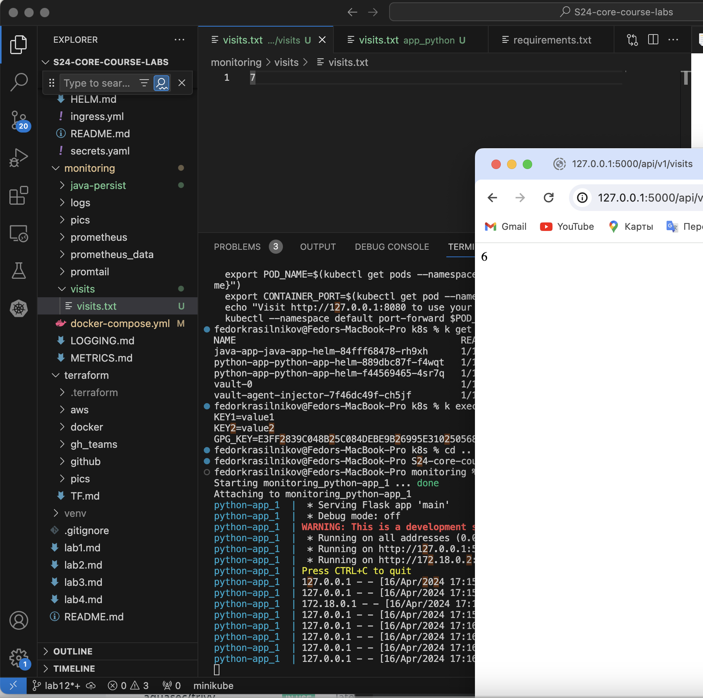
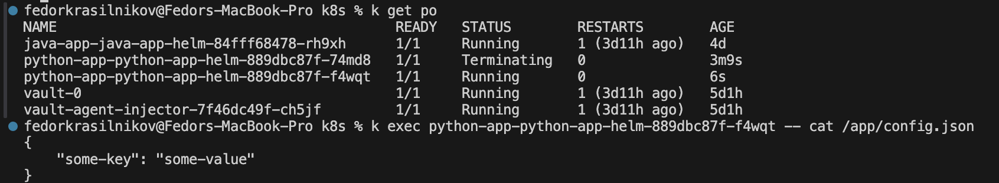
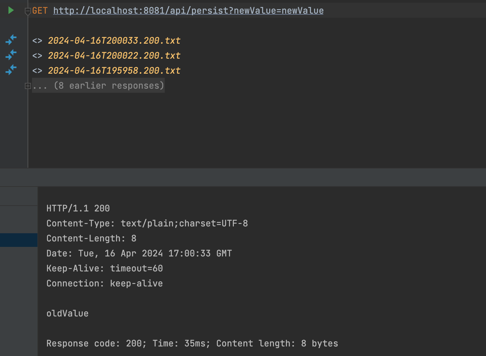
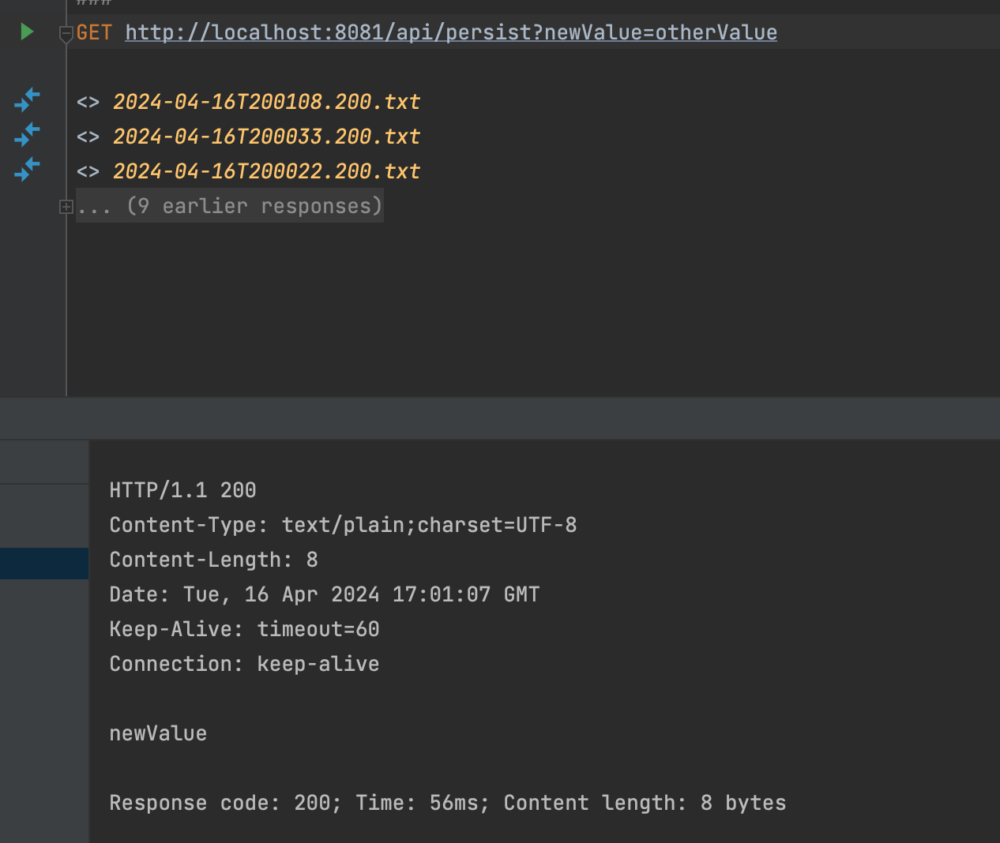
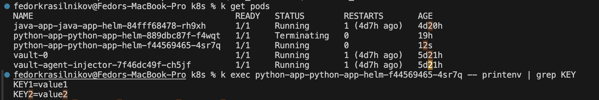

## Visits task 

I implemented the logic and on the screenshot you can see:
- running docker-compose
- browser returning the number of visits 
- visits.txt mounted to the container 

## Config map

Here is the result of `k exec python-app-python-app-helm-889dbc87f-f4wqt -- cat /app/config.json`

## Bonus task

Persistance logic is the following. The api method `/api/persistence?newValue={some_value}` returns the value inside of the `persist/file.txt` and overwrites it with a new one, so in each requrst you get the argument of the previous request. 
- Request one 

- Request two 

Config map. I implemented the env from config file logic (config map is `env-config-map.yaml`) and here is the proof: 

