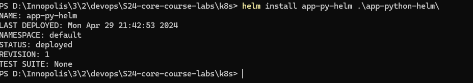
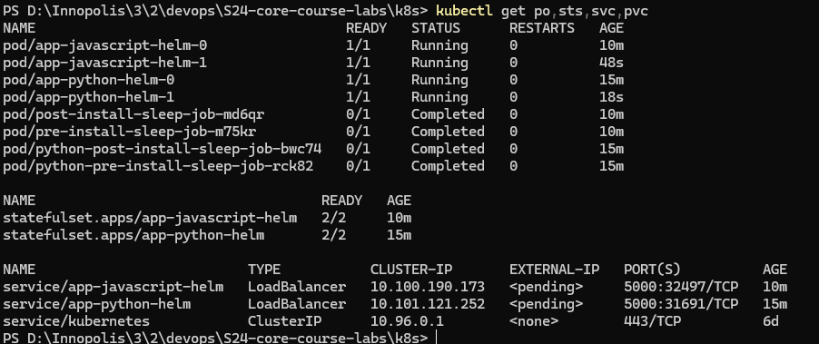
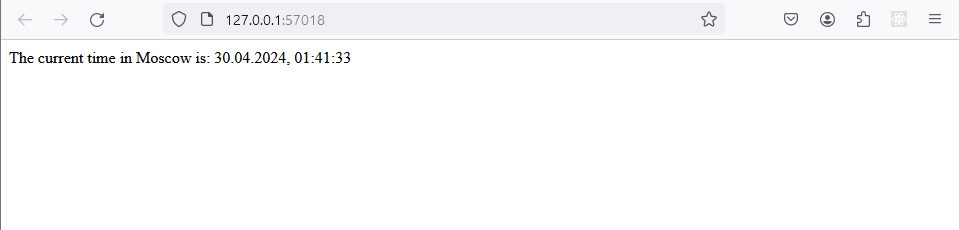
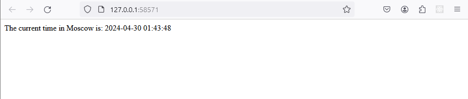
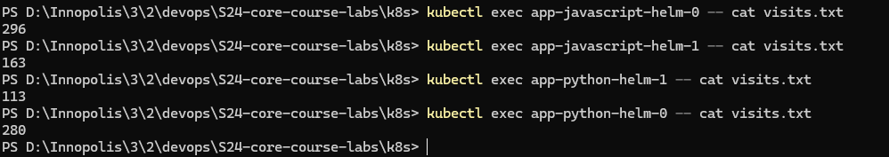

# Task 1

1. Change deployment.yml to statefulset.yml
2. Run `helm install --dry-run --debug app-js-helm .\app-javascript-helm\`

```bash
install.go:218: [debug] Original chart version: ""
install.go:235: [debug] CHART PATH: D:\Innopolis\3\2\devops\S24-core-course-labs\k8s\app-javascript-helm

NAME: app-js-helm
LAST DEPLOYED: Mon Apr 29 21:34:54 2024
NAMESPACE: default
STATUS: pending-install
REVISION: 1
TEST SUITE: None
USER-SUPPLIED VALUES:
{}

COMPUTED VALUES:
affinity: {}
autoscaling:
  enabled: false
  maxReplicas: 100
  minReplicas: 1
  targetCPUUtilizationPercentage: 80
fullnameOverride: ""
image:
  pullPolicy: IfNotPresent
  repository: zeyadalagamy/moscow_tz_js
  tag: latest
imagePullSecrets: []
ingress:
  annotations: {}
  className: ""
  enabled: false
  hosts:
  - host: chart-example.local
    paths:
    - path: /
      pathType: ImplementationSpecific
  tls: []
library-chart:
  global: {}
livenessProbe:
  httpGet:
    path: /
    port: http
nameOverride: ""
nodeSelector: {}
podAnnotations:
  vault.hashicorp.com/agent-inject: "true"
  vault.hashicorp.com/agent-inject-secret-config.txt: internal/data/server/config
  vault.hashicorp.com/role: internal-app
podLabels: {}
podSecurityContext: {}
readinessProbe:
  httpGet:
    path: /
    port: http
replicaCount: 1
resources:
  limits:
    cpu: 100m
    memory: 128Mi
  requests:
    cpu: 100m
    memory: 128Mi
securityContext: {}
service:
  port: 5000
  type: LoadBalancer
serviceAccount:
  annotations: {}
  automount: true
  create: true
  name: ""
tolerations: []
volumeMounts: []
volumes: []

HOOKS:
MANIFEST:
---
# Source: app-javascript-helm/templates/serviceaccount.yaml
apiVersion: v1
kind: ServiceAccount
metadata:
  name: app-js-helm-app-javascript-helm
  labels:
    helm.sh/chart: app-javascript-helm-0.1.0
    app.kubernetes.io/name: app-javascript-helm
    app.kubernetes.io/instance: app-js-helm
    app.kubernetes.io/version: "1.16.0"
    app.kubernetes.io/managed-by: Helm
---
# Source: app-javascript-helm/templates/configmap.yaml
apiVersion: v1
kind: ConfigMap
metadata:
  name: app-js-helm-configmap
data:
  K1: "javascript-value1"
  K2: "javascript-value2"
  config.json: |
        "{\r\n  \"author\": \"Zeyad Alagamy\"\r\n}\r\n"
---
# Source: app-javascript-helm/templates/service.yaml
apiVersion: v1
kind: Service
metadata:
  name: app-js-helm-app-javascript-helm
  labels:
    helm.sh/chart: app-javascript-helm-0.1.0
    app.kubernetes.io/name: app-javascript-helm
    app.kubernetes.io/instance: app-js-helm
    app.kubernetes.io/version: "1.16.0"
    app.kubernetes.io/managed-by: Helm
spec:
  type: LoadBalancer
  ports:
    - port: 5000
      targetPort: http
      protocol: TCP
      name: http
  selector:
    app.kubernetes.io/name: app-javascript-helm
    app.kubernetes.io/instance: app-js-helm
---
# Source: app-javascript-helm/templates/statefulset.yaml
apiVersion: apps/v1
kind: StatefulSet
metadata:
  name: app-js-helm-app-javascript-helm
  labels:
    helm.sh/chart: app-javascript-helm-0.1.0
    app.kubernetes.io/name: app-javascript-helm
    app.kubernetes.io/instance: app-js-helm
    app.kubernetes.io/version: "1.16.0"
    app.kubernetes.io/managed-by: Helm
spec:
  serviceName: "app-js-helm-app-javascript-helm"
  replicas: 1
  selector:
    matchLabels:
      app.kubernetes.io/name: app-javascript-helm
      app.kubernetes.io/instance: app-js-helm
  template:
    metadata:
      annotations:
        vault.hashicorp.com/agent-inject: "true"
        vault.hashicorp.com/agent-inject-secret-config.txt: internal/data/server/config
        vault.hashicorp.com/role: internal-app
      labels:
        helm.sh/chart: app-javascript-helm-0.1.0
        app.kubernetes.io/name: app-javascript-helm
        app.kubernetes.io/instance: app-js-helm
        app.kubernetes.io/version: "1.16.0"
        app.kubernetes.io/managed-by: Helm
    spec:
      serviceAccountName: app-js-helm-app-javascript-helm
      securityContext:
        {}
      containers:
        - name: app-javascript-helm
          securityContext:
            {}
          image: "zeyadalagamy/moscow_tz_js:latest"
          imagePullPolicy: IfNotPresent
          envFrom:
          - configMapRef:
              name: app-js-helm-app-javascript-helm-configmap
          ports:
            - name: http
              containerPort: 5000
              protocol: TCP
          livenessProbe:
            httpGet:
              path: /
              port: http
          readinessProbe:
            httpGet:
              path: /
              port: http
          resources:
            limits:
              cpu: 100m
              memory: 128Mi
            requests:
              cpu: 100m
              memory: 128Mi
          volumeMounts:
            - name: config-volume
              mountPath: /config.json
              subPath: config.json
      volumes:
        - name: config-volume
          configMap:
            name: app-js-helm-app-javascript-helm-configmap
---
# Source: app-javascript-helm/templates/post-install-sleep.yaml
apiVersion: batch/v1
kind: Job
metadata:
  name: post-install-sleep-job
  labels:
    app: app-javascript-helm
    chart: app-javascript-helm-0.1.0
  annotations:
    "helm.sh/hook-delete-policy": hook-succeeded  # Add this annotation
spec:
  template:
    metadata:
      name: post-install-sleep-pod
      labels:
        app: app-javascript-helm
        chart: app-javascript-helm-0.1.0
    spec:
      containers:
        - name: sleep-container
          image: busybox
          command: ["sleep", "20"]
      restartPolicy: OnFailure
---
# Source: app-javascript-helm/templates/pre-install-sleep.yaml
apiVersion: batch/v1
kind: Job
metadata:
  name: pre-install-sleep-job
  labels:
    app: app-javascript-helm
    chart: app-javascript-helm-0.1.0
  annotations:
    "helm.sh/hook-delete-policy": hook-succeeded  # Add this annotation
spec:
  template:
    metadata:
      name: pre-install-sleep-pod
      labels:
        app: app-javascript-helm
        chart: app-javascript-helm-0.1.0
    spec:
      containers:
        - name: sleep-container
          image: busybox
          command: ["sleep", "20"]
      restartPolicy: OnFailure
```

3. No Issues found, so I will deploy it.

```bash
helm install app-javascript-helm .\app-javascript-helm\
helm install app-python-helm .\app-python-helm\
```


4. Apply best practices by moving values to variables in `values.yml` meaningfully

    - Check the values.yml file in the app-javascript-helm folder.

5. Do the same steps for the python app.



** Note I have change the name of the python app to `app-python-helm` and the name of the javascript app to `app-javascript-helm` to avoid conflicts. **

# Task 2

1. Provide the output of `kubectl get po,sts,svc,pvc` commands.



2. Access the root path of your app from different tabs and modes in your browser.

```bash
minikube service app-javascript-helm
minikube service app-python-helm
```



3. Check the content of your file in each pod, e.g., `kubectl exec pod/demo-0 -- cat visits`, and provide the output for all replicas.

```bash
kubectl exec app-javascript-helm-0 -- cat visits.txt
kubectl exec app-javascript-helm-1 -- cat visits.txt
kubectl exec app-python-helm-0 -- cat visits.txt
kubectl exec app-python-helm-1 -- cat visits.txt
```



4. Explanation Differences in the output for each replica

  Each replica shows a different output because they each have their own unique Persistent Volumes. This is due to the use of volumeClaimTemplates, which creates a distinct Volume Claim for each replica. As a result, each pod (or replica) is working with a different file.

5. Implement a way to instruct the StatefulSet controller to launch or terminate all Pods in parallel.

  In the context of our application, there's no need for the replicas to maintain a shared state. Each instance operates independently of the others, so maintaining a specific order doesn't provide any advantages. In fact, it could potentially slow down startup times. To avoid this, we can set the `podManagementPolicy` to "Parallel" in the StatefulSet specification. This allows the pods to start up in parallel, rather than one at a time.

  ```yaml
  apiVersion: apps/v1
  kind: StatefulSet
  metadata:
    ...
  spec:
    ...
    podManagementPolicy: "Parallel"
  ```

# Bonus Task: Update Strategies

1. Apply the main steps to your extra app.

  I have applied the main steps to the extra app.

2. Explore Update Strategies: Kubernetes offers various strategies for deploying updates:

   - **Recreate**: This strategy involves shutting down the existing version before deploying the new one. While this approach might be suitable for a development environment, it can result in significant downtime.
   
   - **Ramped**: This is a slower strategy that gradually rolls out new versions. It's similar to the recreate strategy, but it replaces replicas one by one instead of all at once. This can result in different versions of the app being deployed simultaneously, with no control over which version receives traffic. It can also take some time to complete.
   
   - **Blue/Green**: In this strategy, the new version is deployed alongside the old version, but no traffic is routed to it initially. Once the new version is tested and confirmed to be ready, traffic is switched over to it, and the old version is removed. This strategy eliminates downtime and versioning issues but requires twice the resources.
   
   - **Canary**: This strategy is a mix of the blue/green and ramped strategies. It involves deploying two versions of the app, one of which is updated, and the other is not. Traffic is divided between the two versions based on the number of replicas. This allows for testing the new version with a small subset of users before switching all users to the new version once it's confirmed to be ready.
   
   - **A/B Testing**: Unlike the canary strategy, which splits traffic based on deployed resources, this strategy targets a specific subset of users based on certain parameters, such as the device they're using. It can be implemented using the canary strategy.

Reference: [Kubernetes Deployment Strategies](https://blog.container-solutions.com/kubernetes-deployment-strategies)