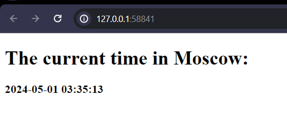

# Kubernetes StatefulSet

## StatefulSet Exploration and Optimization

### Output of commands

`kubectl get po,sts,svc,pvc`

```bash
NAME                        READY   STATUS      RESTARTS   AGE
pod/post-install-hook       0/1     Completed   0          31s
pod/pre-install-hook        0/1     Completed   0          38s
pod/stateful-python-app-0   1/1     Running     0          31s
pod/stateful-python-app-1   1/1     Running     0          31s

NAME                                   READY   AGE
statefulset.apps/stateful-python-app   2/2     31s

NAME                          TYPE           CLUSTER-IP     EXTERNAL-IP   PORT(S)          AGE
service/kubernetes            ClusterIP      10.96.0.1      <none>        443/TCP          28d
service/stateful-python-app   LoadBalancer   10.102.22.59   <pending>     5000:31789/TCP   31s

NAME                                                     STATUS   VOLUME                                     CAPACITY   ACCESS MODES   STORAGECLASS   AGE
persistentvolumeclaim/mymetadata-stateful-python-app-0   Bound    pvc-ed7a9100-ed53-4232-9daa-edc9911477bb   1Gi        RWO            standard       31s
persistentvolumeclaim/mymetadata-stateful-python-app-1   Bound    pvc-5ff572ec-2695-4dd8-9cd8-b0a494949f4f   1Gi        RWO            standard       31s
```

---

`minikube service stateful-python-app`

```bash
|-----------|---------------------|-------------|---------------------------|
| NAMESPACE |        NAME         | TARGET PORT |            URL            |
|-----------|---------------------|-------------|---------------------------|
| default   | stateful-python-app | http/5000   | http://192.168.49.2:31789 |
|-----------|---------------------|-------------|---------------------------|
🏃  Starting tunnel for service stateful-python-app.
|-----------|---------------------|-------------|------------------------|
| NAMESPACE |        NAME         | TARGET PORT |          URL           |
|-----------|---------------------|-------------|------------------------|
| default   | stateful-python-app |             | http://127.0.0.1:58841 |
|-----------|---------------------|-------------|------------------------|
🎉  Opening service default/stateful-python-app in default browser...
❗  Because you are using a Docker driver on windows, the terminal needs to be open to run it.
```



---

```bash
PS D:\VSCodeProjects\DevOps\S24-core-course-labs\k8s> kubectl exec pod/stateful-python-app-0 -- cat visits/visits.txt
5
```
```bash
PS D:\VSCodeProjects\DevOps\S24-core-course-labs\k8s> kubectl exec pod/stateful-python-app-1 -- cat visits/visits.txt
13
```

#### **Describe and explain differences:** 

The difference in visit counts between StatefulSet pods stems from their unique identities and separate storage. Each pod operates independently with its own name and isolated storage, leading to different visit counts. 

--- 

#### **Explaining why ordering guarantees are unnecessary for your app:**

Ordering guarantees are unnecessary for my app because each pod functions independently with its own isolated visits.txt file. The pods do not rely on shared resources or interdependencies. Since there is no need for a specific launch or termination sequence, the application can scale efficiently without being constrained by ordering requirements.

---

#### **Implement a way to instruct the StatefulSet controller to launch or terminate all Pods in parallel:**

To achieve this, I set the podManagementPolicy to "Parallel" and included it in the values.yaml file:
```yaml
podManagementPolicy: "Parallel"
```
And I referenced this value in statefulset.yaml:

```yaml
podManagementPolicy: {{ .Values.podManagementPolicy }}
```
