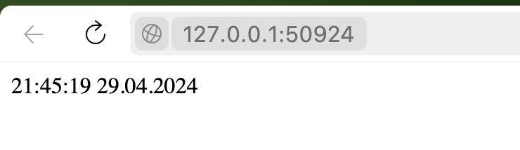

# Kubernetes StatefulSet

## Implement in Helm Chart
- `helm install --dry-run --debug app-python python-app`

```
NAME: app-python
LAST DEPLOYED: Mon Apr 29 21:52:50 2024
NAMESPACE: default
STATUS: deployed
REVISION: 1
USER-SUPPLIED VALUES:
{}

COMPUTED VALUES:
affinity: {}
autoscaling:
  enabled: false
  maxReplicas: 100
  minReplicas: 1
  targetCPUUtilizationPercentage: 80
configenvs:
  enabled: false
fullnameOverride: ""
image:
  pullPolicy: Always
  repository: adarika/devops-lab-02-python
  tag: latest
imagePullSecrets: []
ingress:
  annotations: {}
  className: ""
  enabled: false
  hosts:
  - host: chart-example.local
    paths:
    - path: /
      pathType: ImplementationSpecific
  tls: []
libchart:
  global: {}
livenessProbe:
  httpGet:
    path: /
    port: http
  initialDelaySeconds: 20
  periodSeconds: 5
nameOverride: ""
nodeSelector: {}
podLabels: {}
podSecurityContext: {}
pvc:
  enabled: true
  name: python-access-metric
  storageSize: 5Mi
  storageType: standard
readinessProbe:
  httpGet:
    path: /
    port: http
  initialDelaySeconds: 20
  periodSeconds: 5
replicaCount: 2
resources:
  limits:
    cpu: 100m
    memory: 128Mi
  requests:
    cpu: 100m
    memory: 128Mi
secretData:
  secretKey: secret
  secretName: secret
securityContext:
  runAsNonRoot: false
  runAsUser: 1000
service:
  port: 8000
  type: NodePort
serviceAccount:
  annotations: {}
  automount: true
  create: true
  name: ""
tolerations: []
volumeMounts:
- mountPath: /config.json
  name: configuration
  readOnly: true
  subPath: config.json
- mountPath: /app/volume
  name: python-access-metric
volumes:
- configMap:
    name: configmap
  name: configuration

HOOKS:
---
# Source: python-app/templates/post-install-hook.yaml
apiVersion: v1
kind: Pod
metadata:
   name: postinstall-hook
   annotations:
       "helm.sh/hook": "post-install"

       "helm.sh/hook-delete-policy": hook-succeeded
spec:
  containers:
  - name: post-install-container
    image: busybox
    imagePullPolicy: Always
    command: ['sh', '-c', 'echo post-install hook is running!! && sleep 10' ]
  restartPolicy: Never
  terminationGracePeriodSeconds: 0
---
# Source: python-app/templates/pre-install-hook.yaml
apiVersion: v1
kind: Pod
metadata:
   name: preinstall-hook
   annotations:
       "helm.sh/hook": "pre-install"

       "helm.sh/hook-delete-policy": hook-succeeded
spec:
  containers:
  - name: pre-install-container
    image: busybox
    imagePullPolicy: IfNotPresent
    command: ['sh', '-c', 'echo pre-install hook is running! && sleep 10' ]
  restartPolicy: Never
  terminationGracePeriodSeconds: 0
---
# Source: python-app/templates/tests/test-connection.yaml
apiVersion: v1
kind: Pod
metadata:
  name: "app-python-python-app-test-connection"
  labels:
    helm.sh/chart: python-app-0.1.0
    app.kubernetes.io/name: python-app
    app.kubernetes.io/instance: app-python
    app.kubernetes.io/version: "1.16.0"
    app.kubernetes.io/managed-by: Helm
  annotations:
    "helm.sh/hook": test
spec:
  containers:
    - name: wget
      image: busybox
      command: ['wget']
      args: ['app-python-python-app:8000']
  restartPolicy: Never
MANIFEST:
---
# Source: python-app/templates/serviceaccount.yaml
apiVersion: v1
kind: ServiceAccount
metadata:
  name: app-python-python-app
  labels:
    helm.sh/chart: python-app-0.1.0
    app.kubernetes.io/name: python-app
    app.kubernetes.io/instance: app-python
    app.kubernetes.io/version: "1.16.0"
    app.kubernetes.io/managed-by: Helm
automountServiceAccountToken: true
---
# Source: python-app/templates/configmap.yaml
apiVersion: v1
kind: ConfigMap
metadata:
  name: configmap
data:
  another_key: "another_value"
  config.json: |-
    {
        "app_name": "My Web App",
        "environment": "production",
        "key": "value"
    }
---
# Source: python-app/templates/service.yaml
apiVersion: v1
kind: Service
metadata:
  name: app-python-python-app
  labels:
    helm.sh/chart: python-app-0.1.0
    app.kubernetes.io/name: python-app
    app.kubernetes.io/instance: app-python
    app.kubernetes.io/version: "1.16.0"
    app.kubernetes.io/managed-by: Helm
spec:
  type: NodePort
  ports:
    - port: 8000
      targetPort: http
      protocol: TCP
      name: http
  selector:
    app.kubernetes.io/name: python-app
    app.kubernetes.io/instance: app-python
---
# Source: python-app/templates/statefulset.yaml
apiVersion: apps/v1
kind: StatefulSet
metadata:
  name: app-python-python-app
  labels:
    helm.sh/chart: python-app-0.1.0
    app.kubernetes.io/name: python-app
    app.kubernetes.io/instance: app-python
    app.kubernetes.io/version: "1.16.0"
    app.kubernetes.io/managed-by: Helm
spec:
  podManagementPolicy: Parallel
  replicas: 2
  selector:
    matchLabels:
      app.kubernetes.io/name: python-app
      app.kubernetes.io/instance: app-python
  template:
    metadata:
      labels:
        helm.sh/chart: python-app-0.1.0
        app.kubernetes.io/name: python-app
        app.kubernetes.io/instance: app-python
        app.kubernetes.io/version: "1.16.0"
        app.kubernetes.io/managed-by: Helm
    spec:
      serviceAccountName: internal-app
      securityContext:
        {}
      containers:
        - name: python-app
          securityContext:
            runAsNonRoot: false
            runAsUser: 1000
          image: "adarika/devops-lab-02-python:latest"
          imagePullPolicy: Always
          ports:
            - name: http
              containerPort: 8000
              protocol: TCP
          env:            
            - name: SECRET
              valueFrom:
                secretKeyRef:
                      name: secret
                      key: secret
          envFrom:
            - configMapRef:
                name: configmap
          livenessProbe:
            httpGet:
              path: /
              port: http
            initialDelaySeconds: 20
            periodSeconds: 5
          readinessProbe:
            httpGet:
              path: /
              port: http
            initialDelaySeconds: 20
            periodSeconds: 5
          resources:
            limits:
              cpu: 100m
              memory: 128Mi
            requests:
              cpu: 100m
              memory: 128Mi
          volumeMounts:
            - mountPath: /config.json
              name: configuration
              readOnly: true
              subPath: config.json
            - mountPath: /app/volume
              name: python-access-metric
      volumes:
        - configMap:
            name: configmap
          name: configuration
  volumeClaimTemplates:
    - metadata:
        name: python-access-metric
      spec:
        accessModes: [ "ReadWriteOnce" ]
        storageClassName: standard
        resources:
          requests:
            storage: 5Mi
```

- `kubectl get po,sts,svc,pvc`
```
NAME                                       READY   STATUS    RESTARTS      AGE
pod/app-python-python-app-0                1/1     Running   0             45s
pod/app-python-python-app-1                1/1     Running   0             45s
pod/vault-0                                1/1     Running   6 (95m ago)   15d
pod/vault-agent-injector-dbfc5cd77-6gzkk   1/1     Running   6 (95m ago)   15d

NAME                                     READY   AGE
statefulset.apps/app-python-python-app   2/2     55s
statefulset.apps/vault                   1/1     15d

NAME                               TYPE        CLUSTER-IP       EXTERNAL-IP   PORT(S)             AGE
service/app-python-python-app      NodePort    10.111.113.249   <none>        8000:32296/TCP      55s
service/kubernetes                 ClusterIP   10.96.0.1        <none>        443/TCP             21d
service/vault                      ClusterIP   10.99.225.149    <none>        8200/TCP,8201/TCP   15d
service/vault-agent-injector-svc   ClusterIP   10.106.108.95    <none>        443/TCP             15d
service/vault-internal             ClusterIP   None             <none>        8200/TCP,8201/TCP   15d

NAME                                                                 STATUS   VOLUME                                     CAPACITY   ACCESS MODES   STORAGECLASS   AGE
persistentvolumeclaim/python-access-metric-app-python-python-app-0   Bound    pvc-1b3fc7c1-cb26-42fc-aa64-5f0ceb3baf9a   5Mi        RWO            standard       171m
persistentvolumeclaim/python-access-metric-app-python-python-app-1   Bound    pvc-267ff7de-67ea-43e0-a93c-eabe5191dad2   5Mi        RWO            standard       45s
persistentvolumeclaim/python-access-metric-python-app-0              Bound    pvc-75ffea3c-e6e1-4e3d-af28-eb3f5f229549   5Mi        RWO            standard       54m
```
- `minikube service app-python-python-app`
```
|-----------|-----------------------|-------------|---------------------------|
| NAMESPACE |         NAME          | TARGET PORT |            URL            |
|-----------|-----------------------|-------------|---------------------------|
| default   | app-python-python-app | http/8000   | http://192.168.49.2:30276 |
|-----------|-----------------------|-------------|---------------------------|
🏃  Starting tunnel for service app-python-python-app.
|-----------|-----------------------|-------------|------------------------|
| NAMESPACE |         NAME          | TARGET PORT |          URL           |
|-----------|-----------------------|-------------|------------------------|
| default   | app-python-python-app |             | http://127.0.0.1:50924 |
|-----------|-----------------------|-------------|------------------------|
🎉  Opening service default/app-python-python-app in default browser...
❗  Because you are using a Docker driver on darwin, the terminal needs to be open to run it.
```

- check files in replicas

    `kubectl exec pod/app-python-python-app-0 -- cat app_data/visits`
    ```
    30
    ```
    `kubectl exec pod/app-python-python-app-1 -- cat app_data/visits`
    ```
    36
    ```
    Probing for "live" and "ready" statuses are performed for Helm Charts. Traversal for algorithm-check explains why there is different numbers for calls: take first and go to last, so between checks the is inconsistency in results.

###  Ordering  Guarantees + Parallel Operations
They are useless, as applications are completely stateless, so there is no need to follow any order in deployment. I can scale them without any concerns, in any order, as applications are stateless.

#### Achieve parallel
add a rule in `spec:` section:

``` podManagementPolicy: Parallel```
    

## Update strategies (deployment)

- #### Canary  
It is strategy that introduces a new version of an application to small number of users while most continue using the older version. This allows for real-world testing with minimal risk, as it limits exposure to a smaller group of users. This approach helps identify potential issues early on and provides valuable feedback from users in a live environment, ensuring stability and minimizing the risk of widespread issues. Canary deployments arr especially useful for large applications like social media platforms and mobile apps that have a large user base
- #### Recreate
It is also known as "immutable infrastructure" and involves creating new instances of an application environment rather than updating existing ones. This leads to a clean and consistent environment, ensuring predictable and consistent deployments. This approach improves security by removing vulnerabilities and allows for easy rollback to the previous versions. Creating new deployments is good for applications that prioritize security and predictability, particularly those that use containers or virt environments.
- #### Blue/Green
It is strategy where two identical setups (Blue and Green), and only one of them has real traffic at any given time. When new version ready, to switch traffic from Blue to Green to allow for easy rollback if there are problems. This minimizes downtime during updates and facilitates quick rollbacks in case of issues, ensuring consistency between environments and reducing configuration risks. Blue/Green deployments are good for critical applications such as e-commerce and financial services
- #### A/B testing
It involves creating two versions of an app and making them available to different groups. This allows developers to compare the performance and UX of each version and gather quantitative insights. They can make data-driven decisions and optimize the user experience based on user feedback. This approach also helps reduce impact of untested changes by testing them on a small group of users before rolling them out to the entire user base. A/B testing is widely used in web and marketing applications. It helps businesses understand what works best for their users and make informed decisions based on real-world data.
- #### Rolling update
It gradually replaces instances of the old application version with the new one, either one at time or in small batches, allowing the system to continue operating during the update. This approach ensures service availability during update process, allows for adjusting the update rate based on system performance monitoring, and distributes traffic to healthy instances to minimize risk of overload. Rolling updates are suitable for applications that require uninterrupted availability, such as gaming platforms and content streaming services

### + extra app 
- `helm install --debug app-rust rust-app `
```
NAME: app-rust
LAST DEPLOYED: Tue Apr 30 00:09:33 2024
NAMESPACE: default
STATUS: deployed
REVISION: 1
USER-SUPPLIED VALUES:
{}

COMPUTED VALUES:
affinity: {}
autoscaling:
  enabled: false
  maxReplicas: 100
  minReplicas: 1
  targetCPUUtilizationPercentage: 80
configenvs:
  enabled: false
fullnameOverride: ""
image:
  pullPolicy: IfNotPresent
  repository: adarika/devops-lab-02-rust
  tag: latest
imagePullSecrets: []
ingress:
  annotations: {}
  className: ""
  enabled: false
  hosts:
  - host: chart-example.local
    paths:
    - path: /
      pathType: ImplementationSpecific
  tls: []
libchart:
  global: {}
livenessProbe:
  httpGet:
    path: /
    port: http
  initialDelaySeconds: 20
  periodSeconds: 5
nameOverride: ""
nodeSelector: {}
podLabels: {}
podSecurityContext: {}
pvc:
  enabled: true
  name: rust-access-metric
  storageSize: 5Mi
  storageType: standard
readinessProbe:
  httpGet:
    path: /
    port: http
  initialDelaySeconds: 20
  periodSeconds: 5
replicaCount: 2
resources:
  limits:
    cpu: 100m
    memory: 128Mi
  requests:
    cpu: 100m
    memory: 128Mi
secretData:
  secretKey: secret
  secretName: secret
securityContext:
  runAsNonRoot: false
  runAsUser: 1000
service:
  port: 8000
  type: NodePort
serviceAccount:
  annotations: {}
  automount: true
  create: true
  name: ""
tolerations: []
volumeMounts:
- mountPath: /app/volume
  name: rust-access-metric
volumes: []

HOOKS:
---
# Source: rust-app/templates/tests/test-connection.yaml
apiVersion: v1
kind: Pod
metadata:
  name: "app-rust-rust-app-test-connection"
  labels:
    helm.sh/chart: rust-app-0.1.0
    app.kubernetes.io/name: rust-app
    app.kubernetes.io/instance: app-rust
    app.kubernetes.io/version: "1.16.0"
    app.kubernetes.io/managed-by: Helm
  annotations:
    "helm.sh/hook": test
spec:
  containers:
    - name: wget
      image: busybox
      command: ['wget']
      args: ['app-rust-rust-app:8000']
  restartPolicy: Never
MANIFEST:
---
# Source: rust-app/templates/serviceaccount.yaml
apiVersion: v1
kind: ServiceAccount
metadata:
  name: app-rust-rust-app
  labels:
    helm.sh/chart: rust-app-0.1.0
    app.kubernetes.io/name: rust-app
    app.kubernetes.io/instance: app-rust
    app.kubernetes.io/version: "1.16.0"
    app.kubernetes.io/managed-by: Helm
automountServiceAccountToken: true
---
# Source: rust-app/templates/service.yaml
apiVersion: v1
kind: Service
metadata:
  name: app-rust-rust-app
  labels:
    helm.sh/chart: rust-app-0.1.0
    app.kubernetes.io/name: rust-app
    app.kubernetes.io/instance: app-rust
    app.kubernetes.io/version: "1.16.0"
    app.kubernetes.io/managed-by: Helm
spec:
  type: NodePort
  ports:
    - port: 8000
      targetPort: http
      protocol: TCP
      name: http
  selector:
    app.kubernetes.io/name: rust-app
    app.kubernetes.io/instance: app-rust
---
# Source: rust-app/templates/statefulset.yaml
apiVersion: apps/v1
kind: StatefulSet
metadata:
  name: app-rust-rust-app
  labels:
    helm.sh/chart: rust-app-0.1.0
    app.kubernetes.io/name: rust-app
    app.kubernetes.io/instance: app-rust
    app.kubernetes.io/version: "1.16.0"
    app.kubernetes.io/managed-by: Helm
spec:
  podManagementPolicy: Parallel
  replicas: 2
  selector:
    matchLabels:
      app.kubernetes.io/name: rust-app
      app.kubernetes.io/instance: app-rust
  template:
    metadata:
      labels:
        helm.sh/chart: rust-app-0.1.0
        app.kubernetes.io/name: rust-app
        app.kubernetes.io/instance: app-rust
        app.kubernetes.io/version: "1.16.0"
        app.kubernetes.io/managed-by: Helm
    spec:
      serviceAccountName: app-rust-rust-app
      securityContext:
        {}
      containers:
        - name: rust-app
          securityContext:
            runAsNonRoot: false
            runAsUser: 1000
          image: "adarika/devops-lab-02-rust:latest"
          imagePullPolicy: IfNotPresent
          ports:
            - name: http
              containerPort: 8000
              protocol: TCP
          env:            
            - name: SECRET
              valueFrom:
                secretKeyRef:
                      name: secret
                      key: secret
          livenessProbe:
            httpGet:
              path: /
              port: http
            initialDelaySeconds: 20
            periodSeconds: 5
          readinessProbe:
            httpGet:
              path: /
              port: http
            initialDelaySeconds: 20
            periodSeconds: 5
          resources:
            limits:
              cpu: 100m
              memory: 128Mi
            requests:
              cpu: 100m
              memory: 128Mi
          volumeMounts:
            - mountPath: /app/volume
              name: rust-access-metric
  volumeClaimTemplates:
    - metadata:
        name: rust-access-metric
      spec:
        accessModes: [ "ReadWriteOnce" ]
        storageClassName: standard
        resources:
          requests:
            storage: 5Mi
```

- `kubectl get po,sts,svc,pvc`
```
NAME                                       READY   STATUS    RESTARTS      AGE
pod/app-python-python-app-0                1/1     Running   1 (10m ago)   140m
pod/app-python-python-app-1                1/1     Running   1 (10m ago)   140m
pod/app-rust-rust-app-0                    1/1     Running   0             4m10s
pod/app-rust-rust-app-1                    1/1     Running   0             4m10s
pod/vault-0                                1/1     Running   7 (10m ago)   15d
pod/vault-agent-injector-dbfc5cd77-6gzkk   1/1     Running   7 (10m ago)   15d

NAME                                     READY   AGE
statefulset.apps/app-python-python-app   2/2     140m
statefulset.apps/app-rust-rust-app       2/2     4m10s
statefulset.apps/vault                   1/1     15d

NAME                               TYPE        CLUSTER-IP       EXTERNAL-IP   PORT(S)             AGE
service/app-python-python-app      NodePort    10.111.113.249   <none>        8000:32296/TCP      140m
service/app-rust-rust-app          NodePort    10.99.173.235    <none>        8000:32029/TCP      4m10s
service/kubernetes                 ClusterIP   10.96.0.1        <none>        443/TCP             22d
service/vault                      ClusterIP   10.99.225.149    <none>        8200/TCP,8201/TCP   15d
service/vault-agent-injector-svc   ClusterIP   10.106.108.95    <none>        443/TCP             15d
service/vault-internal             ClusterIP   None             <none>        8200/TCP,8201/TCP   15d

NAME                                                                 STATUS   VOLUME                                     CAPACITY   ACCESS MODES   STORAGECLASS   AGE
persistentvolumeclaim/python-access-metric-app-python-python-app-0   Bound    pvc-1b3fc7c1-cb26-42fc-aa64-5f0ceb3baf9a   5Mi        RWO            standard       5h10m
persistentvolumeclaim/python-access-metric-app-python-python-app-1   Bound    pvc-267ff7de-67ea-43e0-a93c-eabe5191dad2   5Mi        RWO            standard       140m
persistentvolumeclaim/python-access-metric-python-app-0              Bound    pvc-75ffea3c-e6e1-4e3d-af28-eb3f5f229549   5Mi        RWO            standard       3h13m
persistentvolumeclaim/rust-access-metric-app-rust-rust-app-0         Bound    pvc-d0009f14-e9d8-4e72-b14b-c475389c0129   5Mi        RWO            standard       6m24s
persistentvolumeclaim/rust-access-metric-app-rust-rust-app-1         Bound    pvc-1d2a4eb0-6b61-447b-aae5-9ef8fcfd61f2   5Mi        RWO            standard       6m24s
```