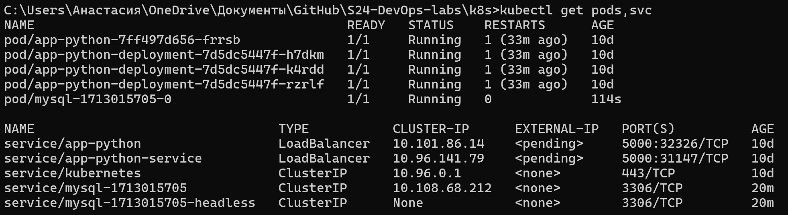
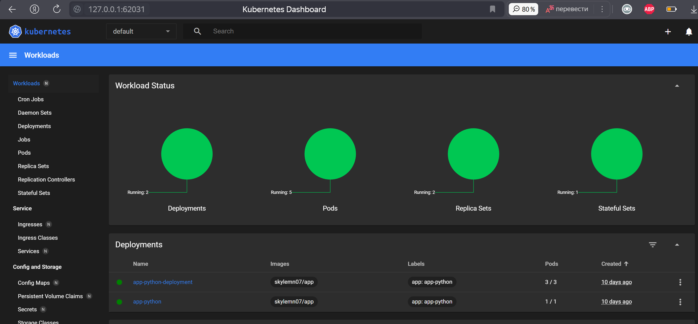

# Lab 13

## Commands output

- `kubectl get po,sts,svc,pvc`
    
    

- `minikube service stateful-web-app`

    

## Describe and explain differences in the report:


Each pod operates independently on its storage, which leads to different visit counts.


## Explain why ordering guarantees are unnecessary for your app:

Because each pod works independently on its isolated file `visits.txt`. The pods do not rely on shared resources.


## Implement a way to instruct the StatefulSet controller to launch or terminate all Pods in parallel.

It is ddone in `statefulset.yml`

by setting:

```bash
podManagementPolicy: "Parallel"
```
