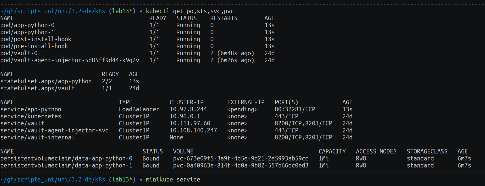
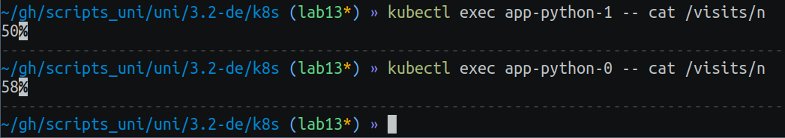

# Lab 13

## StatefulSet



As we can see, these pods get different number of visits - 50 and 58.
This probably due to the Load balancer strategy, it do not splits traffic evenly, but rather makes a preference in sending more requests to `app-python-0`.

### Ordering Guarantee

`Ordering guarantee` is not necessary for my app because my app instances are not dependent on each other in any way.
They have no shared resources, so they can operate completely separately, regardless of their start/stop time.
So, assuming that I can make a conclusion that the need of `Ordering guarantee` is useless for my app.

### Implementing parallel ordering

`values.yaml`:
```yaml
podManagementPolicy: "Parallel"
```

`statefulset.yaml`:
```yaml
podManagementPolicy: {{ .Values.podManagementPolicy }}
```

### Bonus

There are 2 main update strategies for `StatefulSet`:

`RollingUpdate`: This is the most simple strategy that starts update of each new pod after completion of update on previous one, so that there is only one updating pod at a time.
`OnDelete`: This is strategy to update pod only when user manually deletes them.
