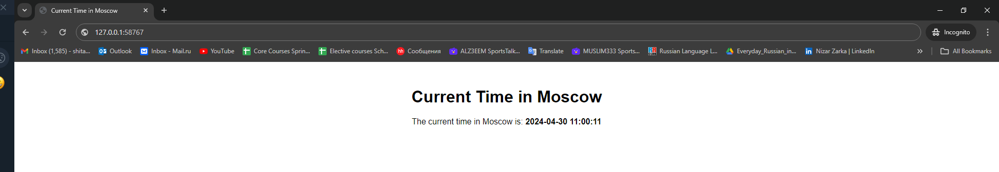

# Kubernetes StatefulSet

## StatefulSet Exploration and Optimization

```shell
laith@DESKTOP-PPRJIN9:/mnt/d/S24-core-course-labs/k8s$ kubectl get po,sts,svc,pvc
NAME                               READY   STATUS    RESTARTS   AGE
pod/app-python-app-python-0        1/1     Running   0          4m20s
pod/app-python-app-python-1        1/1     Running   0          94s

NAME                                          READY   AGE
statefulset.apps/app-python-app-python        2/2     4m20s

NAME                                 TYPE           CLUSTER-IP      EXTERNAL-IP   PORT(S)          AGE
service/app-python-app-python        LoadBalancer   10.108.234.64   <pending>     5000:30951/TCP   4m20s
service/kubernetes                   ClusterIP      10.96.0.1       <none>        443/TCP          21m

NAME                                                        STATUS   VOLUME                                     CAPACITY   ACCESS MODES   STORAGECLASS   AGE
persistentvolumeclaim/Data-app-python-helm-app-python-0     Bound    pvc-11feca6b-be84-4789-86f7-c81f5ec96ad5   2Gi        RWO            standard       4m20s
persistentvolumeclaim/Data-app-python-helm-app-python-1     Bound    pvc-072999ba-a7e7-4944-a4aa-343e1ed65d4b   2Gi        RWO            standard       94s
```

```shell
laith@DESKTOP-PPRJIN9:/mnt/d/S24-core-course-labs/k8s$ minikube service app-python-app-python
|-----------|----------------------------|-------------|---------------------------|
| NAMESPACE |            NAME            | TARGET PORT |            URL            |
|-----------|----------------------------|-------------|---------------------------|
| default   |    app-python-app-python   | http/5000   | http://192.168.49.2:30951 |
|-----------|----------------------------|-------------|---------------------------|
🏃  Starting tunnel for service app-python-app-python.
|-----------|----------------------------|-------------|------------------------|
| NAMESPACE |            NAME            | TARGET PORT |          URL           |
|-----------|----------------------------|-------------|------------------------|
| default   |    app-python-app-python   |             | http://127.0.0.1:58767 |
|-----------|----------------------------|-------------|------------------------|
🎉  Opening service default/app-python-app-python in default browser...
❗  Because you are using a Docker driver on linux, the terminal needs to be open to run it.
```



```shell
laith@DESKTOP-PPRJIN9:/mnt/d/S24-core-course-labs/k8s$ kubectl exec pod/app-python-app-python-0 -- cat visits/visits.txt
45     
```

```shell
laith@DESKTOP-PPRJIN9:/mnt/d/S24-core-course-labs/k8s$ kubectl exec pod/app-python-app-python-1 -- cat visits/visits.txt
55   
```

The reason for the variations in numbers is that each pod in a StatefulSet maintains its own independent state.

### Ordering Guarantee and Parallel Operations
- Since every pod runs separately and doesn't share data, ordering assurances is not required. You can change the quantity of replicas without relying on the order.

- Added `podManagementPolicy: "Parallel"` to `/templates/statefulset.yaml`
