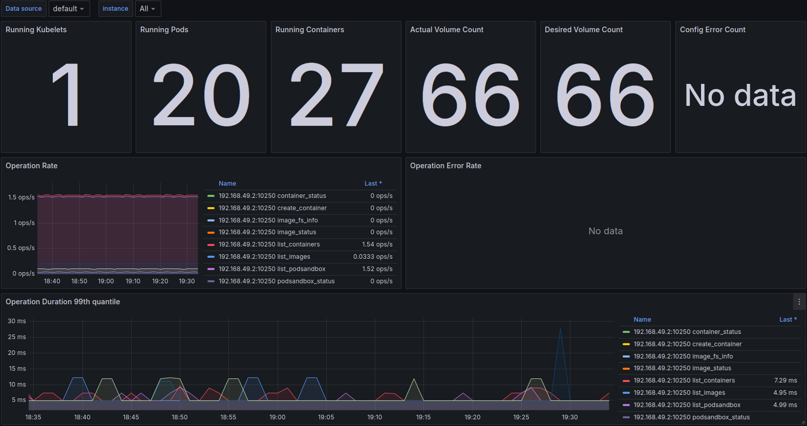
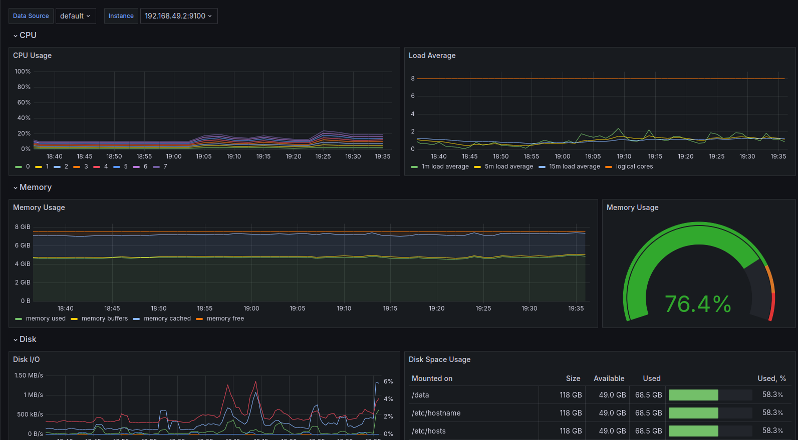
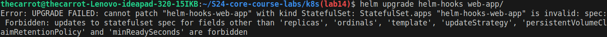

# Lab 14: Kubernetes Monitoring and Init Containers

## components description

1. **Grafana**: Visulizing tool for monitoring data through the application.

2. **Prometheus Operator**: Tool for simplifing the process of launching prometheus on kubernetes cluster.

3. **kube-state-metrics**: For observing the kubernetes API server and generates metrics about prometheus.

4. **Prometheus node-exporter**: Collects hardware and operating system metrics and data for promethrus.

5. **Alertmanager**: Routes and handles errors, directs them to the specified channel.

6. **Prometheus**: Handels and stores time-series data. Usually monitors kubernetes with alerts.

7. **Prometheus blackbox-exporter**: Examine endpoints or its availability via (HTTP, TCP, ..)

8. **Prometheus Adapter for Kubernetes Metrics APIs**: Collect metric from kubernetes and provides them to Prometheus.

## Commands output

```bash
$ kubectl get po,sts,svc,pvc,cm
NAME                                                         READY   STATUS      RESTARTS   AGE
pod/alertmanager-prometheus-kube-prometheus-alertmanager-0   2/2     Running     0          43m
pod/app-python-6fd8674fcb-6dxzt                              1/1     Running     2          3d23h
pod/app-python-6fd8674fcb-985nk                              1/1     Running     2          3d23h
pod/app-python-6fd8674fcb-pmhk9                              1/1     Running     2          3d23h
pod/helm-hooks-web-app-0                                     1/1     Running     1          91m
pod/helm-hooks-web-app-1                                     1/1     Running     1          91m
pod/postinstall-hook                                         0/1     Completed   0          8d
pod/preinstall-hook                                          0/1     Completed   0          8d
pod/prometheus-grafana-5c49bc94bc-v2s2z                      3/3     Running     0          43m
pod/prometheus-kube-prometheus-operator-548d45dcdb-qqb6h     1/1     Running     0          43m
pod/prometheus-kube-state-metrics-688d66b5b8-978g5           1/1     Running     0          43m
pod/prometheus-prometheus-kube-prometheus-prometheus-0       2/2     Running     0          43m
pod/prometheus-prometheus-node-exporter-sns4m                1/1     Running     0          43m
pod/web-app-5dc489ffd6-fpg8x                                 1/1     Running     2          3d23h

NAME                                                                    READY   AGE
statefulset.apps/alertmanager-prometheus-kube-prometheus-alertmanager   1/1     43m
statefulset.apps/helm-hooks-web-app                                     2/2     91m
statefulset.apps/prometheus-prometheus-kube-prometheus-prometheus       1/1     43m

NAME                                              TYPE           CLUSTER-IP       EXTERNAL-IP   PORT(S)                      AGE
service/alertmanager-operated                     ClusterIP      None             <none>        9093/TCP,9094/TCP,9094/UDP   43m
service/app-python                                LoadBalancer   10.101.8.72      <pending>     5000:32394/TCP               10d
service/helm-hooks-web-app                        ClusterIP      10.98.131.24     <none>        80/TCP                       8d
service/kubernetes                                ClusterIP      10.96.0.1        <none>        443/TCP                      10d
service/prometheus-grafana                        ClusterIP      10.111.7.17      <none>        80/TCP                       43m
service/prometheus-kube-prometheus-alertmanager   ClusterIP      10.110.109.212   <none>        9093/TCP,8080/TCP            43m
service/prometheus-kube-prometheus-operator       ClusterIP      10.108.252.150   <none>        443/TCP                      43m
service/prometheus-kube-prometheus-prometheus     ClusterIP      10.111.251.250   <none>        9090/TCP,8080/TCP            43m
service/prometheus-kube-state-metrics             ClusterIP      10.102.245.24    <none>        8080/TCP                     43m
service/prometheus-operated                       ClusterIP      None             <none>        9090/TCP                     43m
service/prometheus-prometheus-node-exporter       ClusterIP      10.106.198.17    <none>        9100/TCP                     43m

NAME                                                       STATUS   VOLUME                                     CAPACITY   ACCESS MODES   STORAGECLASS   VOLUMEATTRIBUTESCLASS   AGE
persistentvolumeclaim/wesammetadata-helm-hooks-web-app-0   Bound    pvc-9e93453c-a8bb-4cd3-a717-55466396c32e   1Gi        RWO            standard       <unset>                 91m
persistentvolumeclaim/wesammetadata-helm-hooks-web-app-1   Bound    pvc-1823f646-52cc-4062-8f3f-540ad9ef2021   1Gi        RWO            standard       <unset>                 91m

NAME                                                                     DATA   AGE
configmap/config                                                         1      3d23h
configmap/kube-root-ca.crt                                               1      10d
configmap/prometheus-grafana                                             1      43m
configmap/prometheus-grafana-config-dashboards                           1      43m
configmap/prometheus-kube-prometheus-alertmanager-overview               1      43m
configmap/prometheus-kube-prometheus-apiserver                           1      43m
configmap/prometheus-kube-prometheus-cluster-total                       1      43m
configmap/prometheus-kube-prometheus-controller-manager                  1      43m
configmap/prometheus-kube-prometheus-etcd                                1      43m
configmap/prometheus-kube-prometheus-grafana-datasource                  1      43m
configmap/prometheus-kube-prometheus-grafana-overview                    1      43m
configmap/prometheus-kube-prometheus-k8s-coredns                         1      43m
configmap/prometheus-kube-prometheus-k8s-resources-cluster               1      43m
configmap/prometheus-kube-prometheus-k8s-resources-multicluster          1      43m
configmap/prometheus-kube-prometheus-k8s-resources-namespace             1      43m
configmap/prometheus-kube-prometheus-k8s-resources-node                  1      43m
configmap/prometheus-kube-prometheus-k8s-resources-pod                   1      43m
configmap/prometheus-kube-prometheus-k8s-resources-workload              1      43m
configmap/prometheus-kube-prometheus-k8s-resources-workloads-namespace   1      43m
configmap/prometheus-kube-prometheus-kubelet                             1      43m
configmap/prometheus-kube-prometheus-namespace-by-pod                    1      43m
configmap/prometheus-kube-prometheus-namespace-by-workload               1      43m
configmap/prometheus-kube-prometheus-node-cluster-rsrc-use               1      43m
configmap/prometheus-kube-prometheus-node-rsrc-use                       1      43m
configmap/prometheus-kube-prometheus-nodes                               1      43m
configmap/prometheus-kube-prometheus-nodes-darwin                        1      43m
configmap/prometheus-kube-prometheus-persistentvolumesusage              1      43m
configmap/prometheus-kube-prometheus-pod-total                           1      43m
configmap/prometheus-kube-prometheus-prometheus                          1      43m
configmap/prometheus-kube-prometheus-proxy                               1      43m
configmap/prometheus-kube-prometheus-scheduler                           1      43m
configmap/prometheus-kube-prometheus-workload-total                      1      43m
configmap/prometheus-prometheus-kube-prometheus-prometheus-rulefiles-0   35     43m
```

## Explaination for the output

The following part contains the list of running pods in the cluster

```bash
NAME                                                            READY   STATUS      RESTARTS   AGE
pod/alertmanager-prometheus-kube-prometheus-alertmanager-0   2/2     Running     0          43m
pod/app-python-6fd8674fcb-6dxzt                              1/1     Running     2          3d23h
pod/app-python-6fd8674fcb-985nk                              1/1     Running     2          3d23h
pod/app-python-6fd8674fcb-pmhk9                              1/1     Running     2          3d23h
pod/helm-hooks-web-app-0                                     1/1     Running     1          91m
pod/helm-hooks-web-app-1                                     1/1     Running     1          91m
pod/postinstall-hook                                         0/1     Completed   0          8d
pod/preinstall-hook                                          0/1     Completed   0          8d
pod/prometheus-grafana-5c49bc94bc-v2s2z                      3/3     Running     0          43m
pod/prometheus-kube-prometheus-operator-548d45dcdb-qqb6h     1/1     Running     0          43m
pod/prometheus-kube-state-metrics-688d66b5b8-978g5           1/1     Running     0          43m
pod/prometheus-prometheus-kube-prometheus-prometheus-0       2/2     Running     0          43m
pod/prometheus-prometheus-node-exporter-sns4m                1/1     Running     0          43m
pod/web-app-5dc489ffd6-fpg8x                                 1/1     Running     2          3d23h
```

This part is for statefulset apps in the cluster

```bash
statefulset.apps/alertmanager-prometheus-kube-prometheus-alertmanager   1/1     43m
statefulset.apps/helm-hooks-web-app                                     2/2     91m
statefulset.apps/prometheus-prometheus-kube-prometheus-prometheus       1/1     43m
```

This is the services with their corresponding IP addresses

```bash
NAME                                              TYPE           CLUSTER-IP       EXTERNAL-IP   PORT(S)                      AGE
service/alertmanager-operated                     ClusterIP      None             <none>        9093/TCP,9094/TCP,9094/UDP   43m
service/app-python                                LoadBalancer   10.101.8.72      <pending>     5000:32394/TCP               10d
service/helm-hooks-web-app                        ClusterIP      10.98.131.24     <none>        80/TCP                       8d
service/kubernetes                                ClusterIP      10.96.0.1        <none>        443/TCP                      10d
service/prometheus-grafana                        ClusterIP      10.111.7.17      <none>        80/TCP                       43m
service/prometheus-kube-prometheus-alertmanager   ClusterIP      10.110.109.212   <none>        9093/TCP,8080/TCP            43m
service/prometheus-kube-prometheus-operator       ClusterIP      10.108.252.150   <none>        443/TCP                      43m
service/prometheus-kube-prometheus-prometheus     ClusterIP      10.111.251.250   <none>        9090/TCP,8080/TCP            43m
service/prometheus-kube-state-metrics             ClusterIP      10.102.245.24    <none>        8080/TCP                     43m
service/prometheus-operated                       ClusterIP      None             <none>        9090/TCP                     43m
service/prometheus-prometheus-node-exporter       ClusterIP      10.106.198.17    <none>        9100/TCP                     43m
```

This is the list of persistent volumes with their capacity

```bash
NAME                                                       STATUS   VOLUME                                     CAPACITY   ACCESS MODES   STORAGECLASS   VOLUMEATTRIBUTESCLASS   AGE
persistentvolumeclaim/wesammetadata-helm-hooks-web-app-0   Bound    pvc-9e93453c-a8bb-4cd3-a717-55466396c32e   1Gi        RWO            standard       <unset>                 91m
persistentvolumeclaim/wesammetadata-helm-hooks-web-app-1   Bound    pvc-1823f646-52cc-4062-8f3f-540ad9ef2021   1Gi        RWO            standard       <unset>                 91m
```

all configs maps in the cluster

```bash
NAME                                                                     DATA   AGE
configmap/config                                                         1      3d23h
configmap/kube-root-ca.crt                                               1      10d
configmap/prometheus-grafana                                             1      43m
configmap/prometheus-grafana-config-dashboards                           1      43m
configmap/prometheus-kube-prometheus-alertmanager-overview               1      43m
configmap/prometheus-kube-prometheus-apiserver                           1      43m
configmap/prometheus-kube-prometheus-cluster-total                       1      43m
configmap/prometheus-kube-prometheus-controller-manager                  1      43m
configmap/prometheus-kube-prometheus-etcd                                1      43m
configmap/prometheus-kube-prometheus-grafana-datasource                  1      43m
configmap/prometheus-kube-prometheus-grafana-overview                    1      43m
configmap/prometheus-kube-prometheus-k8s-coredns                         1      43m
configmap/prometheus-kube-prometheus-k8s-resources-cluster               1      43m
configmap/prometheus-kube-prometheus-k8s-resources-multicluster          1      43m
configmap/prometheus-kube-prometheus-k8s-resources-namespace             1      43m
configmap/prometheus-kube-prometheus-k8s-resources-node                  1      43m
configmap/prometheus-kube-prometheus-k8s-resources-pod                   1      43m
configmap/prometheus-kube-prometheus-k8s-resources-workload              1      43m
configmap/prometheus-kube-prometheus-k8s-resources-workloads-namespace   1      43m
configmap/prometheus-kube-prometheus-kubelet                             1      43m
configmap/prometheus-kube-prometheus-namespace-by-pod                    1      43m
configmap/prometheus-kube-prometheus-namespace-by-workload               1      43m
configmap/prometheus-kube-prometheus-node-cluster-rsrc-use               1      43m
configmap/prometheus-kube-prometheus-node-rsrc-use                       1      43m
configmap/prometheus-kube-prometheus-nodes                               1      43m
configmap/prometheus-kube-prometheus-nodes-darwin                        1      43m
configmap/prometheus-kube-prometheus-persistentvolumesusage              1      43m
configmap/prometheus-kube-prometheus-pod-total                           1      43m
configmap/prometheus-kube-prometheus-prometheus                          1      43m
configmap/prometheus-kube-prometheus-proxy                               1      43m
configmap/prometheus-kube-prometheus-scheduler                           1      43m
configmap/prometheus-kube-prometheus-workload-total                      1      43m
configmap/prometheus-prometheus-kube-prometheus-prometheus-rulefiles-0   35     43m
```

## Dashboards analysis

- Check CPU and Memory consumption of your StatefulSet.

    ```properties
    CPU: 0.78
    Memory: 88 MiB
    ```


- Count the number of pods and containers managed by the Kubelet service.

    Pods: 20
    Containers: 27



- Evaluate network usage of Pods in the default namespace.

    Download speed: 38.0 kB/s
    Upload speed: 25.1 kB/s



- Determine the number of active alerts

    8 alerts


## Init Containers

I did configure the files but I keep getting this error when trying to create new volumeclaimtemplate to my StatefulSet. I kept the changes but commented them.


